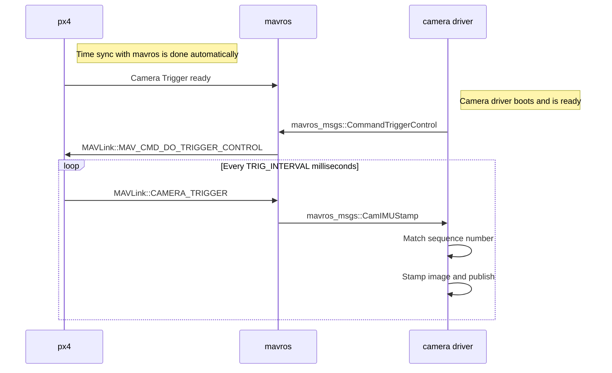

# Camera Trigger
The camera trigger driver allows the use of the AUX ports to send out pulses in
order to trigger a camera. This can be used for multiple applications including
timestamping photos for aerial surveying and reconstruction, synchronizing a
multi-camera system or visual-inertial navigation.

In addition to a pulse being sent out, a MAVLink message is published containing
a sequence number (thus the current session's image sequence number) and the
corresponding time stamp.

Three different modes are supported:
* `TRIG_MODE` 1 works like a basic intervalometer that can be enabled and disabled by calling in the system console `camera_trigger enable` or `camera_trigger disable`, respectively. Repeated enabling time-shifts the intervals to match the latest call.
* `TRIG_MODE` 2 switches the intervalometer constantly on.
* `TRIG_MODE` 3 triggers based on distance. A shot is taken every time the set horizontal distance is exceeded. The minimum time interval between two shots is however limited by the set triggering interval.

In `TRIG_MODE` 0 the triggering is off.

The full list of parameters pertaining to the camera trigger module can be found
on the [parameter reference](https://pixhawk.org/firmware/parameters#camera_trigger) page.

<aside class="tip">
If it is your first time enabling the camera trigger app, remember to reboot
after changing the `TRIG_MODE` parameter to either 1, 2 or 3.
</aside>

## Camera-IMU sync example
In this example, we will go over the basics of synchronizing IMU measurements
with visual data to build a stereo visual-inertial navigation system (VINS). To
be clear, the idea here isn't to take an IMU measurement exactly at the same time
as we take a picture but rather to correctly time stamp our images so as to
provide accurate data to our VI algorithm.

The following diagram illustrates the sequence of events which must happen in
order to correctly time stamp our images.

### Step 1
First, set the TRIG_MODE to 1 to make the driver wait for the start command and
reboot your FCU to obtain the remaining parameters.

### Step 2
For the purposes of this example we will be configuring the trigger to operate
in conjunction with a Point Grey Firefly MV camera running at 30 FPS.

* TRIG_INTERVAL: 33.33 ms
* TRIG_POLARITY: 0, active low
* TRIG_ACT_TIME: 0.5 ms, leave default. The manual specifies it only has to be a
minimum of 1 microsecond.
* TRIG_MODE: 1, because we want our camera driver to be ready to receive images
before starting to trigger. This is essential to properly process sequence
numbers.
* TRIG_PINS: 12, Leave default.

### Step 3
Wire up your cameras to your AUX port by connecting the ground and signal pins to
the appropriate place.

### Step 4
You will have to modify your driver to follow the sequence diagram above. Public
reference implementations for [IDS Imaging UEye](https://github.com/ProjectArtemis/ueye_cam)
cameras and for [IEEE1394 compliant](https://github.com/andre-nguyen/camera1394) cameras are available.
