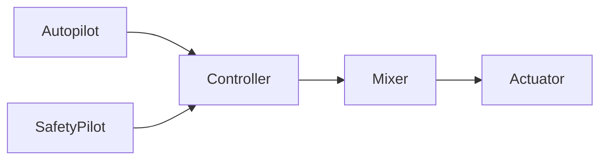

# Airframe Overview

The PX4 system is architected in a modular fashion allowing it to use a single codebase for all robot types.

## Basic Equipment

All hardware configurations in the airframe section assume a basic set of equipment:

  * A Taranis Plus remote control for the safety pilot (or equivalent with PPM / S.BUS out)
  * A ground control station
    * Samsung Note 4 or equivalent / more recent Android tablet
    * iPad (requires Wifi telemetry adapter)
    * Any MacBook or Ubuntu Linux laptop
  * An in-field computer (for software developers)
    * MacBook Pro or Air with OS X 10.10 or newer
    * Modern laptop with Ubuntu Linux (14.04 or newer)
  * Safety glasses
  * For multicopters: A tether for more risky tests

PX4 can be used with a much wider range of equipment, but new developers will benefit from going with one of the standard setups, and a Taranis RC plus a Note 4 tablet make up for a very inexpensive field kit.
