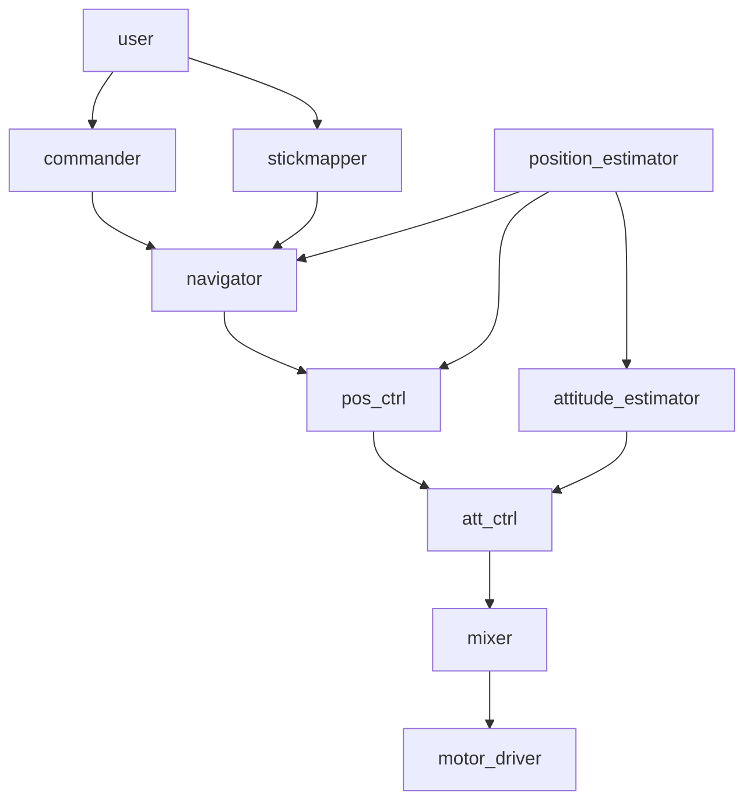
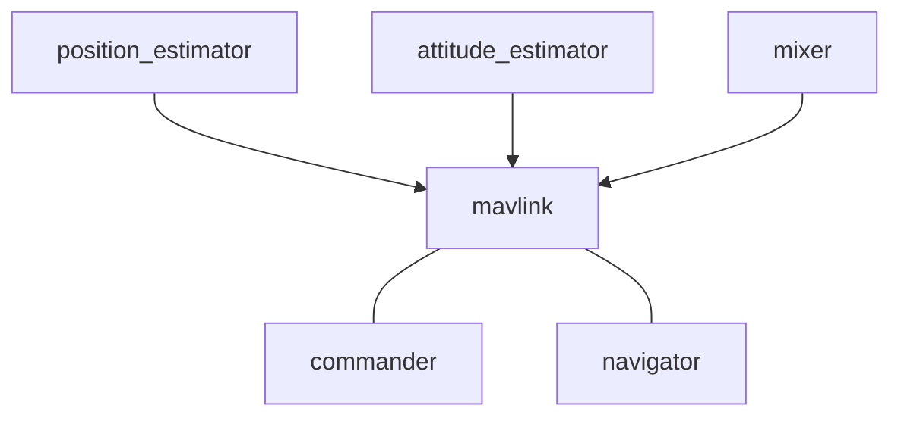

# Architectural Overview

PX4 consists of two main layers: The [PX4 flight stack](concept-flight-stack.md), an autopilot software solution and the [PX4 middleware](concept-middleware.md), a general robotics middleware which can support any type of autonomous robot.

All [airframes](airframes-architecture.md), and in fact all robotic systems including boats, share a single codebase. The complete system design is [reactive](http://www.reactivemanifesto.org), which means that:

  * All functionality is divided into exchangable components
  * Communication is done by asynchronous message passing 
  * The system can deal with varying workload

In addition to these runtime considerations, its modularity maximizes [reusability](https://en.wikipedia.org/wiki/Reusability).

## High Level Software Architecture

Each of the blocks below is a separate module, which is self-contained in terms of code, dependencies and even at runtime. Each arrow is a connection through publish/subscribe calls through [uORB](advanced-uorb.md).

<aside class="tip">
The architecture of PX4 allows to exchange every single of these blocks very rapidly and conveniently, even at runtime.
</aside>

The controllers / mixers are specific to a particular airframe (e.g. a multicopter, VTOL or plane), but the higher-level mission management blocks like the `commander` and `navigator` are shared between platforms.

## Communication Architecture with the GCS

The interaction with the ground control station (GCS) is handled through the "business logic" applications including the commander (general command & control, e.g. arming), the navigator (accepts missions and turns them into lower-level navigation primitives) and the mavlink application, which accepts MAVLink packets and converts them into the onboard uORB data structures. This isolation has been architected explicitely to avoid having a MAVLink dependency deep in the system. The MAVLink application also consumes a lot of sensor data and state estimates and sends them to the ground control station.

