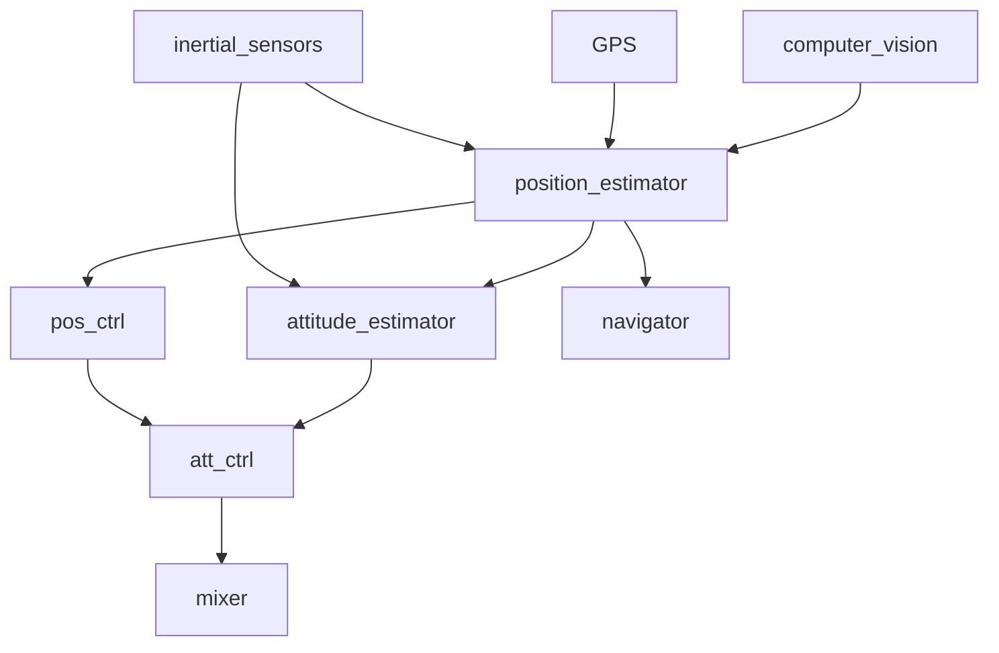

# PX4 Flight Stack

The PX4 flight stack is a collection of guidance, navigation and control algorithms for autonomous drones. It includes controllers for fixed wing, multirotor and VTOL airframes as well as estimators for attitude and position.

## Estimation and Control Architecture

The diagram below shows an example implementation of the typical blocks. Depending on the vehicle some of these can be also combined into a single application (e.g. when a model predictive controller for a specific vehicle is wanted).

