# QAV-R 5" KISS ESC Racer

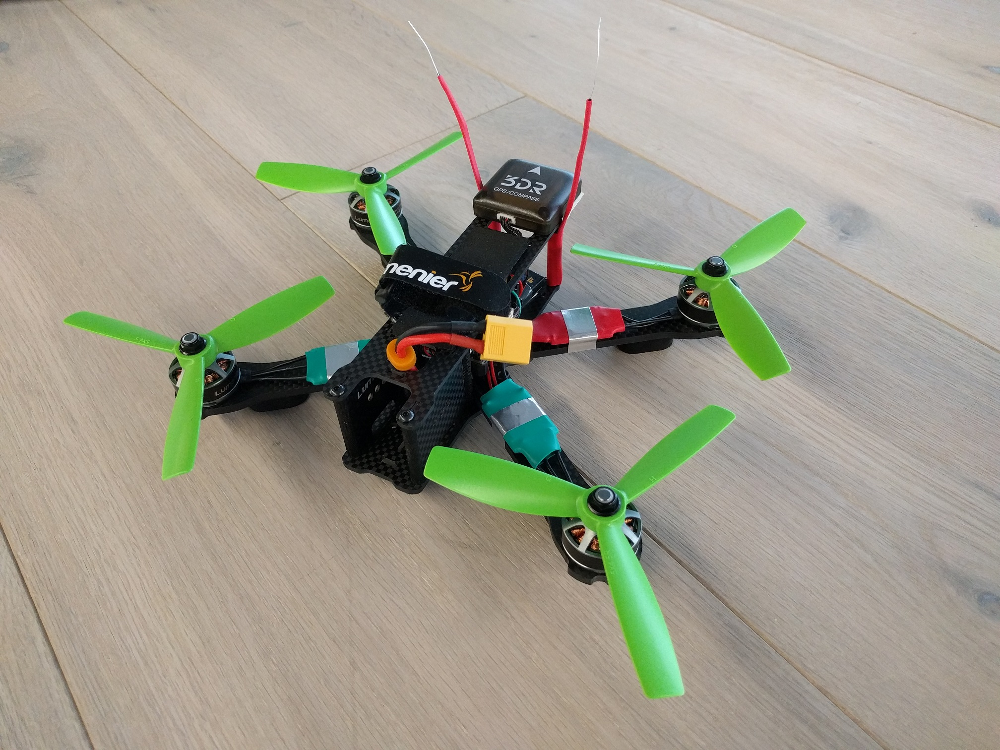
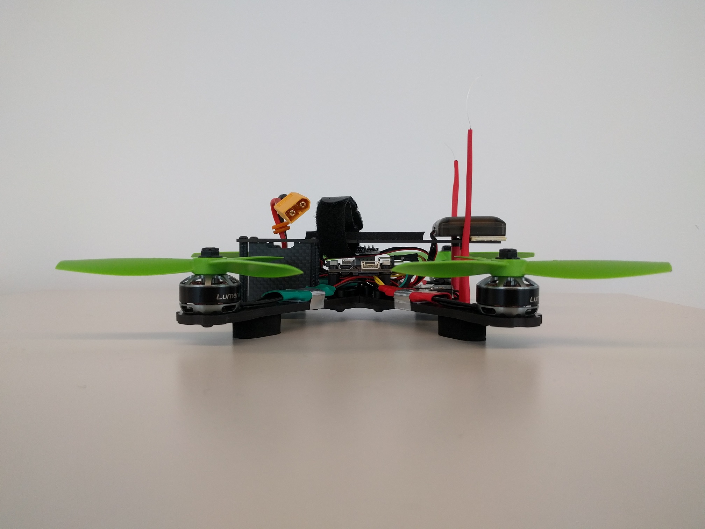

## Parts List

* Autopilot: [Pixracer](../flight_controller/pixracer.md) from AUAV including power- and WiFi-module
* Frame:  [Lumenier QAV-R 5"](http://www.getfpv.com/qav-r-fpv-racing-quadcopter-5.html)
* Motors:  [Lumenier RX2206-11 2350KV](http://www.getfpv.com/lumenier-rx2206-11-2350kv-motor.html)
* ESCs:  [KISS 24A Race Edition](http://www.getfpv.com/kiss-24a-esc-race-edition-32bit-brushless-motor-ctrl.html)
* Props: HQProp 5x4.5x3 [CW](http://www.getfpv.com/hqprop-5x4-5x3rg-cw-propeller-3-blade-2-pack-green-nylon-glass-fiber.html) [CCW](http://www.getfpv.com/hqprop-5x4-5x3g-ccw-propeller-3-blade-2-pack-green-nylon-glass-fiber.html)
* GPS / Ext.Mag.: M8N taken from a [3DR Pixhawk Mini set](https://store.3dr.com/products/3dr-pixhawk) and rewired
* Battery: [TATTU 1800mAh 4s 75c Lipo](http://www.getfpv.com/tattu-1800mah-4s-75c-lipo-battery.html)
* RC Receiver: [FrSky X4R-SB](http://www.getfpv.com/frsky-x4r-sb-3-16-channel-receiver-w-sbus.html)
* Remote Control: [FrSky Taranis](http://www.getfpv.com/frsky-taranis-x9d-plus-2-4ghz-accst-radio-w-soft-case-mode-2.html)

## Assembling the Basic Frame

I assembled the basic center plate and the arms like in this video between 09:25 and 13:26:
https://youtu.be/7SIpJccXZjM?t=565

I mounted the four motors to the frame with the cables coming out towards the center of the frame. I used two of the longer motor screws that come with the frame for each motor and put them in the two holes which are further apart.

## Building the Power Train

The KISS ESCs are known for their good performance but they also come with two disadvantages:
- The software they use is not open source (unlike BLHeli)
- There exists to my knowledge no hardware package with presoldered wires and or plugs

This means we need to solder at least 6 joints on every ESC but it's still totally worth it.

> **Tip** Always tin both sides you want to connect with solder before actually soldering them together.

> **Tip** Make sure that you use a propriate cable gauge for the power connections that transport the high current all the way from the battery to the motors. All signal cables can be very thin in comparison.

> **Tip** Put heat shrink on the cables before you start soldering! Heatshrinking the ESCs and the power module after a successful function test will protect them from dirt, moisure and physical damage

### Motors
First I cut all three motor cables to directly fit when the ESCs are mounted on the arms shifted towards the center but still let enough slack to allow easy placement of the parts and not produce any tension on the cables. Then I soldered them in the order they come out of the motor to the output contacts of the ESCs which are oriented with the switching MOS-FETs facing updwards to get good air cooling during flight. Choosing this cable order resulted in all the motors spinning counter-clockwise in my tests and I switched where necessary the direction of rotation by bridging the dedicated [JP1 solder jumper](https://1.bp.blogspot.com/-JZoWC1LjLis/VtMP6XdU9AI/AAAAAAAAAiU/4dygNp0hpwc/s640/KISS-ESC-2-5S-24A-race-edition-32bit-brushless-motor-ctrl.jpg) to conform the [Quadrotor x configuration](../airframes/airframe_reference.html#quadrotor-x).

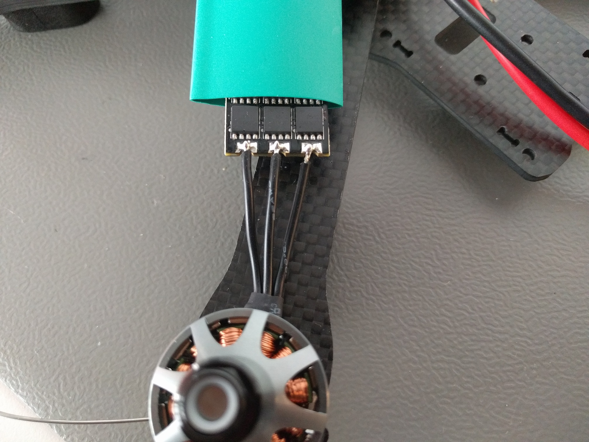

### Power Module
First I soldered the XT60 connector which comes with the frame to the labeled bettery side of the [ACSP5 power module](http://fs5.directupload.net/images/160304/a72l2mbz.jpg) that was shipped with the pixracer and added the elco capacitor delivered with the power module with the correct polarity to the same side.

Now comes the tricky part. I soldered all four ESC voltage source + and - ports to the corresponding pad on the labeled ESC output side of the power module. Make sure to not have any cold solder joint here because the quad will not end up well with a loose connection in flight. Using the additional power distribution board of the frame would make the job a lot easier but also takes too much space on such a small frame...

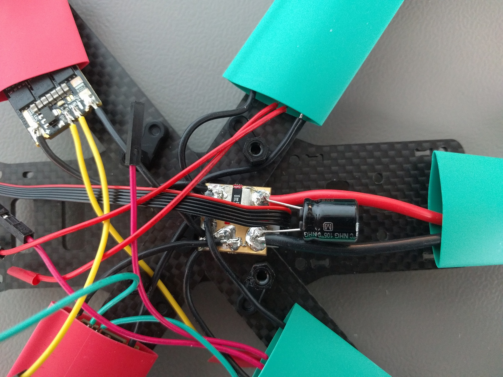

### Signal Cables

I used thin cables with a standardized pin header connector which were cut in half for the ESC signal because this will allow easy plugging on the pixracer pins later on. Only the labeled `PWM` port on the [KISS ESCs](https://1.bp.blogspot.com/-0huvLXoOygM/VtMNAOGkE5I/AAAAAAAAAiA/eNNuuySFeRY/s640/KISS-ESC-2-5S-24A-race-edition-32bit-brushless-motor-ctrl.jpg) is necessary for flying. They will be connected to the correct motor signal output of the pixracer. The `TLM` port is for ESC telemetry and I soldered them on for future use as the needed protocol is not currently supported by PX4.

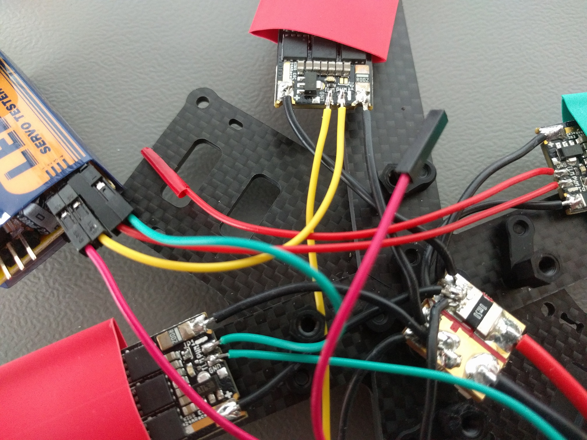

I tested all ESC motor pairs and their rotation directions using a cheap PWM servo tester before proceeding further.

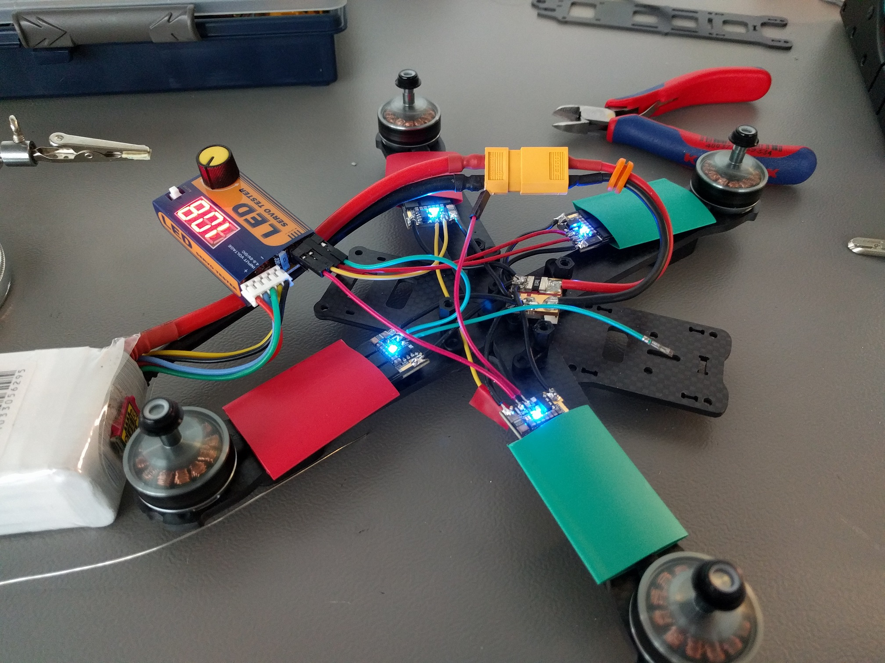

## Connecting & Mounting Electronics

You'll need the [hardware documentation of the Pixracer](https://docs.px4.io/en/flight_controller/pixracer.html) for this step to find all needed connectors. I tried to route all the cables under the Pixracer board to have a clean build and save space for FPV camera and transmitter in the future.

I mounted the Pixracer using the nylon spacers and screws that get shipped with the QAV-R frame but put some small O-rings between the board and the spacers to add a bit of vibration dampening. If you do the same make sure to not tighten the screws too much, not more than to make the board clearly touch both sides.

> **Tip** Double check the pin assignment of every component you connect. Sadly not every hardware component out there is plug and play even if it may look like this at first glance.

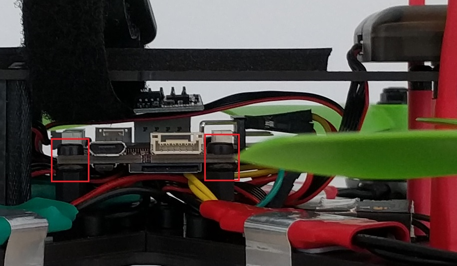

### RC Receiver

I hooked up the FrSky S-BUS receiver using the cable shipped with the Pixracer but cut away the unnecessary cable branch.

For the smart telemetry port I used the cable shipping with the receiver. I removed all unnecessary pins from the connector using tweezers and switched the white loose end cable to the correct pin of the connector to have the "smart" signal connected. I then soldered the loose end to a cable fitting the FrSky port following this [scematic](https://docs.px4.io/images/grau_b_pixracer_frskys.port_connection.jpg). I also skipped the ground (GND) pin because like the voltage supply positive pin it is already connected trough the RCin S-BUS cable.

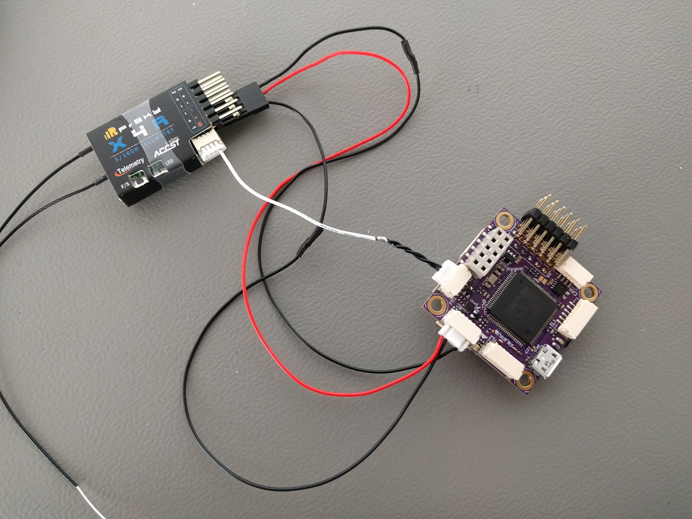

### RC Antenna Mount

To have a good RC link while not risking to have the antenna in the props I employed a rugged mount method using heat shrinks and zip ties.

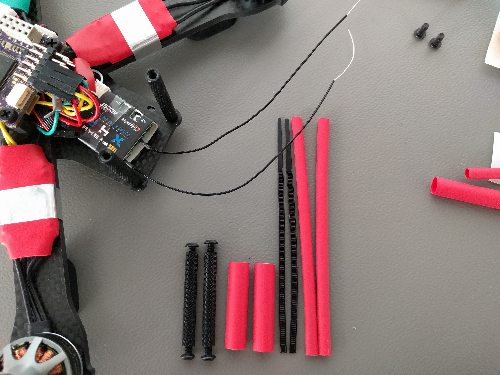

For this method you cut the big end with the hole off the zip tie, put the rest together with the antenna cable through a long heat shrink and mount this to your frame spacers using a bigger but shorter heat shrink.

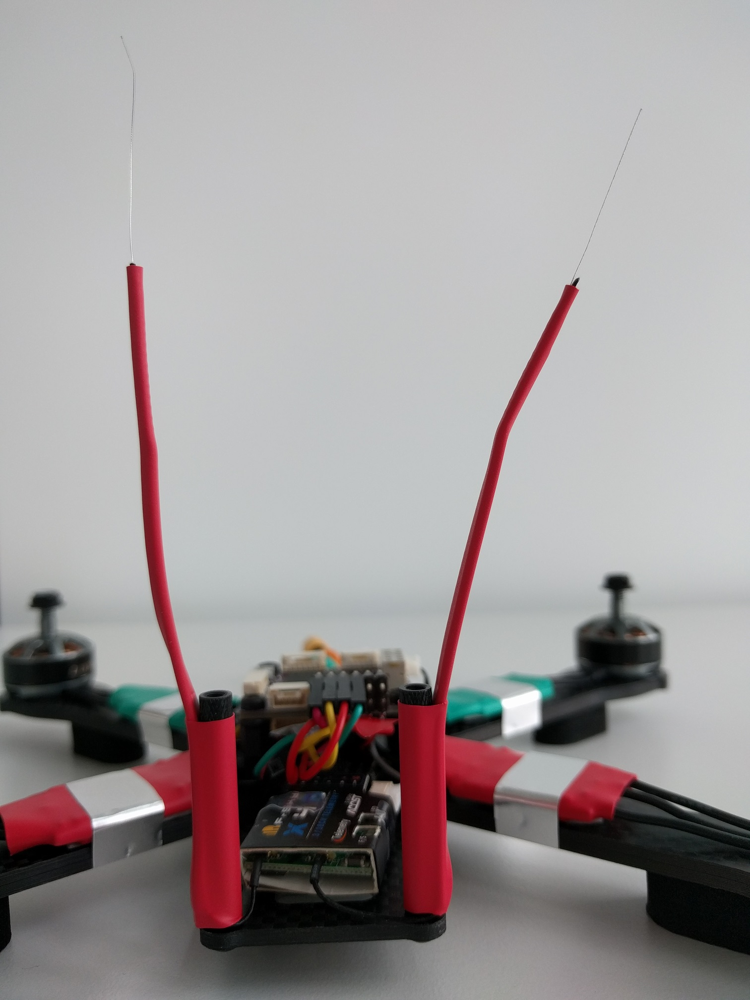

### ESC signal

For the ESC signals I followed the [hardware documentation of the Pixracer](https://docs.px4.io/en/flight_controller/pixracer.html) and the [Quadrotor x configuration](../airframes/airframe_reference.html#quadrotor-x) motor numbering scheme. As we have no ground or positive BEC voltage connections we connect our `PWM` ESC signal cables each to its topmost pins of the corresponding output connector.

### GPS / External Magnetometer

I took the GPS cable which fits the connector of the used GPS and came with the Pixracer set. Sadly the pin assignment was completely wrong and I rewired the connector again using tweezers according to the [3DR pixhawk mini user manual](../flight_controller/pixhawk_mini.md#connector-pin-assignments-pin-outs) GPS port.

#### Pixracer GPS/I2C Port
| Pin  | Assignment |
| ---- | ---------- |
| 1    | GND        |
| 2    | SDA        |
| 3    | SCL        |
| 4    | RX         |
| 5    | TX         |
| 6    | +5V        |

#### M8N 3DR pixhawk mini GPS Connector
| Pin     | Assignment | Connect to Pixracer Pin |
| ------- | ---------- | ----------------------- |
| 1 (red) | SCL        | 3                       |
| 2       | SDA        | 2                       |
| 3       | VCC 5V     | 6                       |
| 4       | RX         | 5                       |
| 5       | TX         | 4                       |
| 6       | GND        | 1                       |

I mounted the GPS using double sided tape to the far back of the top plate of the frame. This covers the power cord and FPV antenna holes. If the distance to interference is big enough needs to be tested.

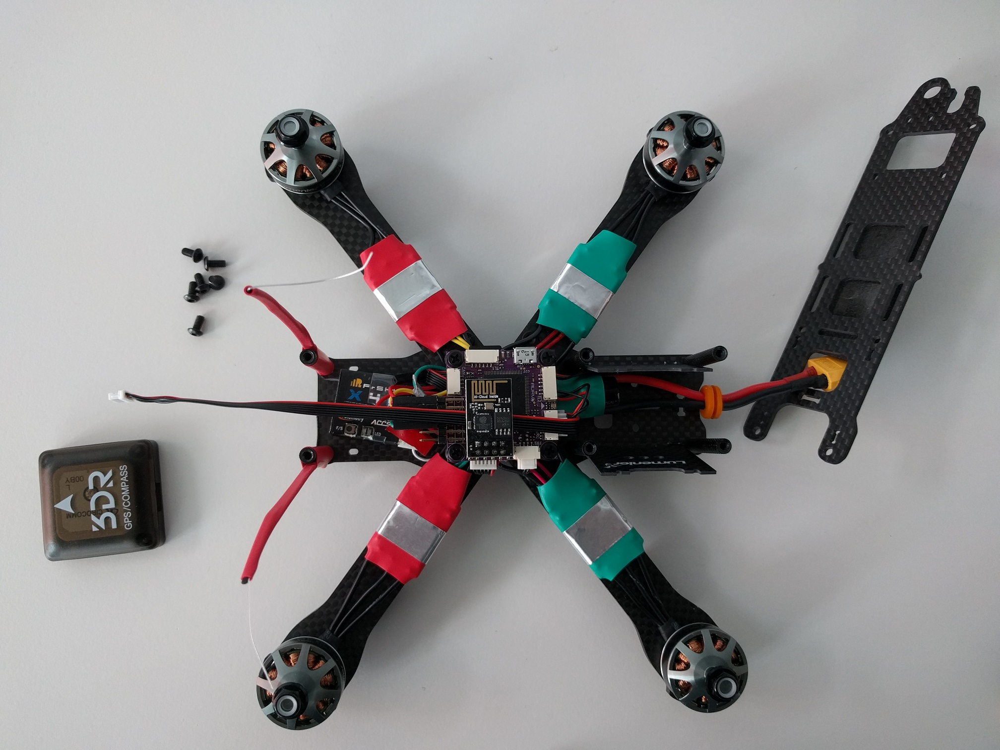

## Software Configuration

> **Warning** Always make sure to not have battery or propellers not connected to your system during any initial configuration. Better safe than sorry!

I pulled the newest PX4 master and flashed it to the Pixracer. Then I calibrated the sensors and while doing this had to set the external magnetometer mounting rotation to `YAW_270` even though I mounted it the oppsoite way (with the printed arrow facing upwards but pointing backwards, see pictures). 

I configured the battery as 4S with charged cell voltage 4.15V and empty cell voltage 3.5V, calibrated the voltage devider through typing in an accurate voltmeter measurement in QGC.

Then I calibrated RC with the Taranis configured for two additional switches to the standard stick inputs. One switch in the top right corner of the Taranis front plate for the mode switch and the other switch in the top left corner of the front plate as arm switch.

### Arm switch

To use an arm switch manually set the parameter `RC_MAP_ARM_SW` to the corresponding switch RC channel. The vehicle should from then on immediately arm/disarm whenever your switch is tuned on/off. The state of the switch is not forced to the vehicle adn therefore all other arming/disarming methods still work. If the switch positions are reversed just change the sign of the parameter `RC_ARMSWITCH_TH` or also change it's value to alter the threshold value. Make sure to test this under safe conditions!

### Improve Racer performance

This build was done to evaluate and improve PX4 racing quad performance. Recently progress was made in reducing the control loop delay and the following options therefore increase the rate controllers performance:
- Use the Oneshot125 protocol to communicate to the ESCs
  **set `PWM_RATE = 0` and reboot**
- Run the FMU as task instead of the work queue
  **set `SYS_FMU_TASK = 1` and reboot**

### Tuning

I first made sure `PWM_MIN` is set such that all motors still safely turn idle when arming but with a value as low as possible. For me it was `1075`.

I did first tuning in acro mode with `MC_ACRO_...` all set to 100 deg/s to have useful hover control. And arrived after the two optimizations from above at the following tuning gains:
`...` is `ROLL` and `PITCH`
`MC_...RATE_P = 0.06`
`MC_...RATE_I = 0.1`
`MC_...RATE_D = 0.001`
`MC_YAWRATE_P = 0.1`
Note that this gains will pretty likely not work well for you but I wanted to give them just as a reference.

After you found a good tuning for the rate controller, flying in manual mode with the default attitude controller gains is most of the time already ok and tuning it isn't very hard and can easily become a matter of taste.
