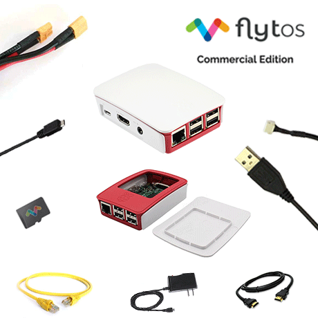

# FlytPi Kit 

[FlytPi](https://flytbase.com/product/flytpi/) Kit is a turnkey companion computer pre-loaded with FlytOS Commercial Edition for Pixhawk / Pixhawk Mini / Pixhawk2 / Cube Autopilot.
Simply connect FlytPi to your drone autopilot with a specially designed cable and enhance the capabilities of your drone. 
The kit also comes with a dedicated power module to power up FlytPi, Autopilot and Electronic Speed Controllers (ESC)
using a single drone battery. It offers a hassle-free connection with the Autopilot, thus saving time and effort in getting 
your drone applications built and deployed.

Features:
=========

* Plug & Play Companion Computer. Hassle-free connection with the Autopilot.
* Pre-loaded FlytOS Commercial Edition.
* Supports both Ardupilot and PX4.
* Pre-Installed FlytOS Sample Apps. (See description below)
* FlytConsole – Web based GCS.
* Access to extensive drone APIs for navigation, telemetry and payloads.
* FlytSDK for Mobile/Web applications.
* Regular performance updates and bug fixes.
* FlytSIM Simulator to test drone apps without drone hardware.
* Priority Email and Chat support from FlytBase experts.

Add-on features:
=================

* Instantly connect your drone to FlytBase Cloud.
* Real time access to drone navigation, telemetry and payload data over 4G/LTE..
* Integration with 3rd Party Apps.
* Cloud Simulator to test your applications.
 
Specifications:
================

* FlytOS Commercial Edition. (See details)
* Raspberry Pi3 Model B (Quad-Core 1.2 GHz, 1GB RAM, Built-in Wifi+Bluetooth)
* Storage: 32GB MicroSD
 
Kit includes:
=============

* 1x Raspberry Pi3 Model B
* 1x Plastic Enclosure
* 1x 32GB uSD Card Class 10 with FlytOS Commercial Edition
* 1x UART-to-USB cable
* 1x Power Module 5V 4A (Powers both FlytPi and Autopilot, provides battery out for ESCs)
* 1x Wall Adapter (Micro-USB)
* 1x HDMI Cable
* 1x Ethernet Cable
