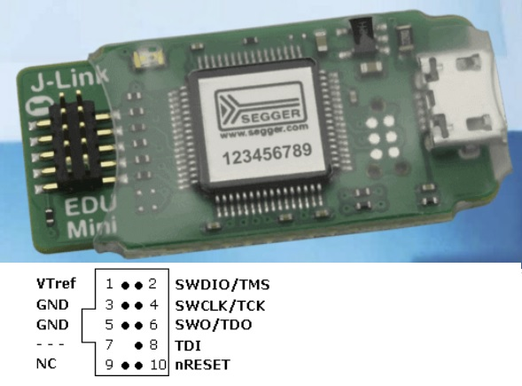
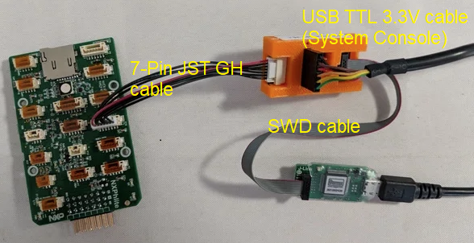

# JTAG Hardware Connections for PX4 Hardware (Debug Port)

PX4 runs on hardware that exposes a [JTAG interface in SW mode](https://en.wikipedia.org/wiki/JTAG), which can be used for on-hardware debugging.

This topic explains how to connect to the JTAG interface on various boards.
Using JTAG for debugging is then covered in other topics (e.g [MCU Eclipse/J-Link Debugging for PX4](../debug/eclipse_jlink.md)).

> **Tip** The Segger [J-Link EDU Mini](https://www.segger.com/products/debug-probes/j-link/models/j-link-edu-mini/) is an inexpensive J-Link adapter.
  

## JTAG SW Modes Pins

PX4 requires the following pins for JTAG.
The pins should be connected on the corresponding pins of the flight controller board and JTAG device.

Pin | Signal Type | Description
--- | --- | ---
VTref | Input | Target reference voltage. Used to check if the target has power, to create the logic-level reference for the input comparators and to control the output logic levels to the target. It is normally fed from Vdd of the target board and must not have a series resistor.
SWDIO | I/O | Single bi-directional data pin. A pull-up resistor is required. ARM recommends 100 kOhms.
SWCLK | Output | Clock signal to target CPU. It is recommended that this pin is pulled to a defined state on the target board. Typically connected to TCK of the target CPU.
GND | - | Ground pin. Should be connected to GND in the target system.

PX4 also supports these pins, if available (e.g. on FMUv5x).

Pin | Signal Type | Description
--- | --- | ---
SWO | Input | Serial Wire Output trace port (Optional, not required for SWD communication.)
nRESET | I/O | Target CPU reset signal. Typically connected to the RESET pin of the target CPU, which is typically called `nRST`.
TRACECLK | Input | Input trace clock. Trace clock = 1/2 CPU clock.
TRACEDATA[0] | Input | Input Trace data pin 0 (called TRACED0 in Pixhawk FMUv5x)

>  **Note** The information above is reproduced from [J-Link / J-Trace User Guide: UM08001 > 18.1.2 Pinout for SW Mode](https://www.segger.com/downloads/jlink/UM08001) (Software Version: 6.54).

## Pixhawk Series

[Pixhawk series](https://docs.px4.io/master/en/flight_controller/pixhawk_series.html) boards provide access to JTAG through the **Pixhawk Debug Port**.
The physical connector and pin order for this port varies across Pixhawk FMU versions.

> **Note** The **Pixhawk Debug Port** also exposes a UART for access to the [System Console](../debug/system_console.md) (a console that provides low-level access to the system, debug output and analysis of the system boot process).

<!--
### FMUv2

Does this have a debug port? where is spec
Is it a Hirose DF13

### FMUv3

Does this have a debug port? where is spec
Is it a Hirose DF13
-->

### FMUv4/FMUv5

FMU V4,5 has a 6 pin JST GH

[Pixracer](http://docs.px4.io/master/en/flight_controller/pixracer.html#pinouts): [Pixhawk debug port](https://pixhawk.org/pixhawk-connector-standard/#dronecode_debug) (JST SM06B connector)

Pin | Signal | Volt
--- | --- | ---
1 (red) | VCC TARGET SHIFT | +3.3V
2 (blk) | CONSOLE TX (OUT) | +3.3V
3 (blk) | CONSOLE RX (IN) | +3.3V
4 (blk) | SWDIO | +3.3V
5 (blk) | SWCLK | +3.3V
6 (blk) | GND | GND

### FMUv5X

FMUv5X will have a [10-pin JST SUR](https://order.jst-mfg.com/InternetShop/app/index.php?back=2&product=53574000&jgcd=0#showProductDetail).
It adds JTAG pins: SWO, nRST. TRACECLK, TRACED0 Pins 7 and 8 are GPIOS to gate timing or 1 wire trace (full trace is on).
<!-- is this link/example correct type for connector? -->

FMU Debug Port Pinout

Pin | Signal | Volt
--- | --- | ---
1 (red) | FMU VDD | +3.3V
2 (blk) | CONSOLE TX (OUT) | +3.3V
3 (blk) | CONSOLE RX (IN) | +3.3V
4 (blk) | SWDIO | +3.3V
5 (blk) | SWCLK | +3.3V
6 (blk) | SWO | +3.3V
7 (blk) | TRACECLK | +3.3V
8 (blk) | TRACED0 | +3.3V
9 (blk) | nRST | +3.3V
10 (blk) | GND | GND

> **Note** This board will have an additional 8-pin JST SUR for ARM ETM TRACE).

## Hex Cube

Cube debug port information can be found here: [Debug ports](http://docs.px4.io/master/en/flight_controller/pixhawk-2.html#debug-ports).

If pulled apart the Cube has a 6 pin JST SUR connector (marked as J10) for both FMU and IO debugging.

<!--
Does the numbering match all the other 6 pin port examples.
What label is the IO port marked as?
So obviously it is much easier to just connect to the carrier board port. Who would know what interface that is. PhilipR?
-->

## Kakute F7

There are Test points on the board.
<!-- I take that to mean that there are SWDIO etc pins somewhere. How do I find out where? -->

UART3 RX and TX are configured for System console. 

## Hovergames RDDRONE-FMUK66

The Hovergames RDDRONE-FMUK66 has a similar debug interface to Pixhawk (it supports an additional JTAG pin - nRST) and uses a JST-GH connector). 
The debug interface is documented here: [RDDRONE-FMUK66 Debug interface](https://nxp.gitbook.io/hovergames/rddrone-fmuk66/connectors/debug-interface-dcd-lz)

<!-- what am I seeing here? Ie the jlink and the FC are obvious. 
But what is the orange connector between them, and what is the connector out of the center of them doing? -->

<!-- 
What can you do with the FMU debug port but not IO port?
Presumably debug the code that runs on each, but how do you work out what you can run on each? -->