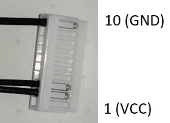

# SWD (JTAG) Hardware Debugging Interface

PX4 usually runs on autopilot controller hardware that provides an ARM *Serial Wire Debug (SWD)* interface.
SWD is a low pin-count physical interface for JTAG debugging on ARM-processors.
It can be used with an SWD-compatible debug probe (e.g. [Segger J-Link EDU Mini](#segger_jlink_edu_mini), [Dronecode Probe](#dronecode_probe), etc.) to set breakpoints in PX4 and step through the code running on a real device.

The SWD interface can also be used to add a new bootloader and/or firmware on a completely empty board (one that does not have the USB bootloader installed).

This topic explains how to connect the SWD interface on different boards (actually performing debugging is then covered in the associated [debugging topics](#debugging_topics)).

## SWD Interface Definition {#swd_interface}

The SWD interface consists of the following pins.

Pin | Signal Type | Description
--- | --- | ---
`Vref` | Output| Target reference voltage. Some JTAG adapters require the `Vref` voltage to set the voltage on the SWD lines. For example, [SEGGER J-Link Debug Probes](#segger_jlink_edu_mini) require `Vref`.
`SWDIO` | I/O | Single bi-directional data pin.
`SWCLK` | Output | Clock signal.
`GND` | - | Ground pin.

While not "part" of SWD, an autopilot may also have an *Serial Wire Output (SWO)* trace output pin.
If present this should also be connected.

Pin | Signal Type | Description
--- | --- | ---
`SWO` | Output| Serial  Wire Output trace output pin. This may be used in combination with *SWD* to emit real-time trace data.

## Connecting SWD Debuggers to PX4 Hardware

Connect `SWDIO`, `SWCLK` and `GND` pins on the debug probe to the corresponding pins on the autopilot.

In addition:
- Connect the `VRef` pin, if required by the debug adapter that is being used.
- Connect the `SWO` pin, if present.

Some SWD [debug probes](#debug_probes) come with adapters/cables for connecting to common Pixhawk [debug ports](#debug_ports).
You can also create custom cables for connecting to different boards or probes.

> **Note** Some manufacturers provide cables to make it easy to connect the SWD interface and [System Console](../debug/system_console.md). 
  For example the [CUAV V5nano](http://docs.px4.io/master/en/flight_controller/cuav_v5_nano.html#debug_port) and [CUAV V5+](http://docs.px4.io/master/en/flight_controller/cuav_v5_plus.html#debug-port) include this debug cable:
  

> **Tip** Where possible, we highly recommend that you create or obtain an adapter board rather than custom cables for connecting to SWD/JTAG debuggers and computers.
  This reduces the risk or poor wiring contributing to debugging problems, and has the benefit that adapters usually provide a common interface for connecting to multiple popular flight controller boards.

## Autopilot Debug Ports {#debug_ports}

Flight controllers commonly provide a debug port that exposes both the [SWD Interface](#swd_interface) and [System Console](../debug/system_console.md).

The [Pixhawk Connector Standards](#pixhawk_standard_debug_ports) attempts to standardise this port.
However since many boards use different pinouts or connectors, we recommend you check the documentation for your autopilot to confirm port location and pinout. 

The debug port location and pinouts for a small subset of autopilots are linked below:

Autopilot | Connector 
--- | ---
[3DR Pixhawk](http://docs.px4.io/master/en/flight_controller/pixhawk.html#swd-port) | ARM 10-pin JTAG Connector (also used for FMUv2 boards including: *mRo Pixhawk*, *HobbyKing HKPilot32*).
[CUAV V5nano](http://docs.px4.io/master/en/flight_controller/cuav_v5_nano.html#debug_port) | [JST BM06B](https://www.digikey.com/product-detail/en/jst-sales-america-inc/455-1806-1-ND/926877) (6-pin JST GH)
[CUAV V5+](http://docs.px4.io/master/en/flight_controller/cuav_v5_plus.html#debug-port) | [JST BM06B](https://www.digikey.com/product-detail/en/jst-sales-america-inc/455-1806-1-ND/926877) (6-pin JST GH)
[Drotek Pixhawk 3 Pro](http://docs.px4.io/master/en/flight_controller/pixhawk3_pro.html#debug-port) | [Pixhawk Debug Port v2](#pixhawk_debug_port_v2) (6-pin JST SH)
[Holybro Pixhawk 4](http://docs.px4.io/master/en/flight_controller/pixhawk4.html#debug_port) | [Pixhawk Debug Port v2](#pixhawk_debug_port_v2) (6-pin JST SH)
[Holybro Pixhawk 4 Mini](http://docs.px4.io/master/en/flight_controller/pixhawk4_mini.html#debug-port) | [Pixhawk Debug Port v2](#pixhawk_debug_port_v2) (6-pin JST SH)
[Holybro Kakute F7](http://docs.px4.io/master/en/flight_controller/kakutef7.html#debug-port) | Solder pads
[Holybro Durandal](http://docs.px4.io/master/en/flight_controller/durandal.html#debug-port) | [Pixhawk Debug Port v2](#pixhawk_debug_port_v2) (6-pin JST SH)

> **Tip** Check the [autopilot topics](http://docs.px4.io/master/en/flight_controller/) if your flight controller is not listed.

## Pixhawk Standard Debug Ports {#pixhawk_standard_debug_ports}

The [Pixhawk Connector Standards](https://pixhawk.org/pixhawk-connector-standard/) define the pinout and connector type for different Pixhawk FMU releases.

At time of writing there are two debug port definitions.

### Pixhawk Debug Port v2 {#pixhawk_debug_port_v2}

The *Connector Standards v2* [Pixhawk Debug Port](https://pixhawk.org/pixhawk-connector-standard/#dronecode_debug) (FMUv4, FMUv5) defines a pinout for both SWD and the [System Console](../debug/system_console.md), and mandates *JST SM06B* connector.

The pinout is as shown below (SWD pins highlighted):

Debug Port | Pin
--- | ---
1 | `Vtref`
2 | Console TX
3 | Console RX
4 | `SWDIO`
5 | `SWDCLK`
6 | `GND`

The debug port definition includes the following solder pads (on board next to connector):

Debug Port | Pin | Voltage
--- | --- | ---
Pad | Signal | Volt
1 | NRST (reset) | +3.3V
2 | GPIO1 (free GPIO) | +3.3V
3 | GPIO2 (free GPIO) | +3.3V

The socket is a *6-pin JST SH* - Digikey number: [SM06B-SRSS-TB(LF)(SN)](https://www.digikey.com/product-detail/en/jst-sales-america-inc/455-1806-1-ND/926877).

You can connect to the debug port using a [cable like this one](https://www.digikey.com/product-detail/en/jst-sales-america-inc/A06SR06SR30K152A/455-3003-ND/6009379).

### Pixhawk Debug Port v3 {#pixhawk_debug_port_v3}

The *Connector Standards v3* Pixhawk Debug Port (FMUv5x, FMUv6, FMUv6x) defines a pinout for both SWD and the [System Console](../debug/system_console.md), and mandates a 10-pin JST SUR connector.
This essentially moves the solder pads from the [Pixhawk Debug Port v2](#pixhawk_debug_port_v2) into the connector, and also adds an SWO pin.

The pinout is as shown below (SWD pins highlighted):

Debug Port | Pin
--- | ---
1 | `Vtref`
2 | Console TX
3 | Console RX
4 | `SWDIO`
5 | `SWDCLK`
6 | *SWO*
7 | NFC GPIO
8 | PH11
9 | nRST
10 | `GND`

The socket is a *10-pin JST SUR* - Digikey number: [SM10B-SRSS-TB(LF)(SN)](https://www.digikey.com/product-detail/en/jst-sales-america-inc/SM10B-SRSS-TB-LF-SN/455-1810-2-ND/926716).

You can connect to the debug port using a [cable like this one](https://www.digikey.com/product-detail/en/jst-sales-america-inc/455-4015-ND/6708452).

 <!-- better to have image showing proper connections for SWD+SWO -->

## Debug Probes {#debug_probes}

The following section outlines some popular debug probes and adaptors for connecting them to autopilots running PX4.

### Segger JLink EDU Mini Debug Probe {#segger_jlink_edu_mini}

The [Segger JLink EDU Mini](https://www.segger.com/products/debug-probes/j-link/models/j-link-edu-mini/) is an inexpensive and popular SWD debug probe. 
The probe's connector pinout looks like this:

The pin mapping to connect the J-Link Edu Mini to [Pixhawk Debug Port (v2)](#pixhawk_debug_port_v2) is shown below (note, the `-` indicates a pin that is not required for SWD).

Debug Port | J-Link Mini
--- | ---
1 (Vtref) | 1
2 (Console TX) | -
3 (Console RX) | -
4 (SWDIO) | 2
5 (SWDCLK)| 4
6 (GND) | 3 or 5

> **Tip** From the table above you can infer the connections for autopilots that do not use the standard port.

<!-- Image of SWD cable and connector to debug port?--> 

### Dronecode Probe {#dronecode_probe}

The [Dronecode Probe](https://kb.zubax.com/display/MAINKB/Dronecode+Probe+documentation) is a generic JTAG/SWD + UART console adapter compatible with most ARM Cortex based designs, and in particular with Pixhawk series flight controllers (and other hardware that PX4 supports).

The probe's USB interface exposes two separate virtual serial port interfaces: one for connecting to the [System Console](../debug/system_console.md) (UART) and the other for an embedded GDB server (SWD interface).

The probe provides a DCD-M connector cable for attaching to the [Pixhawk Debug Port v2](#pixhawk_debug_port_v2).

> **Note** The *6-pos DF13* connector that comes with the probe cannot be used for SWD debugging (it is for using the System Console).

> **Note** The *Dronecode Probe* is based on the [Black Magic Probe](#black_magic_probe).

### Black Magic Probe {#black_magic_probe}

The [Black Magic Probe](https://github.com/blacksphere/blackmagic/wiki) is much like the [Dronecode probe](#dronecode_probe) but does not come with the same adapters for directly connecting to Pixhawk series flight controllers.

Adapters can be purchased separately:
- [Drone Code Debug Adapter](https://1bitsquared.com/products/drone-code-debug-adapter) (1 BIT SQUARED).

## Next Steps {#debugging_topics}

You've now connected the flight controller to an SWD debug probe!

The following topics explain how to start on-target debugging:

- [MCU Eclipse/J-Link Debugging for PX4](../debug/eclipse_jlink.md)

