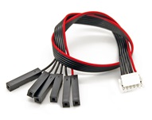

# SWD Hardware Debug Interface

PX4 usually runs on autopilot controller hardware that provides an ARM *Serial Wire Debug (SWD)* interface (SWD is a low pin-count physical interface for JTAG debugging on ARM-processors).
The interface can be used with any SWD-compatible debug probe (e.g. [Segger J-Link EDU Mini](https://www.segger.com/products/debug-probes/j-link/models/j-link-edu-mini/)) to set breakpoints in PX4 and step through the code running on a real device.
The SWD interface can also be used to add a new bootloader and/or firmware on a completely empty board (one that does not have the USB bootloader installed).

This topic explains how to connect the SWD interface on different boards (actually performing debugging is then covered in the associated [debugging topics](#debugging_topics)).

## Wiring/Connections

The SWD interface consists of the following pins.

Pin | Signal Type | Description
--- | --- | ---
`SWDIO` | I/O | Single bi-directional data pin.
`SWCLK` | Output | Clock signal.
`GND` | - | Ground pin.

> **Note** An autopilot may also have an *Serial Wire Output (SWO)* trace output pin.
  This is optional and not "part" of SWD. 
  If present it may be used in combination with *SWD* to emit real-time trace data/enable real-time tracing.
  
<!-- VTref | Input | Target reference voltage. Used to check if the target has power, to create the logic-level reference for the input comparators and to control the output logic levels to the target. It is normally fed from Vdd of the target board and must not have a series resistor. -->

The `SWDIO`, `SWCLK` and `GND` pins on the debug probe must be connected to the corresponding pins on the autopilot's (SWD) *debug port*.

Assuming you're using a JLink-Mini the connector looks like this.

The *standard* [Pixhawk Debug Port](https://pixhawk.org/pixhawk-connector-standard/#dronecode_debug) for FMUv3, FMUv4, FMUv5 uses a *JST SM06B* connector and has the following pin outputs (and mapping to the JLink mini).
Note, the `-` indicates a pin that is not required for SWD.

PX4 Mini | J-Link Mini
--- | ---
1 (Vtref) | -
2 (Console TX| -
3 (Console RX) | -
4 (SWDIO) | 2
5 (SWDCLK)| 4
6 (GND) | 3 or 5

Many boards to not use the *standard* Pixhawk debug port JST SM06B connector (either in error, or because they predate the standard).
You may therefore need to create/purchase an adapter to connect to the specific board you are debugging.

The sections below outline a number of commercially available adapters, and provide links to information about debug connectors on different boards.

## Adapters and Wiring {#adapters_and_wiring}

Where possible, we highly recommend that you use adapter boards rather than custom cables for connecting to SWD/JTAG debuggers and computers.

This reduces the risk or poor wiring contributing to debugging problems, and has the benefit that adapters usually provide a common interface for connecting to multiple popular flight controller boards.

The following section outlines some of the available adapters, and the boards you might use with them.

### Dronecode Probe (Adapter) {#dronecode_probe}

[Dronecode Probe](https://kb.zubax.com/display/MAINKB/Dronecode+Probe+documentation) is a generic JTAG/SWD + UART console adapter compatible with most ARM Cortex based designs, and in particular with Pixhawk series flight controllers (and other hardware that PX4 supports).

The probe's USB interface exposes two separate virtual serial port interfaces: one for connecting to the [System Console](../debug/system_console.md) (UART) and the other for an embedded GDB server (SWD interface).

The probe provides a DCD-M connector cable for attaching to the [Pixhawk Debug port](https://pixhawk.org/pixhawk-connector-standard/#dronecode_debug) (a 6-pos *JST SM06B*), which is used on many Pixhawk flight controllers.

The probe also provides a *6-pos DF13*m which can be attached to the Pixhawk 1 SERIAL4/5 port to debug the System Console (Not SWD).

> **Note** The *Dronecode Probe* is based on the [Black Magic Probe](#black_magic_probe).
  
### Black Magic Probe {#black_magic_probe}

The [Black Magic Probe](https://github.com/blacksphere/blackmagic/wiki) is much like the [Dronecode probe](#dronecode_probe) but does not come with the same adapters for connecting to Pixhawk series flight controllers.

Adapters can be purchased separately:
- [Drone Code Debug Adapter](https://1bitsquared.com/products/drone-code-debug-adapter) (1 BIT SQUARED).

### NXP Debug Adapter {#nxp_dapter}

NXP provide a debug adaptor for the [Hovergames RDDRONE-FMUK66](#fmuk66) (see below).
This connects to the RDDRONE-FMUK66 using a 7-pin JST-GH connector and splits out an SWD cable and UART cable (for the [System Console](../debug/system_console.md)).

This can directly be used with:
* [Hovergames RDDRONE-FMUK66](#fmuk66)

### Custom Cables

You can also create or build your own cables for the board you want to use.

## Pixhawk Series {#pixhawk_series}

[Pixhawk-series](https://docs.px4.io/master/en/flight_controller/pixhawk_series.html) boards from FMUv3 provide access to both SWD and System Console interfaces through a single FMU **DEBUG** port.
This can be used to load new bootloader/FMU Firmware and perform on-hardware SWD debugging on the FMU, or to access the System Console.

The **DEBUG** has changed and standardised across versions (so no single connector works on all boards)
- [Pixhawk debug port](https://pixhawk.org/pixhawk-connector-standard/#dronecode_debug) (JST SM06B connector).

> **Note** Many boards may also expose a separate DEBUG port for the IO board.
  This may be used to load a new bootloader or IO firmware.
  It can also be used to debug IO (this is rare).

### FMUv3

### FMUv3 Pro

FMUv3 Pro (and specifically the ) specifies the [Pixhawk debug port](https://pixhawk.org/pixhawk-connector-standard/#dronecode_debug) (JST SM06B connector).

You can therefore connect to it using a [Dronecode probe](#dronecode_probe) or other cabling or adapter that provides access to the interfaces.

### FMUv4/FMUv5

FMUv4 and FMUv5 specify the [Pixhawk debug port](https://pixhawk.org/pixhawk-connector-standard/#dronecode_debug).
You can therefore connect to it using a [Dronecode probe](#dronecode_probe) or other cabling or adapter that provides access to the interfaces.

Applicable boards include:
- Drotek Pixhawk 3 Pro (FMUv3pro)
- [mRo Pixracer](http://docs.px4.io/master/en/flight_controller/pixracer.html#pinouts) (FMUv4)

The debug port (JST SM06B connector) is documented for each board, and has the following pinout:

Pin | Signal | Volt
--- | --- | ---
1 (red) | VCC TARGET SHIFT | +3.3V
2 (blk) | CONSOLE TX (OUT) | +3.3V
3 (blk) | CONSOLE RX (IN) | +3.3V
4 (blk) | SWDIO | +3.3V
5 (blk) | SWCLK | +3.3V
6 (blk) | GND | GND

### FMUv5X

FMUv5X will have a new debug port definition, which uses a [10-pin JST SUR](https://www.digikey.com/product-detail/en/jst-sales-america-inc/A10SUR10SUR32W152B/455-4015-ND).

The new pinout adds additional SWD pins: SWO, nRST. It also adds TRACECLK, TRACED0 (Pins 7 and 8) which are are GPIOS to gate timing or 1 wire trace (Google ARM ETM).

The FMUv5x debug port pinout is:

Pin | Signal | Volt
--- | --- | ---
1 (red) | FMU VDD | +3.3V
2 (blk) | CONSOLE TX (OUT) | +3.3V
3 (blk) | CONSOLE RX (IN) | +3.3V
4 (blk) | SWDIO | +3.3V
5 (blk) | SWCLK | +3.3V
6 (blk) | SWO | +3.3V
7 (blk) | TRACECLK | +3.3V
8 (blk) | TRACED0 | +3.3V
9 (blk) | nRST | +3.3V
10 (blk) | GND | GND

> **Note** This board will have an additional/separate 8-pin JST SUR for ARM ETM TRACE).

<!-- 

## Hex Cube

TBD

Cube debug port information can be found here: [Debug ports](http://docs.px4.io/master/en/flight_controller/pixhawk-2.html#debug-ports).

If pulled apart the Cube has a 6 pin JST SUR connector (marked as J10) for both FMU and IO debugging.

-->

## FMUv2

FMUv2-based boards provide separate ports for accessing System Console and SWD interface.
- The System Console is accessed through the `SERIAL5 pins` (on the `SERIAL4/5` port).
  You can either use the Dronecode probe or an FTDI cable.
- The FMU and IO SWD ports (for JTAG debugging) are usually hidden inside the case.
  - The ports are *ARM 10-Pin JTAG connectors, which have the following pinout (pin 1 is usually indicated by a marker)
   
  - The position of the FMU and IO ports depends on the board.

### 3DR Pixhawk 1 {#pixhawk1}

The [3DR Pixhawk 1](https://docs.px4.io/master/en/flight_controller/pixhawk.html) is accessed as below.

#### System Console via Dronecode Probe

Connect the 6-pos DF13 1:1 cable on the [Dronecode probe](#dronecode_probe) to the SERIAL4/5 port of Pixhawk.

#### System Console via FTDI 3.3V Cable

An [FTDI 3.3V](http://www.digikey.com/product-detail/en/TTL-232R-3V3/768-1015-ND) (Digi-Key) can also be directly connected.

Pixhawk 1/2 | | FTDI | |
--- | --- | --- | ---
1 | +5V (red) |   | N/C
2 | S4 Tx     |   | N/C
3 | S4 Rx     |   | N/C
4 | S5 Tx     | 5 | FTDI RX (yellow)
5 | S5 Rx     | 4 | FTDI TX (orange)
6 | GND       | 1 | FTDI GND (black)

The connector pinout is shown in the figure below.

The complete wiring is shown below.

#### SWD via ARM 10-pin JTAG Connector

The FMU and IO SWD (JTAG) ports are hidden under the cover (which must be removed for hardware debugging).

The ports are ARM 10-pin JTAG connectors, which you will probably have to solder.
The pinout for the ports is shown below (the square marker in the corner above indicates pin 1).

## Other Boards

### Kakute F7

UART3 RX and TX are configured for System Console.

There are test points for SWD debugging: TBD.
<!-- Beat ? -->

### Hovergames RDDRONE-FMUK66 {#fmuk66}

The Hovergames RDDRONE-FMUK66 has a similar debug interface to Pixhawk (it supports an additional JTAG pin - nRST) and uses a JST-GH connector). 
The debug interface is documented here: [RDDRONE-FMUK66 Debug interface](https://nxp.gitbook.io/hovergames/rddrone-fmuk66/connectors/debug-interface-dcd-lz)

<!-- what am I seeing here? Ie the jlink and the FC are obvious. 
But what is the orange connector between them, and what is the connector out of the center of them doing? -->

## Debugging Topics {#debugging_topics}

After connecting the DEBUG interfaces, these topics explain how you can then perform on-target debugging:

- [System Console](../debug/system_console.md)
- [MCU Eclipse/J-Link Debugging for PX4](../debug/eclipse_jlink.md)

