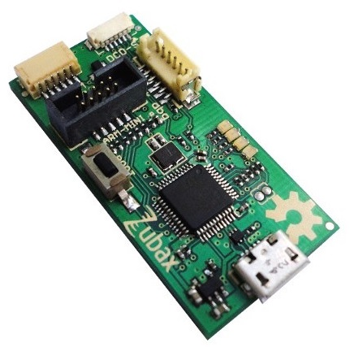
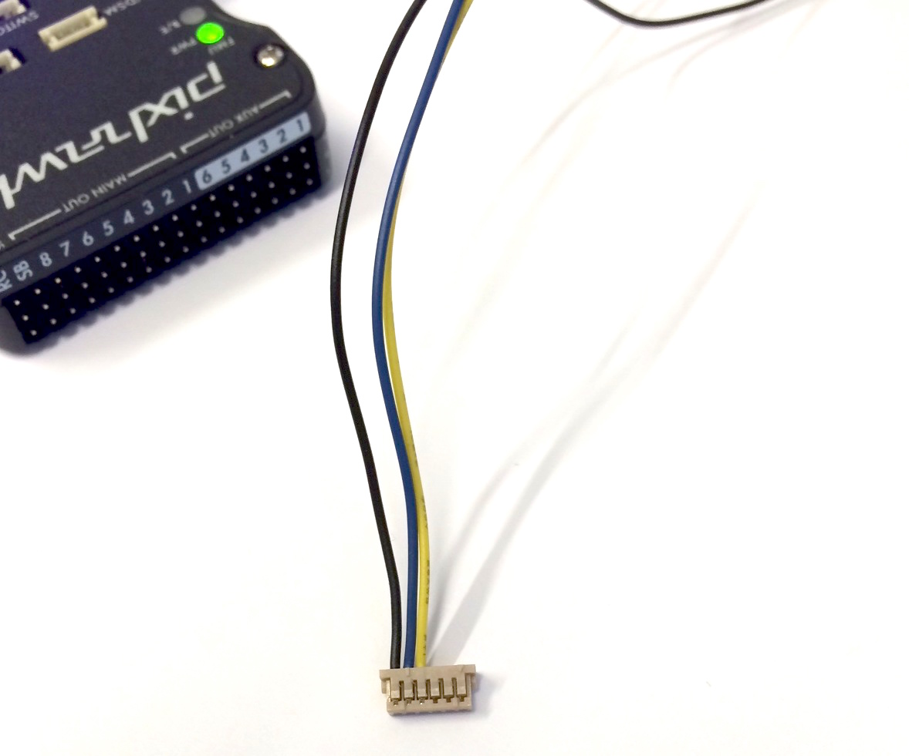
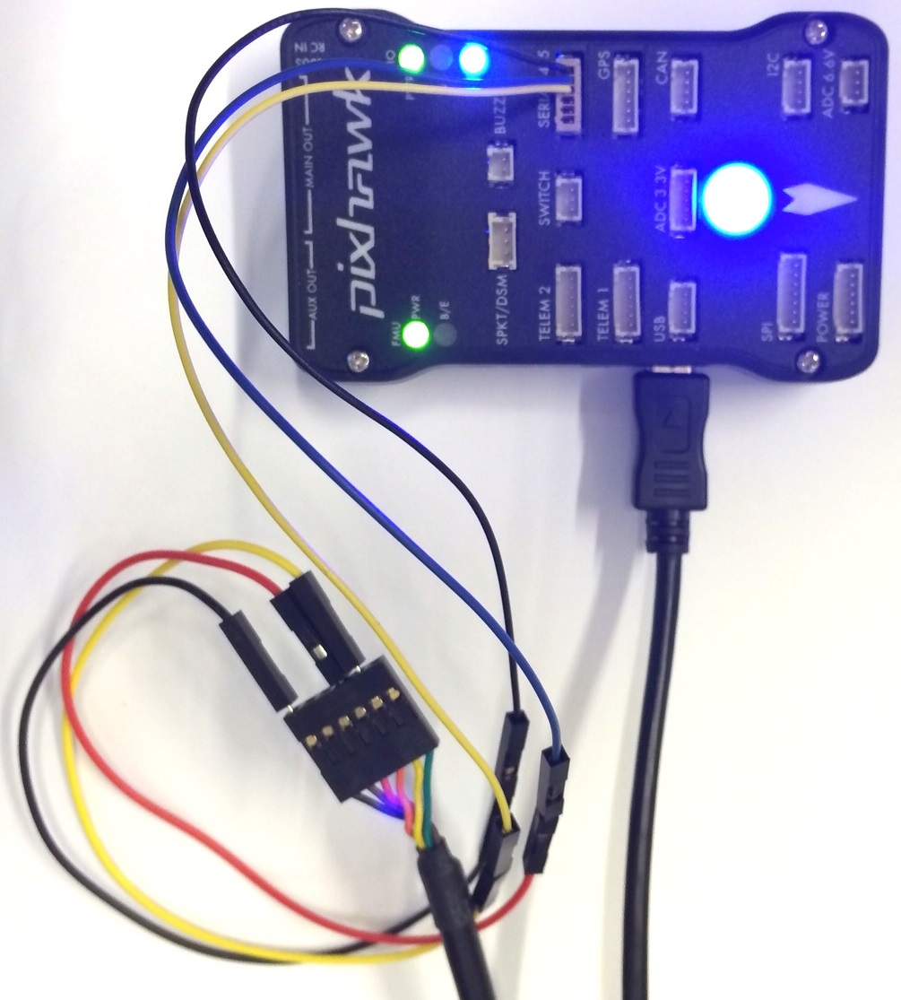

# PX4 System Console

The system console allows low-level access to the system, debug output and analysis of the system boot process. The most convenient way to connect it is by using a [Dronecode probe](https://shop.titaneliteinc.com/index.php?route=product/product&product_id=1294), but a plain FTDI cable can be used as well.

## System Console vs. Shells

There is just one *System Console*, which runs on one specific UART (the debug port, as configured in NuttX), and is commonly attached via FTDI cable.
- Used for *low-level debugging/development*: bootup, NuttX, startup scripts, board bringup, development on central parts of PX4 (e.g. uORB).
- In particular, is the only place where all boot output (including information about applications auto-started on boot) is printed.

Shells provide higher-level access to the system:
- Used for basic module testing/running commands.
- Only display the output of modules you start (and therefore cannot debug the boot process).
- Cannot display the output of tasks running on the work queue.

There can be several shells, either running on a dedicated UART, or via MAVLink.
Since MAVLink provides more flexibility, the shell is nowadays only used [via MAVLink](#mavlink_shell).


## Snapdragon Flight: Wiring the Console

The developer kit comes with a breakout board with three pins to access the console. Connect the bundled FTDI cable to the header and the breakout board to the expansion connector.

## Pixracer / Pixhawk v3: Wiring the Console

Connect the 6-pos JST SH 1:1 cable to the Dronecode probe or connect the individual pins of the cable to a FTDI cable like this:

| Pixracer / Pixhawk v3  |         | FTDI    |        |
| -- | -- | -- | -- |
|1         | +5V (red)     |         | N/C    |
|2         | UART7 Tx      | 5       | FTDI RX (yellow)  |
|3         | UART7 Rx      | 4       | FTDI TX (orange)  |
|4         | SWDIO      |         | N/C   |
|5         | SWCLK      |         | N/C   |
|6         | GND     | 1       | FTDI GND (black)   |

## Pixhawk v1: Wiring the Console

The system console can be accessed through the Dronecode probe or an FTDI cable. Both options are explained in the section below.

### Connecting via Dronecode Probe

Connect the 6-pos DF13 1:1 cable on the [Dronecode probe](http://nicadrone.com/index.php?id_product=61&controller=product) to the SERIAL4/5 port of Pixhawk.



### Connecting via FTDI 3.3V Cable

If no Dronecode probe is at hand an FTDI 3.3V (Digi-Key: [768-1015-ND](http://www.digikey.com/product-detail/en/TTL-232R-3V3/768-1015-ND/1836393)) will do as well.

| Pixhawk 1/2  |         | FTDI    |        |
| -- | -- | -- | -- |
|1         | +5V (red)     |         | N/C    |
|2         | S4 Tx      |         | N/C   |
|3         | S4 Rx      |         | N/C   |
|4         | S5 Tx      | 5       | FTDI RX (yellow)   |
|5         | S5 Rx      | 4       | FTDI TX (orange)   |
|6         | GND     | 1       | FTDI GND (black)   |

The connector pinout is shown in the figure below.



The complete wiring is shown below.



## Opening the Console

After the console connection is wired up, use the default serial port tool of your choice or the defaults described below:

### Linux / Mac OS: Screen

Install screen on Ubuntu (Mac OS already has it installed):

```bash
sudo apt-get install screen
```

* Serial: Pixhawk v1 / Pixracer use 57600 baud
* Serial: Snapdragon Flight uses 115200 baud

Connect screen at BAUDRATE baud, 8 data bits, 1 stop bit to the right serial port (use `ls /dev/tty*` and watch what changes when unplugging / replugging the USB device). Common names are `/dev/ttyUSB0` and `/dev/ttyACM0` for Linux and `/dev/tty.usbserial-ABCBD` for Mac OS.

```bash
screen /dev/ttyXXX BAUDRATE 8N1
```

### Windows: PuTTY

Download [PuTTY](http://www.chiark.greenend.org.uk/~sgtatham/putty/download.html) and start it.

Then select 'serial connection' and set the port parameters to:

* 57600 baud
* 8 data bits
* 1 stop bit

## Getting Started on the Console

Type `ls` to view the local file system, type `free` to see the remaining free RAM. The console will also display the system boot log when power-cycling the board.

```bash
nsh> ls
nsh> free
```

## MAVLink Shell{#mavlink_shell}

For NuttX-based systems (Pixhawk, Pixracer, ...), the nsh console can also be
accessed via MAVLink. This works via serial link (USB/Telemetry) or WiFi (UDP/TCP). Make sure
that QGC is not running, then start the shell with e.g.
`./Tools/mavlink_shell.py /dev/ttyACM0` (in the Firmware source, you may first have to install the dependencies with `sudo pip install pymavlink pyserial`).
Use `./Tools/mavlink_shell.py -h` to get a description of all available arguments which also displays the IP address of wifi connection.
For example `./Tools/mavlink_shell.py <IP address>` can be used to start nsh shell via wifi connection to the autopilot.
.

> **Tip** You can also use the nsh shell on [QGC directly](https://docs.qgroundcontrol.com/en/analyze_view/mavlink_console.html).

# Snapdragon DSP Console

When you are connected to your Snapdragon board via usb you have access to the px4 shell on the posix side of things.
The interaction with the DSP side (QuRT) is enabled with the `qshell` posix app and its QuRT companion.

With the Snapdragon connected via USB, open the mini-dm to see the output of the DSP:
```
${HEXAGON_SDK_ROOT}/tools/debug/mini-dm/Linux_Debug/mini-dm
```

Note: Alternatively, especially on Mac, you can also use [nano-dm](https://github.com/kevinmehall/nano-dm).

Run the main app on the linaro side:
```
cd /home/linaro
./px4 -s px4.config
```

You can now use all apps loaded on the DSP from the linaro shell with the following syntax:
```
pxh> qshell command [args ...]
```

For example, to see the available QuRT apps:
```
pxh> qshell list_tasks
```

The output of the executed command is displayed on the minidm.
