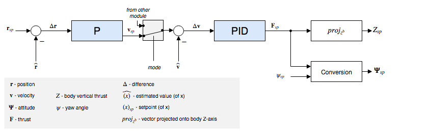

# Controller Diagrams

This section contains diagrams for the main PX4 controllers.

## Multicopter Position Controller

 

<!-- The drawing is on draw.io: https://drive.google.com/open?id=13Mzjks1KqBiZZQs15nDN0r0Y9gM_EjtX. Request access from dev team. -->

* Estimates come from [EKF2](../tutorials/tuning_the_ecl_ekf.md).
* This is a standard cascaded position-velocity loop.
* Depending on the mode, the outer (position) loop is bypassed (shown as a multiplexer after the outer loop). The position loop is only used when holding position or when the requested velocity in an axis is null.
* The integrator in the inner loop (velocity) controller includes an anti-reset windup (ARW) using a clamping method.