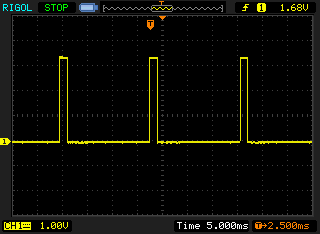
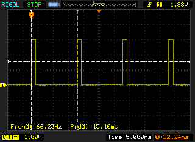
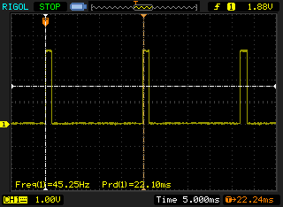
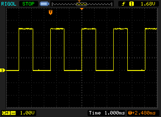

# PWM Servos and Motor Controllers

This section describes the interfaces to brushless motor controllers and servos.

## ESC Power Connection

Each PWM Electronic Speed Controller (ESC) has at least five main wires:
- Power VBAT (usually thick and red)
- Power GND (usually thick and black)

And on the servo plug:
- PWM signal (usually white or yellow)
- +5V (usually red or orange)
- GND (usually black or brown)

> **Tip** Always connect Power VBAT and GND as well as the PWM signal and GND from the servo plug. 
There is **no setup** that does not require signal ground to be connected!

The +5V line on the servo plug has a special purpose, and how it should be connected very much depends on the particular ESC in use:

- On a normal fixed wing ESC (which are often abused for multicopters), it provides the output of a BEC to power servos. Its safe to connect to Pixhawk. 
  Whether its safe to connect **TWO OR MORE** of the +5V outputs to the servo rail depends on the ESC model. 
  As a rule of thumb only connecting the output of one BEC is a good idea.
- On a multicopter ESC this line might be not connected at all and neither power the autopilot nor power the ESC if the autopilot applies 5V. 
  In this case all these can be connected. 
  Some examples of ESCs built in this fashion are DJI ESCs.
- On an opto-isolated ESC **without** BEC this line might need to be connected **and powered with 5V from the autopilot**, as it might be needed to drive the opto-isolator. 
  In this case please provide power to the servo rail by connecting an additional BEC. 
  It is unsafe to power servos or ESCs from the autopilot's avionics power supply, which is why **Pixhawk series** flight controllersdo not provide power for the servo rail (The AUX servo rail is unpowered and is limited to 1A - always connect an additional BEC).

> **Tip** Instead of cutting the +5V line you can gently lift of the locking tab of the plastic housing of the servo connector for that pin (e.g. using a cutter blade or small screw driver) and pull the pin out. 
Isolate it with electrical isolation tape and tape it to the servo cable. 
This allows to undo this later easily.

## PWM Values

The PWM value sent out depends on the flight stack and configuration used. 
Most ESCs must see a low value before they will spin up a motor to higher values (to protects user who have the throttle stick in the middle position on power-up). 
This low value barrier varies between roughly 1200 and 900 us. 
The native stack therefore sends a value of 900 while being disarmed to ensure the ESC sees a valid low pulse. 
Other flight stacks (e.g. APM) might behave differently.

## Pulse Shape, Voltage and Update Rate

Pixhawk uses active high pulses, like all the major brands (Futaba, Spektrum, FrSky) use. 
PWM interfaces are not formally standardised, however, the utilised micro controllers use TTL or CMOS voltage levels. 
TTL is defined as low < 0.8V and high > 2.0V with some manufacturers using > 2.4V for additional noise margin. 
CMOS logic is defined with similar voltage levels. 
5V levels are **never** required to successfully switch to an *on* state.

> **Tip** Futaba, FrSky and Spektrum receivers output 3.3V or 3.0V voltage levels, as they are well above 2.4V. 
  Pixhawk has adopted this common industry pattern and outputs 3.3V levels on recent boards.

Note that on a normal quad rotor motors spin at 100-130 Hz. 
This means that if the bus operates at 400 Hz the motor receives new commands three to four times during a single revolution, but it is physically impossible to change the blade speed (due to electric effects and blade inertia) that fast.

**Why are people then claiming high update rates are relevant?**

Historically systems used the fast update rates to overcome moving average filters on the speed controller input which were designed to prevent electrical overload due to noise on the reference signal / fast rotation rate changes. 
This means that the high update rates put the motor controllers into a mode of operation they were not designed for. 
ESCs designed for multicopters (running e.g. SimonK or AfroESCs) do not have these filters in place and could be just used at 100-250 Hz with the same or better response times.
Another reason to have a high update rate is when the output of the attitude control loop is not synchronised to the PWM generation. 
A higher update rate is then desirable to effectively limit the dead time between control output and motor update. 
In any of these cases the main limiting factor is the PWM signal spec itself, which takes 1-2 ms (0-100% motor speed) to transmit and limits the update rate to < 500 Hz.

## Connecting the Ground Wire

An electric signal is defined as the deviation from a nominal zero-value. 
For normal signals this reference is ground (GND). 
Therefore just one wire is never enough to transmit a signal - it always needs a reference (on differential signals, the reference is established by the difference). 
A wiring setup not in need of a ground reference doesn't exist, and if the path the current has to take to "return" is much longer than the signal wire, complex electromagnetic effects can come into play. 
The image below shows how noisy the signal becomes if GND is not connected.

## Signal Shape Comparison

As the scope shots below show the Pixhawk signal arrives faster (at 400 Hz when configured for multicopters instead of 50-60 Hz), but the overall signal shape and voltage levels are exactly the same as for common RC receivers.

### FrSky D4R-II 

3.3V levels, 55 Hz (default, users are advised to flash the 27 ms / 37 Hz firmware)

### Futaba R7008SB

3.0V levels, 66 Hz

### Spektrum AR 10000

3.3V levels, 45 Hz

### Pixhawk (PX4FMU v2.4.3)

3.3V levels, 400 Hz (**400 Hz ONLY if configured as multicopter, default is 50 Hz**)

## Troubleshooting

Pixhawk is compatible with all ESCs on the market (as the comparison with the common RC receiver signals showed). 
If a particular ESC is not operational, it is either wired up incorrectly, or the flight control stack used sends out the wrong values for this particular ESC.

### Ground Connection

Check that the ground (black wire) of the ESC servo connector is connected to Pixhawk. 
**IT IS UNSAFE TO FLY WITHOUT GROUND CONNECTED**. 
This is because for every positive pulse (the ESC signal) there needs to be an adjacent ground return path for a clean signal shape.

### Power Connection / Opto-isolated ESCs

Please see the first section of this page for a complete explanation on power connection considerations. 
If you are using an opto-isolated ESC not providing a BEC / power output, please ensure that the ESC does not need its +5V line powered for the opto-isolator.

### Missing Valid Minimum Value

If the ESC requires to see a special low value pulse first before switching on, it is necessary that the flight control stack sends this value initially. 
The PX4 flight stack for example sends a 900 us pulse while being disarmed, ensuring all ESCs initialise correctly (and do not annoy the user because they beep at him).

### Timeout

Some ESCs might time out (do not allow to switch on the motor) after not having received a valid low pulse a few seconds after power on. 
This again depends on the flight control stack. 
As the PX4 flight stack sends a 900 us idle pulse right after power on, ESCs will not time out.