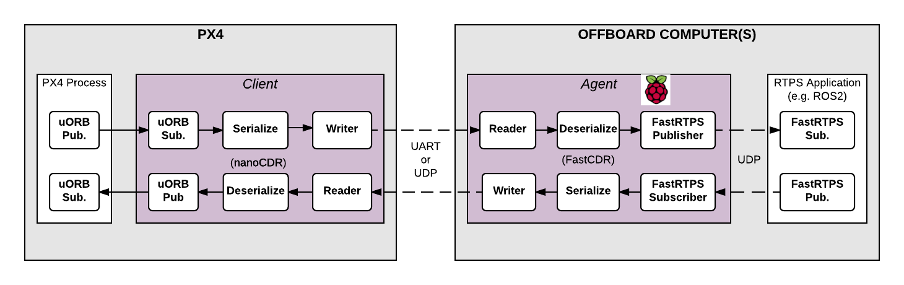

# RTPS/ROS2 Interface: PX4-FastRTPS Bridge

The *PX4-FastRTPS Bridge* adds a Real Time Publish Subscribe (RTPS) interface to PX4, enabling the exchange of [uORB messages](../middleware/uorb.md) between PX4 components and (offboard) *FastRTPS* applications.

> **Note** RTPS is the underlying protocol of the Object Management Group's (OMG) Data Distribution Service (DDS) standard. It aims to enable scalable, real-time, dependable, high-performance and interoperable data communication using the publish/subscribe pattern. *FastRTPS* is a very lightweight cross-platform implementation of the latest version of the RTPS protocol and a minimum DDS API.

RTPS has been adopted as the middleware for the ROS2 (Robot Operating System). The bridge allows us to better integrate with ROS2, making it easy to share sensor values, commands, and other vehicle information.

This topic describes the bridge architecture, how it is compiled, and how to write a simple FastRTSP application to subscribe to PX4 changes.


## Architectural overview



The main elements of the architecture are the client and agent processes shown in the diagram above.

- The *Client* is PX4 middleware daemon process that runs on the flight controller. It subscribes to uORB topics published by other PX4 components and sends any updates to the *Agent* (via a UART or UDP port). It also receives messages from the *Agent* and publishes them as uORB message on PX4.
- The *Agent* runs as a daemon process on an offboard computer. It watches for uORB update messages from the *Client* and (re)publishes them over RTPS. It also subscribes to "uORB" RTPS messages from other RTPS applications and forwards them to the *Client*.
- The *Agent* and *Client* are connected via a serial link (UART) or UDP network. The uORB information is [CDR serialized](https://en.wikipedia.org/wiki/Common_Data_Representation) for sending (*CDR serialization* provides a common format for exchanging serial data between different platforms).
- The *Agent* and any *FastRTPS* applications are connected via UDP, and may be on the same or another device. In a typical configuration they will both be on the same system (e.g. a development computer, Linux companion computer or compute board), connected to the *Client* over a Wifi link or via USB.


## Code generation

All the code needed to create, build and use the bridge is automatically generated when the PX4 Firmware is compiled. 

The *Client* application is also compiled and built into the firmware as part of the normal build process. The *Agent* must be separately/manually compiled for the target computer.

> **Note** [Fast RTPS must be installed](../setup/fast-rtps-installation.md) in order to generate the required code!

<span></span>
> **Tip** The bridge code can also be [manually generated](micrortps_manual_code_generation.md). Most users will not need to do so, but the linked topic provides a more detailed overview of the build process and can be useful for troubleshooting.


## Supported uORB messages

The generated bridge code will enable a specified subset of uORB topics to be published/subscribed via RTPS.

For *automatic code generation* (via the normal PX4 firmware build process) this set must be listed in the **.cmake** file (**cmake/configs**) for your target platform.

```cmake
set(config_rtps_send_topics
  sensor_combined
   # Add new topic...
   )

set(config_rtps_receive_topics
   sensor_baro
   # Add new topic...
   )
```

> **Caution** At time of writing (August 2017), only the small set of uORB topics listed above are included in our cmake files: **posix_sitl_default.cmake**, **nuttx_px4fmu-v4_default.cmake**, **posix_sdflight_default.cmake**. It is likely you will need to edit your *cmake* file and add additional uORB topics. In future we hope to define a larger standard set. 

For *manual code generation* the uORB topics that will be supported by the bridge are specified when you call **generate_microRTPS_bridge.py** (using the `-s`/`--send` and `-r`/`--receive` flags). See [Manual Generation of the Code](../middleware/micrortps_manual_code_generation.md) for more information.


## Client (PX4 Firmware)

The *Client* source code is generated, compiled and built into the PX4 firmware as part of the normal build process. 

To build and upload the firmware for NuttX/Pixhawk flight controllers:
```sh
make px4fmu-v4_default upload
```

To build and upload the firmware for Qualcomm Snapdragon Flight:
```sh
$ make eagle_default upload
```
  

The *Client* application can be launched from [NuttShell/System Console](../debug/system_console.md). The command syntax is shown below (you can specify a variable number of arguments):

```sh
> micrortps_client start|stop [options]
  -t <transport>          [UART|UDP] Default UART
  -d <device>             UART device. Default /dev/ttyACM0
  -u <update_time_ms>     Time in ms for uORB subscribed topics update. Default 0
  -l <loops>              How many iterations will this program have. -1 for infinite. Default 10000.
  -w <sleep_time_ms>      Time in ms for which each iteration sleep. Default 1ms
  -b <baudrate>           UART device baudrate. Default 460800
  -p <poll_ms>            Time in ms to poll over UART. Default 1ms
  -r <reception port>     UDP port for receiving. Default 2019
  -s <sending port>       UDP port for sending. Default 2020
```

By default the *Client* runs for 10000 loops and then stops. To run the *Client* continuously, enter the following command:

```sh
micrortps_client start -l -1
```

> **Note** The PX4 Firmware initialisation code may in future automatically start the *Client* as a permanent daemon process. In the meantime you will need to start the client manually.<!-- at that point, most of this section would move into the "manual generation" doc: https://github.com/PX4/Firmware/pull/7663#issuecomment-317928506 -->


## Agent (Off Board FastRTPS Interface)

The *Agent* code is automatically *generated* when you build the associated PX4 firmware. You can find the source here: **build_BUILDPLATFORM/src/modules/micrortps_bridge/micrortps_agent/**.

To build the *Agent* application, compile the code:

```sh
cd src/modules/micrortps_bridge/microRTPS_agent
mkdir build && cd build
cmake ..
make
```

> **Note** To cross-compile for the *Qualcomm Snapdragon Flight* platform see [this link](https://github.com/eProsima/PX4-FastRTPS-PoC-Snapdragon-UDP#how-to-use).


The command syntax for the *Agent* is listed below:

```text
$ ./micrortps_agent [options]
  -t <transport>          [UART|UDP] Default UART.
  -d <device>             UART device. Default /dev/ttyACM0.
  -w <sleep_time_us>      Time in us for which each iteration sleep. Default 1ms.
  -b <baudrate>           UART device baudrate. Default 460800.
  -p <poll_ms>            Time in ms to poll over UART. Default 1ms.
  -r <reception port>     UDP port for receiving. Default 2019.
  -s <sending port>       UDP port for sending. Default 2020.
```

To launch the *Agent*, run `micrortps_agent` with appropriate options for specifying the connection to the *Client* (the default options connect from a Linux device to the *Client* over a UART port).


## Creating a FastRTPS Listener application

Once the *Client* (on the flight controller) and the *Agent* (on an offboard computer) are running and connected, *FastRTPS* applications can publish and subscribe to uORB topics on PX4 using RTPS. 

This example shows how to create a *FastRTPS* "listener" application that subscribes to the `sensor_combined` topic and prints out updates (from PX4). A connected RTPS application can run on any computer on the same network as the *Agent*. For this example the *Agent* and *Listener application* will be on the same computer.

The *fastrtpsgen* script can be used to generate a simple RTPS application from an IDL message file. 

> **Note** RTPS messages are defined in IDL files and compiled to C++ using *fastrtpsgen*. As part of building the bridge code, IDL files are generated for the uORB message files that may be sent/received (see **build_BUILDPLATFORM/src/modules/micrortps_bridge/micrortps_agent/idl/*.idl**). These IDL files are needed when you create a FastRTPS application to communicate with PX4.

Enter the following commands to create the application:

```sh
cd /path/to/PX4/Firmware/src/modules/micrortps_bridge
mkdir micrortps_listener
cd micrortps_listener
fastrtpsgen -example x64Linux2.6gcc ../micrortps_agent/idl/sensor_combined_.idl
```

This creates a basic subscriber and publisher, and a main-application to run them. To print out the data from the `sensor_combined` topic, modify the `onNewDataMessage()` method in **sensor_combined_Subscriber.cxx**:

```sh
void sensor_combined_Subscriber::SubListener::onNewDataMessage(Subscriber* sub)
{
    // Take data
    sensor_combined_ st;

    if(sub->takeNextData(&st, &m_info))
    {
        if(m_info.sampleKind == ALIVE)
        {
            // Print your structure data here.
            ++n_msg;
            std::cout << "\n\n\n\n\n\n\n\n\n\n";
            std::cout << "Sample received, count=" << n_msg << std::endl;
            std::cout << "=============================" << std::endl;
            std::cout << "gyro_rad: " << st.gyro_rad().at(0);
            std::cout << ", " << st.gyro_rad().at(1);
            std::cout << ", " << st.gyro_rad().at(2) << std::endl;
            std::cout << "gyro_integral_dt: " << st.gyro_integral_dt() << std::endl;
            std::cout << "accelerometer_timestamp_relative: " << st.accelerometer_timestamp_relative() << std::endl;
            std::cout << "accelerometer_m_s2: " << st.accelerometer_m_s2().at(0);
            std::cout << ", " << st.accelerometer_m_s2().at(1);
            std::cout << ", " << st.accelerometer_m_s2().at(2) << std::endl;
            std::cout << "accelerometer_integral_dt: " << st.accelerometer_integral_dt() << std::endl;
            std::cout << "magnetometer_timestamp_relative: " << st.magnetometer_timestamp_relative() << std::endl;
            std::cout << "magnetometer_ga: " << st.magnetometer_ga().at(0);
            std::cout << ", " << st.magnetometer_ga().at(1);
            std::cout << ", " << st.magnetometer_ga().at(2) << std::endl;
            std::cout << "baro_timestamp_relative: " << st.baro_timestamp_relative() << std::endl;
            std::cout << "baro_alt_meter: " << st.baro_alt_meter() << std::endl;
            std::cout << "baro_temp_celcius: " << st.baro_temp_celcius() << std::endl;

        }
    }
}
```

To build and run the application on Linux:

```sh
make -f makefile_x64Linux2.6gcc
bin/*/sensor_combined_PublisherSubscriber subscriber
```

Now you should see the sensor information being printed out:

```sh
Sample received, count=10119
Received sensor_combined data
=============================
gyro_rad: -0.0103228, 0.0140477, 0.000319406
gyro_integral_dt: 0.004
accelerometer_timestamp_relative: 0
accelerometer_m_s2: -2.82708, -6.34799, -7.41101
accelerometer_integral_dt: 0.004
magnetometer_timestamp_relative: -10210
magnetometer_ga: 0.60171, 0.0405879, -0.040995
baro_timestamp_relative: -17469
baro_alt_meter: 368.647
baro_temp_celcius: 43.93
```

> **Note** If the *Listener application* does not print anything, make sure the *Client* is running.


## Examples/tests

The following examples provide additional real-world demonstrations of how to use the features described in this topic.

* [Throughput test](../middleware/micrortps_throughput_test.md): A simple simple test to measure the throughput of the bridge.


## Troubleshooting

### Client reports that selected UART port is busy

If the selected UART port is busy, it's possible that the MAVLink application is already being used. If both MAVLink and RTPS connections are required you will have to either move the connection to use another port or configure the port so that it can be shared. <!-- https://github.com/PX4/Devguide/issues/233 -->

> **Tip** A quick/temporary fix to allow bridge testing during development is to stop MAVLink from *NuttShell*:
  ```sh
  mavlink stop-all
  ```

### Agent not built/fastrtpsgen is not found

The *Agent* code is generated using a *FastRTPS* tool called *fastrtpsgen*.  

If you haven't installed Fast RTPS in the default path then you must to specify its installation directory by setting the `FASTRTPSGEN_DIR` environment variable before executing *make*.

On Linux/Mac this is done as shown below:

```sh
export FASTRTPSGEN_DIR=/path/to/fastrtps/install/folder/bin
```

> **Note** This should not be a problem if [Fast RTPS is installed in the default location](../setup/fast-rtps-installation.md).

### Enable UART on Raspberry Pi

For UART transport on Raspberry Pi you will have to enable the serial port:

1. Make sure the `userid` (default is pi) is a member of the `dialout` group:

  ```sh
  groups pi
  sudo usermod -a -G dialout pi
  ```

2. You need to stop the already running on the GPIO serial console:

  ```sh
  sudo raspi-config
  ```

  In the menu showed go to **Interfacing options > Serial**. Select **NO** for *Would you like a login shell to be accessible over serial?*. Valid and reboot.

3. Check UART in kernel:

  ```sh
  sudo vi /boot/config.txt
  ```

  And make sure that the `enable_uart` value is set to 1:
  ```txt
  enable_uart=1
  ```


## Additional information

* [FastRTPS Installation](../setup/fast-rtps-installation.md)
* [Manually Generate Client and Agent Code](micrortps_manual_code_generation.md)
* [DDS and ROS middleware implementations](https://github.com/ros2/ros2/wiki/DDS-and-ROS-middleware-implementations)

