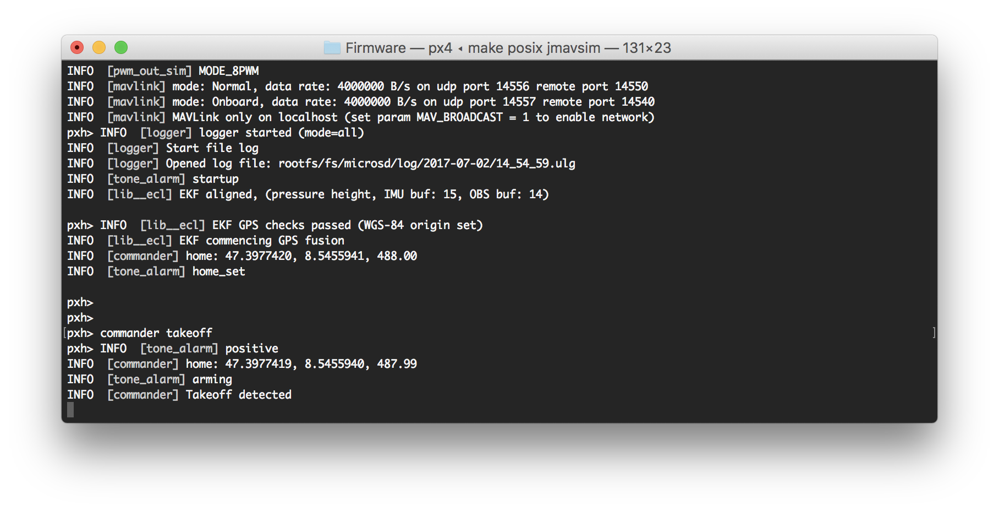
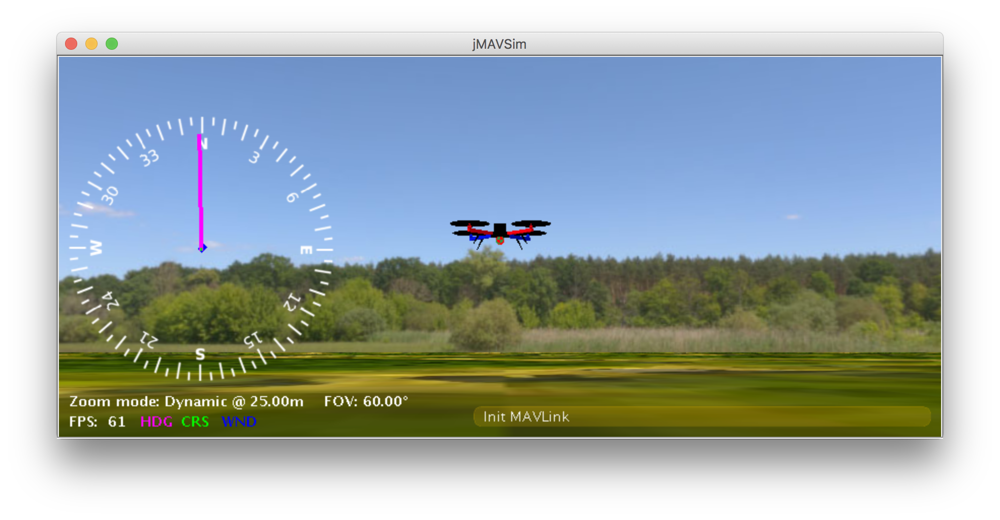

# Building PX4 Software

PX4 can be built on the console or in an IDE, for both simulated and hardware targets.

> **Note** Before following these instructions you must first install the [Developer Toolchain](../setup/dev_env.md) for your host operating system and target hardware.

<span></span>
> **Tip** For solutions to common build problems see [Troubleshooting](#troubleshooting) below.

## Downloading PX4 Source Code {#get_px4_code}

The PX4 source code is stored on Github in the [PX4/Firmware](https://github.com/PX4/Firmware) repository.
We recommend that you [fork](https://help.github.com/articles/fork-a-repo/) this repository (creating a copy associated with your own Github account), and then [clone](https://help.github.com/articles/cloning-a-repository/) the source to your local computer.

> **Tip** Forking the repository allows you to better manage your custom code.
  Later on you will be able to use *git* to share changes with the main project.

The steps to fork and clone the project source code are:

1. [Sign up](https://github.com/) to Github.
1. Go to the [Firmware](https://github.com/PX4/Firmware) repository and click the **Fork** button near the upper right corner.
   This will create and open the forked repository.

   
1. Copy the repository URL for your *Firmware* repository fork.
   The easiest way to do this is to click the **Clone or download** button and then copy the URL:

   
1. Open a command prompt/terminal on your computer
   * On OS X, hit ⌘-space and search for 'terminal'.
   * On Ubuntu, click the launch bar and search for 'terminal'.
   * On Windows, find the PX4 folder in the start menu and click on 'PX4 Console'.
1. Clone the repository fork using the copied URL. This will look something like:
   ```
   git clone https://github.com/<youraccountname>/Firmware.git
   ```
   
   > **Tip** If you're just experimenting (and don't want to make any sort of permanent changes) you can simply clone the main Firmware repository as shown:
   >  ```sh
   >  git clone https://github.com/PX4/Firmware.git
   >  ```
   
   Windows users [refer to the Github help](https://help.github.com/desktop/guides/getting-started-with-github-desktop/installing-github-desktop/). 
   You can use a *git* command line client as above or instead perform the same actions with the *Github for Windows* app.

This will copy *most* of the *very latest* version of PX4 source code onto your computer 
(the rest of the code is automatically fetched from other [git submodules](https://git-scm.com/book/en/v2/Git-Tools-Submodules) when you build PX4).

<span id="specific_version_source"></span>

### Get a Specific Release

To get the source code for a *specific older release*:
1. Clone the Firmware repo and navigate into Firmware directory:
   ```sh
   git clone https://github.com/PX4/Firmware.git
   cd Firmware
   ```
1. List all releases (tags)
   ```sh
   git tag -l
   ```
1. Checkout code for particular tag (e.g. for tag 1.7.4beta)
   ```sh
   git checkout v1.7.4beta
   ```


## First Build (Using the jMAVSim Simulator) {#jmavsim_build}

For the first build we'll build for a simulated target using a console environment.
This allows us to validate the system setup before moving on to real hardware and an IDE.

Navigate into the **Firmware** directory and start [jMAVSim](../simulation/jmavsim.md) using the following command:
```sh
make px4_sitl jmavsim
```

This will bring up the PX4 console below:



The drone can be flown by typing:
```sh
pxh> commander takeoff
```



The drone can be landed by typing `commander land` and the whole simulation can be stopped by doing **CTRL+C** (or by entering `shutdown`).

Flying the simulation with the ground control station is closer to the real operation of the vehicle. Click on a location in the map while the vehicle is flying (takeoff flight mode) and enable the slider. 
This will reposition the vehicle.


> **Tip** PX4 can be used with a number of other [Simulators](../simulation/README.md), including [Gazebo Simulation](../simulation/gazebo.md) and [AirSim Simulation](../simulation/airsim.md). 
  These are also started with *make* - e.g.
  ```
  make px4_sitl gazebo
  ```

## NuttX / Pixhawk Based Boards {#nuttx}

### Building {#building_nuttx}

To build for NuttX- or Pixhawk- based boards, navigate into the **Firmware** directory and then call `make` with the build target for your board.

For example, to build for *Pixracer* you would use the following command:
```sh
cd Firmware
make px4_fmu-v4_default
```

> **Note** In the example above the first part of the build target `px4_fmu-v4` is the firmware for a particular flight controller hardware and `default` is the configuration name (in this case the "default" configuration).
  The `default` is optional so you could instead do: 
  ```
  make px4_fmu-v4
  ```

A successful run will end with similar output to:
```sh
-- Build files have been written to: /home/youruser/src/Firmware/build/px4_fmu-v4_default
[954/954] Creating /home/youruser/src/Firmware/build/px4_fmu-v4_default/px4_fmu-v4_default.px4
```

The following list shows the build commands for common boards:
* Pixhawk 4: `make px4_fmu-v5_default`
* [Pixracer](https://docs.px4.io/en/flight_controller/pixracer.html): `make px4_fmu-v4_default`
* [Pixhawk 3 Pro](https://docs.px4.io/en/flight_controller/pixhawk3_pro.html): `make px4_fmu-v4pro_default`
* [Pixhawk Mini](https://docs.px4.io/en/flight_controller/pixhawk_mini.html): `make px4_fmu-v3_default`
* [Pixhawk 2](https://docs.px4.io/en/flight_controller/pixhawk-2.html): `make px4_fmu-v3_default`
* [mRo Pixhawk](https://docs.px4.io/en/flight_controller/mro_pixhawk.html): `make px4_fmu-v3_default` (supports 2MB Flash)
* [HKPilot32](https://docs.px4.io/en/flight_controller/HKPilot32.html): `make px4_fmu-v2_default`
* [Pixfalcon](https://docs.px4.io/en/flight_controller/pixfalcon.html): `make px4_fmu-v2_default`
* [Dropix](https://docs.px4.io/en/flight_controller/dropix.html): `make px4_fmu-v2_default`
* [MindPX](https://docs.px4.io/en/flight_controller/mindpx.html)/[MindRacer](https://docs.px4.io/en/flight_controller/mindracer.html): `make airmind_mindpx-v2_default`
* [mRo X-2.1](https://docs.px4.io/en/flight_controller/mro_x2.1.html): `make auav_x21_default` 
* [Crazyflie 2.0](https://docs.px4.io/en/flight_controller/crazyflie2.html): `make bitcraze_crazyflie_default`
* [Intel® Aero Ready to Fly Drone](https://docs.px4.io/en/flight_controller/intel_aero.html): `make intel_aerofc-v1_default`
* [Pixhawk 1](https://docs.px4.io/en/flight_controller/pixhawk.html): `make px4_fmu-v2_default`
  > **Warning** You **must** use a [supported version of GCC](../setup/dev_env_linux_ubuntu.md#nuttx-based-hardware) to build this board (e.g. the same as used by [CI/docker](../test_and_ci/docker.md)) or remove modules from the build. Building with an unsupported GCC may fail, as PX4 is close to the board's 1MB flash limit.
* Pixhawk 1 with 2 MB flash: `make px4_fmu-v3_default`

> **Note** Generally the `_default` suffix is optional (i.e. you can also build using `make px4_fmu-v4`, `make bitcraze_crazyflie`, etc.).


### Uploading Firmware (Flashing the board)

Append `upload` to the make commands to upload the compiled binary to the autopilot hardware via USB.
For example

```sh
make px4_fmu-v4_default upload
```

A successful run will end with this output:

```sh
Erase  : [====================] 100.0%
Program: [====================] 100.0%
Verify : [====================] 100.0%
Rebooting.

[100%] Built target upload
```

## Other Boards

The following boards have more complicated build and/or deployment instructions.

### Raspberry Pi 2/3 Boards

The command below builds the target for [Raspberry Pi 2/3 Navio2](https://docs.px4.io/en/flight_controller/raspberry_pi_navio2.html).

#### Cross-compiler Build

```sh
cd Firmware
make emlid_navio2_cross # for cross-compiler build
```

The "px4" executable file is in the directory **build/emlid_navio2_cross/**.
Make sure you can connect to your RPi over ssh, see [instructions how to access your RPi](https://docs.px4.io/en/flight_controller/raspberry_pi_navio2.html#developer-quick-start).

Then set the IP (or hostname) of your RPi using:

```sh
export AUTOPILOT_HOST=192.168.X.X
```

And upload it with:

```sh
cd Firmware
make emlid_navio2_cross upload # for cross-compiler build
```

Then, connect over ssh and run it with (as root):

```sh
sudo ./bin/px4 -s px4.config
```

#### Native Build

If you're building *directly* on the Pi, you will want the native build target (emlid_navio2_native).

```sh
cd Firmware
make emlid_navio2_native # for native build
```

The "px4" executable file is in the directory **build/emlid_navio2_native/**.
Run it directly with:

```sh
sudo ./build/emlid_navio2_native/px4 -s ./posix-configs/rpi/px4.config
```

A successful build followed by executing px4 will give you something like this:

```sh

______  __   __    ___
| ___ \ \ \ / /   /   |
| |_/ /  \ V /   / /| |
|  __/   /   \  / /_| |
| |     / /^\ \ \___  |
\_|     \/   \/     |_/

px4 starting.


pxh>
```

#### Autostart

To autostart px4, add the following to the file **/etc/rc.local** (adjust it
accordingly if you use native build), right before the `exit 0` line:
```sh
cd /home/pi && ./bin/px4 -d -s px4.config > px4.log
```


### Parrot Bebop

Support for the [Parrot Bebop](https://docs.px4.io/en/flight_controller/bebop.html) is at an early stage and should be used very carefully.

#### Build

```sh
cd Firmware
make parrot_bebop
```

Turn on your Bebop and connect your host machine with the Bebop's wifi.
Then, press the power button four times to enable ADB and to start the telnet daemon.

```sh
make parrot_bebop upload
```

This will upload the PX4 mainapp into /data/ftp/internal_000/px4/ and create the file /home/root/parameters if not already
present.
This also uploads the mixer file and the px4.config file into the /home/root/ directory.

#### Run

Connect to the Bebop's wifi and press the power button four times.
Next, connect with the Bebop via telnet or adb shell and run the commands below.

```sh
telnet 192.168.42.1
```

Kill the Bebop's proprietary driver with
```sh
kk
```
and start the PX4 mainapp with:
```sh
/data/ftp/internal_000/px4/px4 -s /home/root/px4.config /data/ftp/internal_000/px4/
```

In order to fly the Bebop, connect a joystick device with your host machine and start QGroundControl.
Both the Bebop and the joystick should be recognized.
Follow the instructions to calibrate the sensors and setup your joystick device.

#### Autostart

To auto-start PX4 on the Bebop at boot, modify the init script `/etc/init.d/rcS_mode_default`.
Comment the following line:
```
DragonStarter.sh -out2null &
```
Replace it with:
```
echo 1 > /sys/class/gpio/gpio85/value # enables the fan
/data/ftp/internal_000/px4/px4 -d -s /home/root/px4.config /data/ftp/internal_000/px4/ >/dev/null &
```

Enable adb server by pressing the power button 4 times and connect to adb server as described before:
```sh
adb connect 192.168.42.1:9050
```
Re-mount the system partition as writeable:
```sh
adb shell mount -o remount,rw /
```
In order to avoid editing the file manually, you can use this one: https://gist.github.com/bartslinger/8908ff07381f6ea3b06c1049c62df44e

Save the original one and push this one to the Bebop
```sh
adb shell cp /etc/init.d/rcS_mode_default /etc/init.d/rcS_mode_default_backup
adb push rcS_mode_default /etc/init.d/
adb shell chmod 755 /etc/init.d/rcS_mode_default
```
Sync and reboot:
```sh
adb shell sync
adb shell reboot
```

### OcPoC-Zynq Mini

Build instructions for the [OcPoC-Zynq Mini](https://docs.px4.io/en/flight_controller/ocpoc_zynq.html) are covered in:
* [Aerotenna OcPoC-Zynq Mini Flight Controller > Building PX4 for OcPoC-Zynq](https://docs.px4.io/en/flight_controller/ocpoc_zynq.html#building-px4-for-ocpoc-zynq) (PX4 User Guide)
* [OcPoC PX4 Setup Page](https://aerotenna.readme.io/docs/px4-setup)


### QuRT / Snapdragon Based Boards

This section shows how to build for the [Qualcomm Snapdragon Flight](https://docs.px4.io/en/flight_controller/snapdragon_flight.html).

#### Build

> **Note** If you use the [Qualcomm ESC board](http://shop.intrinsyc.com/products/qualcomm-electronic-speed-control-board) (UART-based), then please follow their instructions [here](https://github.com/ATLFlight/ATLFlightDocs/blob/master/PX4.md). 
  If you use normal PWM-based ESCs boards, then you may continue to follow the instructions on this page.

The commands below build the targets for the Linux and the DSP side. Both executables communicate via [muORB](../middleware/uorb.md).

```sh
cd Firmware
make atlflight_eagle_default
```

To load the SW on the device, connect via USB cable and make sure the device is booted.
Run this in a new terminal window:

```sh
adb shell
```

Go back to previous terminal and upload:

```sh
make atlflight_eagle_default upload
```

Note that this will also copy (and overwrite) the two config files [mainapp.config](https://github.com/PX4/Firmware/blob/master/posix-configs/eagle/flight/mainapp.config) and [px4.config](https://github.com/PX4/Firmware/blob/master/posix-configs/eagle/flight/px4.config) to the device.
Those files are stored under /usr/share/data/adsp/px4.config and /home/linaro/mainapp.config respectively if you want to edit the startup scripts directly on your vehicle.

The mixer currently needs to be copied manually:

```sh
adb push ROMFS/px4fmu_common/mixers/quad_x.main.mix  /usr/share/data/adsp
```

#### Run

Run the DSP debug monitor:

```sh
${HEXAGON_SDK_ROOT}/tools/debug/mini-dm/Linux_Debug/mini-dm
```

Note: alternatively, especially on Mac, you can also use [nano-dm](https://github.com/kevinmehall/nano-dm).

Go back to ADB shell and run px4:

```sh
cd /home/linaro
./px4 -s mainapp.config
```

Note that the px4 will stop as soon as you disconnect the USB cable (or if you ssh session is disconnected). 
To fly, you should make the px4 auto-start after boot.

#### Autostart

To run the px4 as soon as the Snapdragon has booted, you can add the startup to `rc.local`:

Either edit the file `/etc/rc.local` directly on the Snapdragon:

```sh
adb shell
vim /etc/rc.local
```

Or copy the file to your computer, edit it locally, and copy it back:

```sh
adb pull /etc/rc.local
gedit rc.local
adb push rc.local /etc/rc.local
```

For the auto-start, add the following line before `exit 0`:

```sh
(cd /home/linaro && ./px4 -s mainapp.config > mainapp.log)

exit 0
```

Make sure that the `rc.local` is executable:

```sh
adb shell
chmod +x /etc/rc.local
```

Then reboot the Snapdragon:

```sh
adb reboot
```

## Compiling in a Graphical IDE

The PX4 system supports Qt Creator, Eclipse and Sublime Text.
Qt Creator is the most user-friendly variant and hence the only officially supported IDE.
Unless an expert in Eclipse or Sublime, their use is discouraged.
Hardcore users can find an [Eclipse project](https://github.com/PX4/Firmware/blob/master/eclipse.project) and a [Sublime project](https://github.com/PX4/Firmware/blob/master/Firmware.sublime-project) in the source tree.

https://www.youtube.com/watch?v=Bkk8zttWxEI&rel=0&vq=hd720

## Qt Creator Functionality

Qt creator offers clickable symbols, auto-completion of the complete codebase and building and flashing firmware.


### Qt Creator on Linux

Before starting Qt Creator, the [project file](https://cmake.org/Wiki/CMake_Generator_Specific_Information#Code::Blocks_Generator) needs to be created:

```sh
cd ~/src/Firmware
mkdir ../Firmware-build
cd ../Firmware-build
cmake ../Firmware -G "CodeBlocks - Unix Makefiles"
```

Then load the CMakeLists.txt in the root firmware folder via **File > Open File or Project** (Select the CMakeLists.txt file).

After loading, the **play** button can be configured to run the project by selecting 'custom executable' in the run target configuration and entering 'make' as executable and 'upload' as argument.

### Qt Creator on Windows

> **Note** Windows has not been tested for PX4 development with Qt Creator.


### Qt Creator on Mac OS

Before starting Qt Creator, the [project file](https://cmake.org/Wiki/CMake_Generator_Specific_Information#Code::Blocks_Generator) needs to be created:

```sh
cd ~/src/Firmware
mkdir -p build/creator
cd build/creator
cmake ../.. -G "CodeBlocks - Unix Makefiles"
```

That's it! Start *Qt Creator*, then complete the steps in the video below to set up the project to build.

https://www.youtube.com/watch?v=0pa0gS30zNw&rel=0&vq=hd720


## PX4 Make Build Targets {#make_targets}

The previous sections showed how you can call *make* to build a number of different targets, start simulators, use IDEs etc.
This section shows how *make* options are constructed and how to find the available choices.

The full syntax to call *make* with a particular configuration and initialization file is:
```sh
make [VENDOR_][MODEL][_VARIANT] [VIEWER_MODEL_DEBUGGER]
```

**VENDOR_MODEL_VARIANT**: (also known as `CONFIGURATION_TARGET`)

- **VENDOR:** The manufacturer of the board: `px4`, `aerotenna`, `airmind`, `atlflight`, `auav`, `beaglebone`, `intel`, `nxp`, `parrot`, etc.
    The vendor name for Pixhawk series boards is `px4`.
- **MODEL:** The *board model* "model": `sitl`, `fmu-v2`, `fmu-v3`, `fmu-v4`, `fmu-v5`, `navio2`, etc.
- **VARIANT:** Indicates particular configurations: e.g. `rtps`, `lpe`, which contain components that are not present in the `default` configuration. Most commonly this is `default`, and may be omitted.

> **Tip** You can get a list of *all* available `CONFIGURATION_TARGET` options using the command below:
  ```sh
  make list_config_targets
  ```

**VIEWER_MODEL_DEBUGGER:**
  
- **VIEWER:** This is the simulator ("viewer") to launch and connect: `gazebo`, `jmavsim` <!-- , ?airsim -->
- **MODEL:** The *vehicle* model to use (e.g. `iris` (*default*), `rover`, `tailsitter`, etc), which will be loaded by the simulator.
  The environment variable `PX4_SIM_MODEL` will be set to the selected model, which is then used in the [startup script](..\simulation\README.md#scripts) to select appropriate parameters. 
- **DEBUGGER:** Debugger to use: `none` (*default*), `ide`, `gdb`, `lldb`, `ddd`, `valgrind`, `callgrind`. 
  For more information see [Simulation Debugging](../debug/simulation_debugging.md).

> **Tip** You can get a list of *all* available `VIEWER_MODEL_DEBUGGER` options using the command below:
  ```sh
  make px4_sitl list_vmd_make_targets
  ```

Notes:
- Most of the values in the `CONFIGURATION_TARGET` and `VIEWER_MODEL_DEBUGGER` have defaults, and are hence optional.
  For example, `gazebo` is equivalent to `gazebo_iris` or `gazebo_iris_none`.
- You can use three underscores if you want to specify a default value between two other settings.
  For example, `gazebo___gdb` is equivalent to `gazebo_iris_gdb`.
- You can use a `none` value for `VIEWER_MODEL_DEBUGGER` to start PX4 and wait for a simulator.
  For example start PX4 using `make px4_sitl_default none` and jMAVSim using `./Tools/jmavsim_run.sh -l`.


The `VENDOR_MODEL_VARIANT` options map to particular *cmake* configuration files in the PX4 source tree under the [/boards](https://github.com/PX4/Firmware/tree/master/boards) directory.
Specifically `VENDOR_MODEL_VARIANT` maps to a configuration file **boards/VENDOR/MODEL/VARIANT.cmake**
(e.g. `px4_fmu-v5_default` corresponds to [boards/px4/fmu-v5/default.cmake](https://github.com/PX4/Firmware/blob/master/boards/px4/fmu-v5/default.cmake)).

Additional make targets are discussed in the following sections (list is not exhaustive):


### Binary Size Profiling {#bloaty_compare_master}

The `bloaty_compare_master` build target allows you to get a better understanding of the impact of changes on code size.
When it is used, the toolchain downloads the latest successful master build of a particular firmware and compares it to the local build (using the [bloaty](https://github.com/google/bloaty) size profiler for binaries).

> **Tip** This can help analyse changes that (may) cause `px4_fmu-v2_default` to hit the 1MB flash limit.

*Bloaty* must be in your path and found at *cmake* configure time.
The PX4 [docker files](https://github.com/PX4/containers/blob/master/docker/px4-dev/Dockerfile_nuttx) install *bloaty* as shown:
```
git clone --recursive https://github.com/google/bloaty.git /tmp/bloaty \
	&& cd /tmp/bloaty && cmake -GNinja . && ninja bloaty && cp bloaty /usr/local/bin/ \
	&& rm -rf /tmp/*
```

The example below shows how you might see the impact of removing the *mpu9250* driver from `px4_fmu-v2_default`.
First it locally sets up a build without the driver:
```sh
 % git diff
diff --git a/boards/px4/fmu-v2/default.cmake b/boards/px4/fmu-v2/default.cmake
index 40d7778..2ce7972 100644
--- a/boards/px4/fmu-v2/default.cmake
+++ b/boards/px4/fmu-v2/default.cmake
@@ -36,7 +36,7 @@ px4_add_board(
                imu/l3gd20
                imu/lsm303d
                imu/mpu6000
-               imu/mpu9250
+               #imu/mpu9250
                #iridiumsbd
                #irlock
                #magnetometer # all available magnetometer drivers
```
Then use the make target, specifying the target build to compare (`px4_fmu-v2_default` in this case):
```sh
% make px4_fmu-v2_default bloaty_compare_master
...
...
...
     VM SIZE                                                                                        FILE SIZE
 --------------                                                                                  --------------
  [DEL]     -52 MPU9250::check_null_data(unsigned int*, unsigned char)                               -52  [DEL]
  [DEL]     -52 MPU9250::test_error()                                                                -52  [DEL]
  [DEL]     -52 MPU9250_gyro::MPU9250_gyro(MPU9250*, char const*)                                    -52  [DEL]
  [DEL]     -56 mpu9250::info(MPU9250_BUS)                                                           -56  [DEL]
  [DEL]     -56 mpu9250::regdump(MPU9250_BUS)                                                        -56  [DEL]
...                                        -336  [DEL]
  [DEL]    -344 MPU9250_mag::_measure(ak8963_regs)                                                  -344  [DEL]
  [DEL]    -684 MPU9250::MPU9250(device::Device*, device::Device*, char const*, char const*, cha    -684  [DEL]
  [DEL]    -684 MPU9250::init()                                                                     -684  [DEL]
  [DEL]   -1000 MPU9250::measure()                                                                 -1000  [DEL]
 -41.3%   -1011 [43 Others]                                                                        -1011 -41.3%
  -1.0% -1.05Ki [Unmapped]                                                                       +24.2Ki  +0.2%
  -1.0% -10.3Ki TOTAL                                                                            +14.9Ki  +0.1%
```
This shows that removing *mpu9250* from `px4_fmu-v2_default` would save 10.3 kB of flash.
It also shows the sizes of different pieces of the *mpu9250* driver.

## Firmware Version & Git Tags {#firmware_version}

The *PX4 Firmware Version* and *Custom Firmware Version* are published using the MAVLink [AUTOPILOT_VERSION](https://mavlink.io/en/messages/common.html#AUTOPILOT_VERSION) message, and displayed in the *QGroundControl* **Setup > Summary** airframe panel:


These are extracted at build time from the active *git tag* for your repo tree.
The git tag should be formatted as `<PX4-version>-<vendor-version>` (e.g. the tag in the image above was set to `v1.8.1-2.22.1`).

> **Warning** If you use a different git tag format, versions information may not be displayed properly.


## Troubleshooting {#troubleshooting}

### General Build Errors

Many build problems are caused by either mismatching submodules or an incompletely cleaned-up build environment.
Updating the submodules and doing a `distclean` can fix these kinds of errors:
```
git submodule update --recursive
make distclean
```

### Flash overflowed by XXX bytes

The `region 'flash' overflowed by XXXX bytes` error indicates that the firmware is too large for the target hardware platform.
This is common for `make px4_fmu-v2_default` builds, where the flash size is limited to 1MB.

If you're building the *vanilla* master branch, the most likely cause is using an unsupported version of GCC.
In this case, install the version specified in the [Developer Toolchain](../setup/dev_env.md) instructions.

If building your own branch, it is possibly you have increased the firmware size over the 1MB limit. 
In this case you will need to remove any drivers/modules that you don't need from the build. 


### macOS: Too many open fileserror {#macos_open_files}

MacOS allows a default maximum of 256 open files in all running processes.
The PX4 build system opens a large number of files, so you may exceed this number.

The build toolchain will then report `Too many open files` for many files, as shown below:
```sh
/usr/local/Cellar/gcc-arm-none-eabi/20171218/bin/../lib/gcc/arm-none-eabi/7.2.1/../../../../arm-none-eabi/bin/ld: cannot find NuttX/nuttx/fs/libfs.a: Too many open files
```

The solution is to increase the maximum allowed number of open files (e.g. to 300). 
You can do this in the macOS *Terminal* for each session:
- Run this script [Tools/mac_set_ulimit.sh](https://github.com/PX4/Firmware/blob/master/Tools/mac_set_ulimit.sh), or
- Enter this command:
  ```sh
  ulimit -S -n 300
  ```
