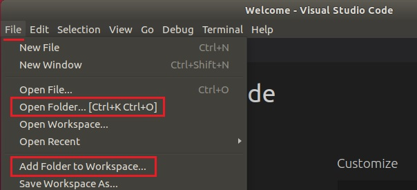

# Visual Studio Code IDE

Visual Studio Code (VSCode) is a powerful cross-platform source code editor/IDE that can be used for PX4 development on Linux and macOS (Windows support coming soon).

PX4 has been set up with all the definition files that you need to install needed VSCode extensions, and and start developing.
This topic explains how to get started.

<!-- 
- why VSCode vs Qt creator? 
- Do we recommend VSCode?
- what had to happen to make this setup work - ie presumably the directory contains definition files that vscode needs to know to set everything up?
-->

## Preconditions

You must already have installed the command line [PX4 developer environment](../setup/dev_env.md) for your platform and downloaded the *Firmware* source code repo.

<!-- xcode? -->

## Installation & Setup

1. [Download and install VSCode](https://code.visualstudio.com/) (you will be offered the correct version for your OS).
1. Add the PX4 source code into VSCode. 
   - Select the menu option **File > Open Folder** (or **File > Add Folder to Workspace**):
     
   - A file selection dialog will appear. 
     Select the PX4 project directory (**Firmware**) from the file selection dialog to load the source.
1. Press **Install All** on the *This workspace has extension recommendations* prompt (this will appear after a moment on the bottom right of the IDE).
   

   VSCode will open the Extensions panel on the left hand side so you can watch the progress of installation.
   
1. A number of notifications/prompts may appear in the bottom right corner (if these disappear, click the little "alarm" icon on the right of the blue bar at the bottom).
   - If asked to install a new version of cmake you can say "no" on Ubuntu 1.18.04
   - If prompted sign into github.com, do this if you wish to make pull requests directly from the IDE.
1. Select a kit. <!-- why/what does this do? -->
   - You can launch the kit selection dialog by choosing *No Kit Selected* on the bottom bar (if a kit is already selected that will be displayed instead)
     
   - Select *PX4 Detect* in the dialog:
     
     
## Build & Debugging

To build or debug:
1. Load a cmake build config (i.e. a build target):
   - Select the existing cmake target from the bottom config bar.
     
   - In the dialog, select your build target (this will replace any selected target).
1. You can then kick off a debugging session or run a build using the config bar on the bottom.
   

Once debugging you can set breakpoints, step over code, and otherwise develop as normal. 

<!-- px4 at the bottom - select target to launch - test mixer multi_rotor or PX4 -->
