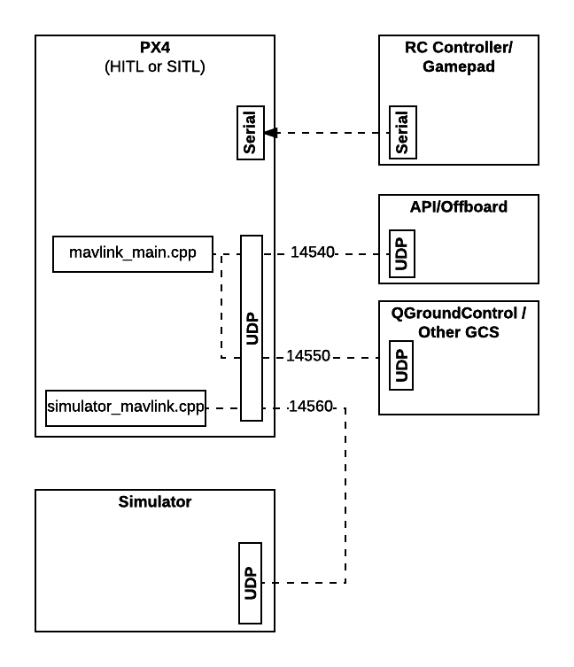

# Simulation

Simulators allow PX4 flight code to control a computer modeled vehicle in a simulated "world". You can interact with this vehicle just as you might with a real vehicle, using a *QGroundControl*, offboard API, or radio controller/gamepad. 

> **Tip** Simulation is a quick, easy, and most importantly, *safe* way to test changes to PX4 code before attempting to fly in the real world. It is also a good way to start flying with PX4 when you haven't yet got a vehicle to experiment with.

PX4 supports both *Software In the Loop (SITL)* simulation, where the flight stack runs on computer (either the same computer or another computer on the same network) and *Hardware In the Loop (HITL)* simulation using a simulation firmware on a real flight controller board.

Information about available simulators and how to set them up are provided in the next section. The other sections provide general information about how the simulator works, and are not required to *use* the simulators. 


## Supported Simulators

The following simulators work with PX4 for HITL and/or SITL simulation.

Simulator | Description
---|---
[jMAVSim](https://github.com/px4/jMAVSim) | A simple multirotor simulator that allows you to fly *copter* type vehicles around a simulated world. <ul><li>This is probably the easiest simulator to set up with SITL</li><li>It can be used to test that your vehicle can take off, fly and land, and responds appropriately to various fail conditions (e.g. GPS failure).</li></ul>
[Gazebo](../simulation/gazebo.md) | A powerful 3D simulation environment that is particularly suitable for testing object-avoidance and computer vision. <ul><li>It can also be used for <a href="../simulation/multi-vehicle-simulation.md">multi-vehicle Simulation</a><li>Gazebo is commonly used with <a href="../simulation/ros_interface.md">ROS</a>, a collection of tools for automating vehicle control.</li><li>If you're thinking about using ROS, then it is easier to <a href="../simulation/ros_interface.md">install the packages together</a>.</li></ul>
[AirSim](../simulation/airsim.md) | An open-source, cross platform simulator that provides physically and visually realistic simulations.<ul><li>Supports either HITL or SITL.</li><li>This simulator is resource intensive, and requires a very significantly more powerful computer than the other simulators described here. </li></ul>
[XPlane](../simulation/hitl.md) | X-Plane is a comprehensive and powerful flight simulator for personal computers and offers very realistic flight models.<ul><li>HITL only.</li></ul> 

Instructions for how to setup and use the simulators are in the topics linked above. Below is a "somewhat generic" description of how the simulation infrastructure works. It is not required to *use* the simulators. 

 
## Simulation Environment

The diagram below shows a fairly "standard" simulation environment for working with any of the supported simulators. The simulator and PX4 are connected by UDP, and if using SITL can be run on either the same computer or a different computer on the same network. The standard setup also creates UDP connections from PX4 to *QGroundControl* and an additional connection that can be used to connect to an offboard API.



> **Note** Only remote (server) ports are shown in the diagram. The client side port has to be set up and mapped to its associated remote port, but you don't need to know what those ports are to use/connect the different components.

PX4 uses the standard mavlink module to set up UDP connections to *QGroundControl* and the API. It uses a simulation-specific module to set up a UDP connection to the Simulator and share information (this is discussed in the next section).

TBD - Add something about the gamepad or QGC throttle switches. Using normal RC connected to simulation via a Pixhawk is messy.


### Simulator MAVLink API

All simulators communicate with PX4 using the Simulator MAVLink API. This API defines a set of MAVLink messages that (among other things) supply sensor data from the simulated world to PX4 and return motor and actuator values from the flight code that will be applied to the simulated vehicle. The image below shows the message flow.


> **Note** A simulator build of PX4 (both SITL and HITL) includes [simulator_mavlink.cpp](https://github.com/PX4/Firmware/blob/master/src/modules/simulator/simulator_mavlink.cpp) to handle these messages. Sensor data from the simulator is written to a dummy driver and appears "real" to PX4. All motors / actuators are blocked, but internal software is fully operational.

The messages are described below (see links for specific detail).

Message | Direction | Description
--- | --- | ---
[MAV_MODE:MAV_MODE_FLAG_HIL_ENABLED](http://mavlink.org/messages/common#MAV_MODE_FLAG_HIL_ENABLED) | NA | Mode flag when using simulation. All motors/actuators are blocked, but internal software is fully operational.
[HIL_ACTUATOR_CONTROLS](http://mavlink.org/messages/common#HIL_ACTUATOR_CONTROLS) | PX4 to Sim | PX4 control outputs (to motors, actuators).
[HIL_SENSOR](http://mavlink.org/messages/common#HIL_SENSOR) | Sim to PX4 | Simulated IMU readings in SI units in NED body frame.
[HIL_GPS](http://mavlink.org/messages/common#HIL_GPS) | Sim to PX4 | The simulated GPS RAW sensor value.
[HIL_OPTICAL_FLOW](http://mavlink.org/messages/common#HIL_OPTICAL_FLOW) | Sim to PX4 | Simulated optical flow from a flow sensor (e.g. PX4FLOW or optical mouse sensor)
[HIL_STATE_QUATERNION](http://mavlink.org/messages/common#HIL_STATE_QUATERNION) | Sim to PX4 | Contains the actual "simulated" vehicle position, attitude, speed etc. This can be logged and compared to PX4's estimates for analysis and debugging (for example, checking how well an estimator works for noisy (simulated) sensor inputs).
[HIL_RC_INPUTS_RAW](http://mavlink.org/messages/common#HIL_RC_INPUTS_RAW) | Sim to PX4 | The RAW values of the RC channels received.

## Manual Simulator Flight (Gamepads, Joysticks)

TBD

<!-- 
for thumb sticks it's a checkbox in the QGC settings
click the Q

for a gamepad it should probably be available if you plug it in before starting
Tried with the common logitech gamepad and a and a random joystick on
linux and windows -->


## Starting/Building a Simulator

The build system makes it very easy to build PX4 with an appropriate initialisation file and launch a simulator to connect to it. For example, you can launch a SITL version of PX4 that uses the EKF2 estimator and simulate a plane in gazebo with just the following command (provided all the build and gazebo dependencies are present!):
```
make posix_sitl_ekf2 gazebo_plane
```

<!-- ? How about HITL -->

The syntax to call `make` with a particular configuration and initialisation file is:

```bash
make [CONFIGURATION_TARGET] [SIMULATOR]_[INIT_FILE]
```

where:
* **CONFIGURATION_TARGET:** has the format `[OS]_[PLATFORM]_[FEATURE]`
  * **OS:**: posix, nuttx, qurt
  * **PLATFORM:** SITL (or in principle any platform supported among the different OS: bebop, eagle, excelsior, etc.)
  * **FEATURE:** <!-- better name? --> A particular high level feature - for example which estimator to use (ekf2, lpe) or to run tests or simulate using a replay.
* **SIMULATOR:** The simulator to launch and connect: gazebo, jmavsim, ?airsim
* **INIT_FILE:** The specific init file to use for PX4 launch, within the associated configuration target This might define the start up for a particular vehicle, or allow simulation of multiple vehicles (we explain how to determine available init files in the next section).

You can get a list of all configuration targets using:

```
make list_config_targets
```

### Init File Location

The settings for each configuration target are defined in appropriately named files in [/Firmware/cmake/configs](https://github.com/PX4/Firmware/tree/master/cmake/configs). Within each file there is a setting `config_sitl_rcS_dir` that defines the location of the folder where the configuration stores its init files.

In the cmake config file for [posix_sitl_ekf2](https://github.com/PX4/Firmware/blob/master/cmake/configs/posix_sitl_ekf2.cmake) you can see that the init file will be stored in the folder: **Firmware/posix-configs/SITL/init/ekf2/**.
```bash
set(config_sitl_rcS_dir
    posix-configs/SITL/init/ekf2
    )
```    

> **Note** Generally the init files are located using a consistent folder naming convention. For example, `make posix_sitl_ekf2 gazebo_iris` corresponds to the following folder structure:
```
Firmware/
  posix-configs/  (os=posix)
    SITL/         (platform=sitl)
      init/       
        ekf2/     (feature=ekf2)
          iris    (init file name)
```


### Example Startup File

A slightly reduced version of the startup file for `make posix_sitl_ekf2 gazebo_iris` [/Firmware/posix-configs/SITL/init/ekf2/iris](https://github.com/PX4/Firmware/blob/master/posix-configs/SITL/init/ekf2/iris) is shown below.

Note the sections that set parameters, start simulator drivers, and other modules, and that set up mavlink ports and start streaming out messages to the *QGroundControl* UDP port.


```bash
uorb start
param load
dataman start
param set BAT_N_CELLS 3
param set CAL_ACC0_ID 1376264
param set CAL_ACC0_XOFF 0.01
...
...
param set SYS_MC_EST_GROUP 2
param set SYS_RESTART_TYPE 2
replay tryapplyparams
simulator start -s
tone_alarm start
gyrosim start
accelsim start
barosim start
adcsim start
gpssim start
pwm_out_sim mode_pwm
sensors start
commander start
land_detector start multicopter
navigator start
ekf2 start
mc_pos_control start
mc_att_control start
mixer load /dev/pwm_output0 ROMFS/px4fmu_common/mixers/quad_dc.main.mix
mavlink start -u 14556 -r 4000000
mavlink start -u 14557 -r 4000000 -m onboard -o 14540
mavlink stream -r 50 -s POSITION_TARGET_LOCAL_NED -u 14556
mavlink stream -r 50 -s LOCAL_POSITION_NED -u 14556
mavlink stream -r 50 -s GLOBAL_POSITION_INT -u 14556
mavlink stream -r 50 -s ATTITUDE -u 14556
mavlink stream -r 50 -s ATTITUDE_QUATERNION -u 14556
mavlink stream -r 50 -s ATTITUDE_TARGET -u 14556
mavlink stream -r 50 -s SERVO_OUTPUT_RAW_0 -u 14556
mavlink stream -r 20 -s RC_CHANNELS -u 14556
mavlink stream -r 250 -s HIGHRES_IMU -u 14556
mavlink stream -r 10 -s OPTICAL_FLOW_RAD -u 14556
logger start -e -t
mavlink boot_complete
replay trystart
```
