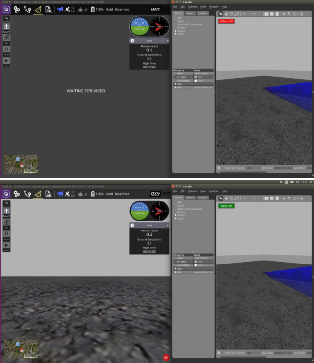

# Gazebo Simulation

[Gazebo](http://gazebosim.org) is a powerful 3D simulation environment for autonomous robots that is particularly suitable for testing object-avoidance and computer vision.
This page describes its use with SITL and a single vehicle.
Gazebo can also be used with [HITL](../simulation/hitl.md) and for [multi-vehicle simulation](../simulation/multi-vehicle-simulation.md).

**Supported Vehicles:** Quad ([Iris](../airframes/airframe_reference.md#copter_quadrotor_wide_3dr_iris_quadrotor) and [Solo](../airframes/airframe_reference.md#copter_quadrotor_x_3dr_solo), Hex (Typhoon H480), [Generic quad delta VTOL](../airframes/airframe_reference.md#vtol_standard_vtol_generic_quad_delta_vtol), Tailsitter, Plane, Rover, Submarine/UUV.

> **Warning** Gazebo is often used with [ROS](../ros/README.md), a toolkit/offboard API for automating vehicle control.
  If you plan to use PX4 with ROS you **should follow the** [ROS Instructions](../simulation/ros_interface.md) to install both ROS and Gazebo (and thereby avoid installation conflicts).

https://www.youtube.com/watch?v=qfFF9-0k4KA&vq=hd720



graph LR;
  Gazebo-->Plugin;
  Plugin-->MAVLink;
  MAVLink-->SITL;


> **Note** See [Simulation](/simulation/README.md) for general information about simulators, the simulation environment, and simulation configuration (e.g. supported vehicles).


## Installation {#installation}

Gazebo 9 setup is included in our standard build instructions:
- **macOS:** [Development Environment on Mac](../setup/dev_env_mac.md)
- **Linux:** [Development Environment on Ubuntu LTS / Debian Linux > Gazebo, JMAVSim and NuttX (Pixhawk) Targets](../setup/dev_env_linux_ubuntu.md#sim_nuttx)
- **Windows:** Not supported.

Additional installation instructions can be found on [gazebosim.org](http://gazebosim.org/tutorials?cat=guided_b&tut=guided_b1).


## Running the Simulation

You can run a simulation by starting PX4 SITL and gazebo with the airframe configuration to load (multicopters, planes, VTOL, optical flow and multi-vehicle simulations are supported).

The easiest way to do this is to open a terminal in the root directory of the PX4 *Firmware* repository and call `make` for the targets as shown in the following sections.

> **Tip** You can use the [instructions below](#start_px4_sim_separately) to keep Gazebo running and only re-launch PX4.
This is quicker than restarting both.
  You can also run the simulation in [Headless Mode](#headless) which does not start the Gazebo UI (this uses fewer resources and is much faster).

<span></span>
> **Tip** For the full list of build targets run `make px4_sitl list_vmd_make_targets` (and filter on those that start with `gazebo_`).

<span></span>
> **Note** The [Installing Files and Code](../setup/dev_env.md) guide is a useful reference if there are build errors.


### Quadrotor

```sh
cd ~/src/Firmware
make px4_sitl gazebo
```

### Quadrotor with Optical Flow

```sh
make px4_sitl gazebo_iris_opt_flow
```

### 3DR Solo (Quadrotor) {#3dr-solo}

```sh
make px4_sitl gazebo_solo
```


### Typhoon H480 (Hexrotor) {#typhoon_h480}

```
make px4_sitl gazebo_typhoon_h480
```


> **Note** This target also supports [video streaming simulation](#video).

### Standard Plane

```sh
make px4_sitl gazebo_plane
```


### Standard VTOL

```sh
make px4_sitl gazebo_standard_vtol
```


### Tailsitter VTOL

```sh
make px4_sitl gazebo_tailsitter
```


### Ackerman vehicle (UGV/Rover) {#ugv}

```sh
make px4_sitl gazebo_rover
```


### HippoCampus TUHH (UUV: Unmanned Underwater Vehicle) {#uuv}

```sh
make px4_sitl gazebo_uuv_hippocampus
```


### Boat (USV: Unmanned Surface Vehicle) {#usv}

```sh
make px4_sitl gazebo_boat
```


## Taking it to the Sky

The `make` commands above first build PX4, and then run it along with the Gazebo simulator.

Once PX4 has started it will launch the PX4 shell as shown below.

```
______  __   __    ___ 
| ___ \ \ \ / /   /   |
| |_/ /  \ V /   / /| |
|  __/   /   \  / /_| |
| |     / /^\ \ \___  |
\_|     \/   \/     |_/

px4 starting.

INFO  [px4] Calling startup script: /bin/sh etc/init.d-posix/rcS 0
INFO  [param] selected parameter default file eeprom/parameters_10016
[param] Loaded: eeprom/parameters_10016
INFO  [dataman] Unknown restart, data manager file './dataman' size is 11798680 bytes
INFO  [simulator] Waiting for simulator to connect on TCP port 4560
Gazebo multi-robot simulator, version 9.0.0
Copyright (C) 2012 Open Source Robotics Foundation.
Released under the Apache 2 License.
http://gazebosim.org
...
INFO  [ecl/EKF] 5188000: commencing GPS fusion
```
The console will print out status as PX4 loads the airframe-specific initialisation and parameter files, waits for (and connects to) the simulator.
Once there is an INFO print that [ecl/EKF] is `commencing GPS fusion` the vehicle is ready to arm.


> **Note** Right-clicking the quadrotor model allows to enable follow mode from the context menu, which is handy to keep it in view.


You can bring it into the air by typing:

```sh
pxh> commander takeoff
```

## Usage/Configuration Options

### Headless Mode {#headless}

Gazebo can be run in a *headless* mode in which the Gazebo UI is not launched.
This starts up more quickly and uses less system resources (i.e. it is a more "lightweight" way to run the simulation).

Simply prefix the normal `make` command with `HEADLESS=1` as shown:
```bash
HEADLESS=1 make px4_sitl gazebo_plane
```

### Set Custom Takeoff Location {#custom_takeoff_location}

The default takeoff location in SITL Gazebo can be overridden using environment variables.

The variables to set are: `PX4_HOME_LAT`, `PX4_HOME_LON`, and `PX4_HOME_ALT`.

For example:
```
export PX4_HOME_LAT=28.452386
export PX4_HOME_LON=-13.867138
export PX4_HOME_ALT=28.5
make px4_sitl gazebo
```

### Change Simulation Speed

The simulation speed can be increased or decreased with respect to realtime using the environment variable `PX4_SIM_SPEED_FACTOR`.

```
export PX4_SIM_SPEED_FACTOR=2
make px4_sitl_default gazebo
```

For more information see: [Simulation > Run Simulation Faster than Realtime](../simulation/README.md#simulation_speed).

### Using a Joystick

Joystick and thumb-joystick support are supported through *QGroundControl* ([setup instructions here](../simulation/README.md#joystickgamepad-integration)).


### Improving Distance Sensor Performance

The current default world is [PX4/sitl_gazebo/worlds/**iris.world**](https://github.com/PX4/sitl_gazebo/tree/master/worlds)), which uses a heightmap as ground.

This can cause difficulty when using a distance sensor.
If there are unexpected results we recommend you change the model in **iris.model** from `uneven_ground` to `asphalt_plane`.


### Simulating GPS Noise {#gps_noise}

Gazebo can simulate GPS noise that is similar to that typically found in real systems (otherwise reported GPS values will be noise-free/perfect).
This is useful when working on applications that might be impacted by GPS noise - e.g. precision positioning.

GPS noise is enabled if the target vehicle's SDF file contains a value for the `gpsNoise` element (i.e. it has the line: `<gpsNoise>true</gpsNoise>`).
It is enabled by default in many vehicle SDF files: **solo.sdf**, **iris.sdf**, **standard_vtol.sdf**, **delta_wing.sdf**, **plane.sdf**, **typhoon_h480**, **tailsitter.sdf**.

To enable/disable GPS noise:
1. Build any gazebo target in order to generate SDF files (for all vehicles).
   For example:
   ```
   make px4_sitl gazebo_iris
   ```
   > **Tip** The SDF files are not overwritten on subsequent builds.
2. Open the SDF file for your target vehicle (e.g. **./Tools/sitl_gazebo/models/iris/iris.sdf**).
3. Search for the `gpsNoise` element:
   ```xml
   <plugin name='gps_plugin' filename='libgazebo_gps_plugin.so'>
     <robotNamespace/>
     <gpsNoise>true</gpsNoise>
   </plugin>
   ```
   * If it is present, GPS is enabled.
     You can disable it by deleting the line: `<gpsNoise>true</gpsNoise>`
   * If it is not preset GPS is disabled.
     You can enable it by adding the `gpsNoise` element to the `gps_plugin` section (as shown above).

The next time you build/restart Gazebo it will use the new GPS noise setting.


## Starting Gazebo and PX4 Separately {#start_px4_sim_separately}

For extended development sessions it might be more convenient to start Gazebo and PX4 separately or even from within an IDE.

In addition to the existing cmake targets that run `sitl_run.sh` with parameters for px4 to load the correct model it creates a launcher targets named `px4_<mode>` that is a thin wrapper around original sitl px4 app.
This thin wrapper simply embeds app arguments like current working directories and the path to the model file.

To start Gazebo and PX4 separately:

* Run gazebo (or any other sim) server and client viewers via the terminal specifing an `_ide` variant:
  ```sh
  make px4_sitl gazebo___ide
  ```
  or
  ```sh
  make px4_sitl gazebo_iris_ide
  ```
* In your IDE select `px4_<mode>` target you want to debug (e.g. `px4_iris`)
* Start the debug session directly from IDE

This approach significantly reduces the debug cycle time because simulator (e.g. Gazebo) is always running in background and you only re-run the px4 process which is very light.


## Simulated Survey Camera

The *Gazebo* survey camera simulates a [MAVLink camera](https://mavlink.io/en/services/camera.html) that captures geotagged JPEG images and sends camera capture information to a connected ground station.
The camera also supports video streaming.
It can be used to test camera capture, in particular within survey missions.

The camera emits the [CAMERA_IMAGE_CAPTURED](https://mavlink.io/en/messages/common.html#CAMERA_IMAGE_CAPTURED) message every time an image is captured.
The captured images are saved to: **Firmware/build/px4_sitle_default/tmp/frames/DSC_n_.jpg** (where _n_ starts as 00000 and is iterated by one on each capture).

To simulate a plane with this camera:
```
make px4_sitl_default gazebo_plane_cam
```

> **Note** The camera also supports/responds to the following MAVLink commands: [MAV_CMD_REQUEST_CAMERA_CAPTURE_STATUS](https://mavlink.io/en/messages/common.html#MAV_CMD_REQUEST_CAMERA_CAPTURE_STATUS), [MAV_CMD_REQUEST_STORAGE_INFORMATION](https://mavlink.io/en/messages/common.html#MAV_CMD_REQUEST_STORAGE_INFORMATION), [MAV_CMD_REQUEST_CAMERA_SETTINGS](https://mavlink.io/en/messages/common.html#MAV_CMD_REQUEST_CAMERA_SETTINGS), [MAV_CMD_REQUEST_CAMERA_INFORMATION](https://mavlink.io/en/messages/common.html#MAV_CMD_REQUEST_CAMERA_INFORMATION), [MAV_CMD_RESET_CAMERA_SETTINGS](https://mavlink.io/en/messages/common.html#MAV_CMD_RESET_CAMERA_SETTINGS), [MAV_CMD_STORAGE_FORMAT](https://mavlink.io/en/messages/common.html#MAV_CMD_STORAGE_FORMAT), [MAV_CMD_SET_CAMERA_ZOOM](https://mavlink.io/en/messages/common.html#MAV_CMD_SET_CAMERA_ZOOM), [MAV_CMD_IMAGE_START_CAPTURE](https://mavlink.io/en/messages/common.html#MAV_CMD_IMAGE_START_CAPTURE), [MAV_CMD_IMAGE_STOP_CAPTURE](https://mavlink.io/en/messages/common.html#MAV_CMD_IMAGE_STOP_CAPTURE), [MAV_CMD_REQUEST_VIDEO_STREAM_INFORMATION](https://mavlink.io/en/messages/common.html#MAV_CMD_REQUEST_VIDEO_STREAM_INFORMATION), [MAV_CMD_REQUEST_VIDEO_STREAM_STATUS](https://mavlink.io/en/messages/common.html#MAV_CMD_REQUEST_VIDEO_STREAM_STATUS), [MAV_CMD_SET_CAMERA_MODE](https://mavlink.io/en/messages/common.html#MAV_CMD_SET_CAMERA_MODE).

<span></span>
> **Note** The simulated camera is implemented in [PX4/sitl_gazebo/src/gazebo_geotagged_images_plugin.cpp](https://github.com/PX4/sitl_gazebo/blob/master/src/gazebo_geotagged_images_plugin.cpp).


## Simulated Parachute/Flight Termination {#flight_termination}

*Gazebo* can be used to simulate deploying a [parachute](https://docs.px4.io/master/en/peripherals/parachute.html) during [Flight Termination](https://docs.px4.io/master/en/advanced_config/flight_termination.html) (flight termination is triggered by the PWM command that is simulated in *Gazebo*).

The `if750a` target has a parachute attached to the vehicle. 
To simulate the vehicle, run the following command:
```
make px4_sitl gazebo_if750a
```

To put the vehicle into flight termination state, you can force it to fail a [safety check](https://docs.px4.io/master/en/config/safety.html) that has flight termination set as the failsafe action.
For example, you could do this by forcing a [Geofence violation](https://docs.px4.io/master/en/config/safety.html#geofence-failsafe).

For more information see:
- [Flight Termination](https://docs.px4.io/master/en/advanced_config/flight_termination.html) 
- [Parachute](https://docs.px4.io/master/en/peripherals/parachute.html)
- [Safety Configuration (Failsafes)](https://docs.px4.io/master/en/config/safety.html)

## Video Streaming {#video}

PX4 SITL for Gazebo supports UDP video streaming from a Gazebo camera sensor attached to a vehicle model.
When streaming is enabled, you can connect to this stream from *QGroundControl* (on UDP port 5600) and view video of the Gazebo environment from the simulated vehicle - just as you would from a real camera.
The video is streamed using a *gstreamer* pipeline and can be enabled/disabled using a button in the Gazebo UI.

The Gazebo camera sensor is supported/enabled on the following frames:
* [Typhoon H480](#typhoon_h480)


### Prerequisites

*Gstreamer 1.0* is required for video streaming.
The required dependencies should already have been [installed when you set up Gazebo](#installation) (they are included in the standard PX4 installation scripts/instructions for macOS and Ubuntu Linux).

> **Note** FYI only, the dependencies include: `gstreamer1.0-plugins-base`, g`streamer1.0-plugins-good`, `gstreamer1.0-plugins-bad`, `gstreamer1.0-plugins-ugly`, `libgstreamer-plugins-base1.0-dev`.


### Start/Stop Video Streaming

Video streaming is automatically started when supported by the target vehicle.
For example, to start streaming video on the Typhoon H480:
```
make px4_sitl gazebo_typhoon_h480
```

Streaming can be paused/restarted using the Gazebo UI *Video ON/OFF* button..




### How to View Gazebo Video

The easiest way to view the SITL/Gazebo camera video stream is in *QGroundControl*.
Simply open **Application Settings > General** and set **Video Source** to *UDP h.264 Video Stream* and **UDP Port** to *5600*:
  


The video from Gazebo should then display in *QGroundControl* just as it would from a real camera.


> **Note** The Typhoon world is not very interesting.

It is also possible to view the video using the *Gstreamer Pipeline*.
Simply enter the following terminal command:
```sh
gst-launch-1.0  -v udpsrc port=5600 caps='application/x-rtp, media=(string)video, clock-rate=(int)90000, encoding-name=(string)H264' \
! rtph264depay ! avdec_h264 ! videoconvert ! autovideosink fps-update-interval=1000 sync=false
```

## Extending and Customizing

To extend or customize the simulation interface, edit the files in the `Tools/sitl_gazebo` folder.
The code is available on the [sitl_gazebo repository](https://github.com/px4/sitl_gazebo) on Github.

> **Note** The build system enforces the correct GIT submodules, including the simulator.
  It will not overwrite changes in files in the directory.


## Further Information

* [ROS with Gazebo Simulation](../simulation/ros_interface.md)
* [Gazebo Octomap](../simulation/gazebo_octomap.md)
