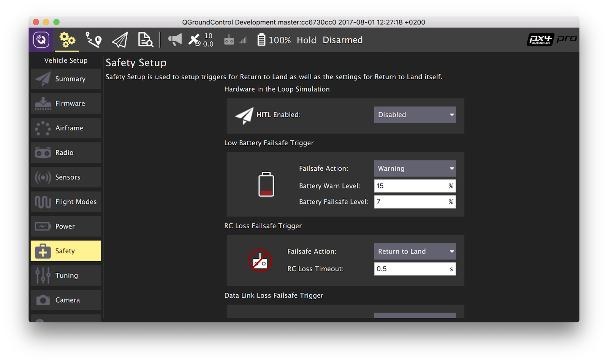
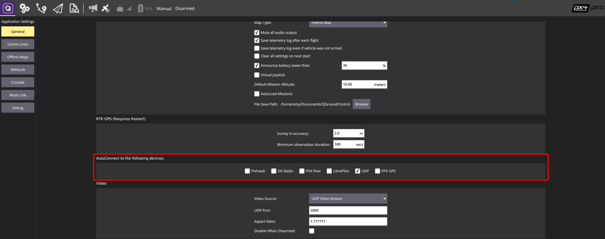
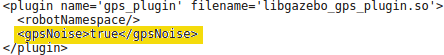

# Hardware in the Loop Simulation \(HITL\)

Hardware in the loop simulation is a simulation mode where the autopilot is connected to the simulator and all flight code runs on the autopilot. This approach has the benefit of testing the actual flight code on the real processor.

## Step 1: Enable HITL mode and configure airframe

Connect the autopilot directly to QGroundControl.

First enable HITL mode in the safety setup as shown in the screenshot below. Select the "Enabled" in the drop down on the HITL enabled section \(first on the page\):

PX4 supports HITL for multicopters \(using jMAVSim or Gazebo\) and fixed wing \(using X-Plane demo or full version or Gazebo\). Generally any compatible airframe can be put into HITL mode. Compatible airframes are right now:

* X-frame multicopters \(autostart IDs 4001, 4011\)
* Standard AERT planes
* HITL X-frame multicopter \(autostart ID 1001\)
* HITL AERT plane \(autostart ID 1000\)

The screenshot below shows the simulation airframe selected. Select HILStar for XPlane Simulator and fixed wing and Quadrotor X for jMAVSim or Gazebo.


For Gazebo, set the `SYS_COMPANION` parameter to `921600`. 

Under the `General` tab of the settings menu, uncheck all AutoConnect boxes except for UDP. 



Once configuration in QGroundControl is complete, close QGroundControl and disconnect the autopilot from the computer. 

## Configure Joystick and Failsafe \(Optional\)

These parameter are optional and allow to run HITL without a radio remote controller connected. Use the search bar on the top of the parameter editor to bring them up.

* Optional: `COM_RC_IN_MODE` to "Joystick/No RC Checks" if no RC remote control is used. This allows joystick input and disables RC input checks.
* Optional: `NAV_DLL_ACT` to "Disabled" if no RC remote control is used. This ensures that no RC failsafe actions interfere when not running HITL with a radio control.

## Connect to the Simulator

Currently Gazebo, jMAVSim, or X-Plane and QGroundControl are supported. Follow either setup step below.

### Using Gazebo
* Update the environment variables: 
``` 
cd <Firmware_clone>
make posix_sitl_default gazebo
source Tools/setup_gazebo.bash $(pwd) $(pwd)/build/posix_sitl_default
```

* Open the vehicle model's sdf file (e.g. Tools/sitl_gazebo/models/iris/iris.sdf). 

* Under the mavlink_interface plugin section, change the `serialEnabled` and `hil_mode` parameters to `true`. 


* Replace the `serialDevice` parameter (`/dev/ttyACM0`) if necessary.

* Recommended: Under the `gps_plugin` section, change `gpsNoise` to false.



* **Make sure QGroundControl is not running**

* Connect the autopilot to the computer and allow it a few seconds to boot.

* Run Gazebo in HITL mode 
```
gazebo /Tools/sitl_gazebo/worlds/iris.world
```
* Then run QGroundControl - it will auto-connect.

### Using jMAVSim \(Quadrotor only\)

* **Make sure QGroundControl is not running**
* Run jMAVSim in HITL mode \(replace the serial port name `/dev/ttyACM0` if necessary - e.g. on Mac OS this would be `/dev/tty.usbmodem1`\):

  ```
  ./Tools/jmavsim_run.sh -q -d /dev/ttyACM0 -b 921600 -r 250
  ```

* Then run QGroundControl - it will auto-connect.

### Using X-Plane and QGroundControl \(Fixed Wing only\)

In X-Plane two key settings have to be made: In Settings -&gt; Data Input and Output, set these checkboxes:


In Settings -&gt; Net Connections in the Data tab, set localhost and port 49005 as IP address, as shown in the screenshot below:


#### Enable HITL in QGroundControl

Widgets -&gt; HIL Config, then select X-Plane 10 in the drop-down and hit connect. Once the system is connected, battery status, GPS status and aircraft position should all become valid:


## Fly an Autonomous Mission in HITL

Switch to the flight planning view and put a single waypoint in front of the plane. Click on the sync icon to send the waypoint.

Then select MISSION from the flight mode menu in the toolbar and click on DISARMED to arm the plane. It will take off and loiter around the takeoff waypoint.


