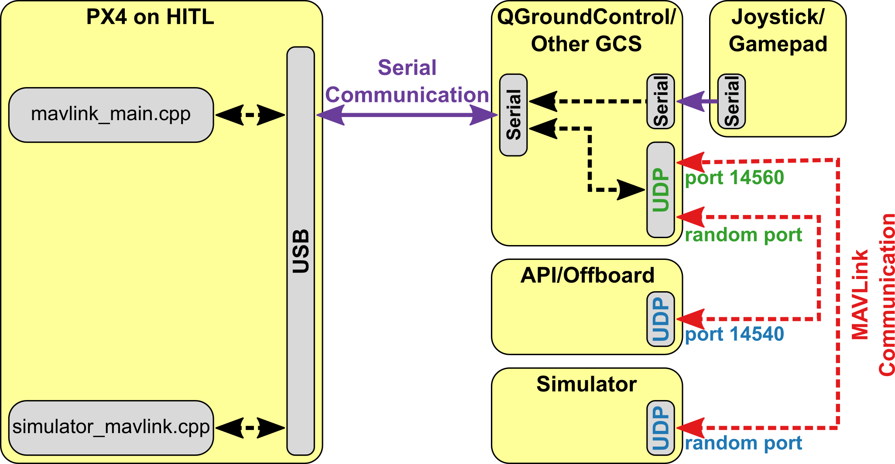

# Hardware in the Loop Simulation \(HITL\)

Hardware-in-the-Loop (HITL) is a simulation mode in which normal PX4 firmware is run on real flight controller hardware. This approach has the benefit of testing most of the actual flight code on the real hardware.

PX4 supports HITL for multicopters (using jMAVSim or Gazebo) and fixed wing (using X-Plane demo/full version or Gazebo). 


## HITL-Compatible Airframes {#compatible_airframe}

The current list of compatible airframes vs Simulators is:

Airframe | `SYS_AUTOSTART` | X-Plane | Gazebo | jMAVSim
---|---|---
<a href="../airframes/airframe_reference.md#plane_simulation_(plane)_hilstar_(xplane)">HILStar (X-Plane)</a> | 1000 | Y | |
<a href="../airframes/airframe_reference.md#copter_simulation_(copter)_hil_quadcopter_x">HIL Quadcopter X</a> | 1001 | | Y | Y
[Standard planes](../airframes/airframe_reference.md#plane_standard_plane_standard_plane) | 2100 | Y | |
[Generic Quadrotor x](../airframes/airframe_reference.md#copter_quadrotor_x_generic_quadrotor_x) copter | 4001 | | Y | Y
[DJI Flame Wheel f450](../airframes/airframe_reference.md#copter_quadrotor_x_dji_flame_wheel_f450) | 4011 | | Y | Y


## HITL Simulation Environment {#simulation_environment}

With Hardware-in-the-Loop (HITL) simulation the normal PX firmware is run on real hardware. *QGroundControl* is connected to the physical hardware over USB and acts as a gateway to forward data between the simulator running on a development computer, PX4, and any offboard API.

The diagram below shows a typical HITL simulation environment:
* A HITL configuration is selected (via *QGroundControl*) that doesn't start any real sensors.
* *QGroundControl* is connected to the flight controller via the USB.
* *QGroundControl* is connected to the simulator and offboard API via UDP.
* A serial connection is used to connect Joystick/Gamepad hardware via *QGroundControl*.



> **Tip** For more information see: [Simulation](../simulation/README.md).


## HITL vs SITL

SITL runs on a development computer in a simulated environment, and uses firmware specifically generated for that environment. Other than simulation drivers to provide fake environmental data from the simulator the system behaves normally.

By contrast, HITL runs normal PX4 firmware in "HITL mode", on normal hardware. The simulation data enters the system at a different point than for SITL. Core modules like commander and sensors have HIL modes at startup that bypass some of the normal functionality. 

In summary, HITL runs PX4 on the actual hardware using standard firmware, but SITL actually executes more of the standard system code.


## Setting up HITL

### PX4 Configuration

1. Connect the autopilot directly to *QGroundControl* via USB.
1. Enable HITL Mode
   1. Open **Setup > Safety** section.
   1. Enable HITL mode by selecting **Enabled** from the *HITL Enabled* list:

      
1. Select Airframe
   1. Open **Setup > Airframes**
   1. Select a [compatible airframe](#compatible_airframe) you want to test.
      Generally you'll select *HILStar* for Fixed Wing/X-Plane simulator and a *HIL QuadCopter* option for copters (and jMAVSim or Gazebo).

      
1. Setup UDP
   1. Under the *General* tab of the settings menu, uncheck all *AutoConnect* boxes except for **UDP**. 

      
1. (Gazebo only) Set the `SYS_COMPANION` parameter to `921600` (see [PX4 User Guide > Parameters](https://docs.px4.io/en/advanced_config/parameters.html#finding-a-parameter) for instructions on how to change parameters).

1. (Optional) Configure Joystick and Failsafe.

   Set the following [parameters](https://docs.px4.io/en/advanced_config/parameters.html#finding-a-parameter) in order to use a joystick instead of an RC remote control transmitter:
   * [COM_RC_IN_MODE](../advanced/parameter_reference.md#COM_RC_IN_MODE) to "Joystick/No RC Checks". This allows joystick input and disables RC input checks.
   * [NAV_DLL_ACT](../advanced/parameter_reference.md#NAV_DLL_ACT) to "Disabled". This ensures that no RC failsafe actions interfere when not running HITL with a radio control.

   > **Tip** The *QGroundControl User Guide* also has instructions on [Joystick](https://docs.qgroundcontrol.com/en/SetupView/Joystick.html) and [Virtual Joystick](https://docs.qgroundcontrol.com/en/SettingsView/VirtualJoystick.html) setup.
   
Once configuration is complete, **close** *QGroundControl* and disconnect the flight controller hardware from the computer. 

### Simulator Setup

Follow the appropriate setup steps for your simulator in the following sections.

#### Gazebo

> **Note** Make sure *QGroundControl* is not running!

1. Update the environment variables: 
  ```sh
  cd <Firmware_clone>
  make posix_sitl_default gazebo
  source Tools/setup_gazebo.bash $(pwd) $(pwd)/build/posix_sitl_default
  ```
1. Open the vehicle model's sdf file (e.g. **Tools/sitl_gazebo/models/iris/iris.sdf**).
1. Under the `mavlink_interface plugin` section, change the `serialEnabled` and `hil_mode` parameters to `true`. 

  
1. Replace the `serialDevice` parameter (`/dev/ttyACM0`) if necessary.
1. Connect the flight controller to the computer and wait for it to boot.
1. Run Gazebo in HITL mode 
  ```sh
  gazebo /Tools/sitl_gazebo/worlds/iris.world
  ```
1. Start *QGroundControl*. It should autoconnect to PX4 and Gazebo.

#### jMAVSim (Quadrotor only)

> **Note** Make sure *QGroundControl* is not running!

1. Run jMAVSim in HITL mode (replace the serial port name `/dev/ttyACM0` if necessary - e.g. on Mac OS this would be `/dev/tty.usbmodem1`):
  ```sh
  ./Tools/jmavsim_run.sh -q -d /dev/ttyACM0 -b 921600 -r 250
  ```
1. Start *QGroundControl*. It should autoconnect to PX4 and jMAVSim.

#### Using X-Plane (Fixed Wing only)

1. Open X-Plane
1. In **Settings > Data Input and Output**, set these checkboxes:

   

1. In **Settings > Net Connections**, in the *Data* tab, set localhost and port 49005 as IP address, as shown below:

   

1. Enable HITL in QGroundControl
   1. Open *QGroundControl*
   1. Open **Widgets > HIL Config**. Select X-Plane 10 in the drop-down and hit connect. Once the system is connected, battery status, GPS status and aircraft position should all become valid:

      


## Fly an Autonomous Mission in HITL

You should not be able to use *QGroundControl* to [run missions](../qgc/README.md#planning-missions) and otherwise control the vehicle. 
