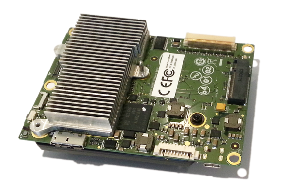

# Intel Aero

The Aero is a UAV development platform. Part of this is the Intel Aero Compute Board (see below), running Linux on a Quad-core CPU. This is connected to the FMU, which runs PX4 on NuttX.




## Introduction

The main documentation is under https://github.com/intel-aero/meta-intel-aero/wiki. It includes instructions how to setup, update and connect to the board. And it also explains how to do development on the Linux side.

The following describes how to flash and connect to the FMU.


## Flashing

After setting up the PX4 development environment, follow these steps to put the PX4 software on the FMU board:

1. Do a full update of all software on the Aero (https://github.com/intel-aero/meta-intel-aero/wiki/Upgrade-To-Latest-Software-Release)

2. Grab the [Firmware](https://github.com/PX4/Firmware)

3. Compile with `make aerofc-v1_default`

4. Set the hostname (The following IP assumes you are connected via WiFi): 
```
export AERO_HOSTNAME=192.168.1.1`
```
5. Upload with  `make aerofc-v1_default upload`


## Connecting QGroundControl via Network 

1. Make sure you are connected to the board with WiFi or USB Network

2. ssh to the board and make sure mavlink forwarding runs. By default it automatically starts when booting. It can be started manually with:
```
/etc/init.d/mavlink_bridge.sh start
```

3. Start QGroundControl and it should automatically connect.

4. Instead of starting QGroundControl, you can open a [NuttX shell](advanced-system-console.md#mavlink-shell) with:
```
./Tools/mavlink_shell.py 0.0.0.0:14550
```


