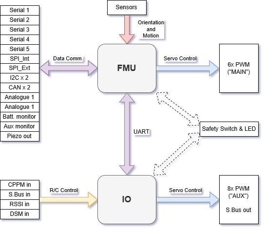

# PX4 참조 비행체 조종 장치 설계

PX4 참조 설계는 비행체 조종 장치의 [픽스호크 계열](https://docs.px4.io/master/en/flight_controller/pixhawk_series.html)입니다. 2011년 처음 출시했으며, 현재 설계는 5번째 [세대](#reference_design_generations)입니다(6세대 보드 설계는 진행중).

## 바이너리 호환성

제각각의 설계에 따라 제조한 모든 보드는 잠재 바이너리 호환성을 지니고 있습니다(예: 동일한 펌웨어 실행 가능). 2018년도부터는 호환성을 검증하고 인증하는 바이너리 호환성 시험 기반을 제공합니다.

FMU 1~3 세대는 공개 하드웨어로 설계했으나, 4~5세대에서는 핀 출력과 전원 공급장치 명세 정보만 제공합니다(설계도는 각 제조사에서 만듦). 좀 더 우수한 호환성을 확보하기 위해, FMUv6 및 이후 버전에서는 완전한 참조 설계 모델로 돌아올 예정입니다.

## 참조 설계 세대 {#reference_design_generations}

* FMUv1: Development board \(STM32F407, 128 KB RAM, 1MB flash, [schematics](https://github.com/PX4/Hardware/tree/master/FMUv1)\) (no longer supported by PX4)
* FMUv2: Pixhawk \(STM32F427, 168 MHz, 192 KB RAM, 1MB flash, [schematics](https://github.com/PX4/Hardware/tree/master/FMUv2)\)
* FMUv3: Pixhawk variants with 2MB flash \(3DR Pixhawk 2 \(Solo\), Hex Pixhawk 2.1, Holybro Pixfalcon, 3DR Pixhawk Mini, STM32F427, 168 MHz, 256 KB RAM, 2 MB flash, [schematics](https://github.com/PX4/Hardware/tree/master/FMUv3_REV_D)\)
* FMUv4: Pixracer \(STM32F427, 168 MHz, 256 KB RAM, 2 MB flash, [pinout](https://docs.google.com/spreadsheets/d/1raRRouNsveQz8cj-EneWG6iW0dqGfRAifI91I2Sr5E0/edit#gid=1585075739)\) 
* FMUv4 PRO: Drotek Pixhawk 3 PRO \(STM32F469, 180 MHz, 384 KB RAM, 2 MB flash, [pinout](https://docs.google.com/spreadsheets/d/1raRRouNsveQz8cj-EneWG6iW0dqGfRAifI91I2Sr5E0/edit#gid=1585075739)\)
* FMUv5: Holybro Pixhawk 4 \(STM32F765, 216 MHz, 512 KB RAM, 2 MB flash, [pinout](https://docs.google.com/spreadsheets/d/1-n0__BYDedQrc_2NHqBenG1DNepAgnHpSGglke-QQwY/edit#gid=912976165)\)
* FMUv6: work in progress, final name TBD, variant 6s \(STM32H7, 400 MHz, 2 MB RAM, 2 MB flash\) and variant 6i \(i.MX RT1050, 600 MHz, 512 KB RAM, external flash\)

## 주요/입출력 기능 해부

The diagram below shows the division of bus and functional responsibilities between the FMU and I/O boards in a Pixhawk-series flight controller (the boards are incorporated into a single physical module).

<!-- Draw.io version of file can be found here: https://drive.google.com/file/d/1H0nK7Ufo979BE9EBjJ_ccVx3fcsilPS3/view?usp=sharing -->

일부 픽스호크 계열 조종 장치는 입출력보드 없이 만들어 공간과 복잡도를 출이거나, 각 보드 용도를 알맞게 개선했습니다.

입출력 보드의 기능은 [SYS_USE_IO=0](../advanced/parameter_reference.md#SYS_USE_IO) 매개변수 설정으로 끌 수 있습니다. 입출력 보드의 기능을 끄면:

- The MAIN mixer file is loaded into the FMU (so the "MAIN" outputs listed in the [Airframe Reference](../airframes/airframe_reference.md) appear on the port labeled AUX). The AUX mixer file isn't loaded, so outputs defined in this file are not used.
- RC input goes directly to the FMU rather than via the IO board.

Flight controllers without an I/O board have `MAIN` ports, but they *do not* have `AUX` ports. Consequently they can only be used in [airframes](../airframes/airframe_reference.md) that do not use `AUX` ports, or that only use them for non-essential purposes (e.g. RC passthrough). They can be used for most multicopters and *fully* autonomous vehicles (without a safety pilot using RC control), as these typically only use `MAIN` ports for motors/essential controls.

> **Warning** Flight controllers without an I/O board cannot be used in [airframes](../airframes/airframe_reference.md) that map any `AUX` ports to essential flight controls or motors (as they have no `AUX` ports).

> **Note** Manufacturer flight controller variants without an I/O board are often named as a "diminutive" of a version that includes the I/O board: e.g. *Pixhawk 4* **Mini**_, *CUAV v5 **nano***.

Most PX4 PWM outputs are mapped to either `MAIN` or `AUX` ports in mixers. A few specific cases, including camera triggering and Dshot ESCs, are directly mapped to the FMU pins (i.e. they will output to *either* `MAIN` or `AUX`, depending on whether or not the flight controller has an I/O board).