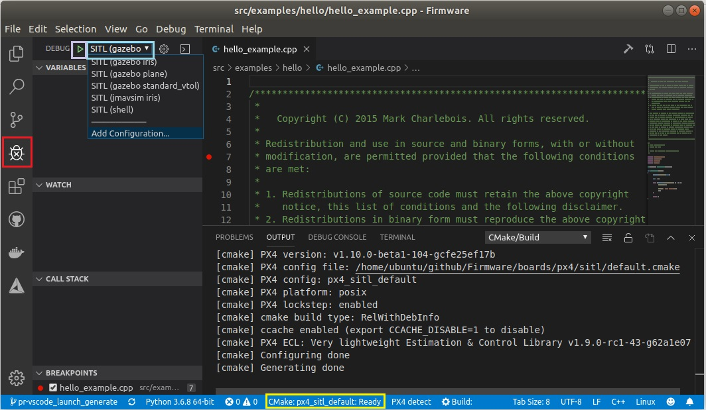

# 비주얼 스튜디오 코드 IDE (VSCode)

[비주얼 스튜디오 코드](https://code.visualstudio.com/)는 강력한 교차 플랫폼 소스 코드 편집기/통합 개발 환경이며, 우분투 18.04 LTS와 macOS(윈도우 는 곧 지원 예정)의 PX4 개발에 활용할 수 있습니다.

PX4 개발에 VSCode를 활용해야 하는 이유는 여러가지가 있습니다:

- 설치 시간이 *정말로* 단 몇분 밖에 걸리지 않습니다.
- 풍부한 확장기능 생태계 덕분에 PX4 개발시 C/C++ (단일 *cmake* 통합), *Python*, *Jinja2*, ROS 메시지, UAVCAN DSDL에 필요한 필요한 여러 도구를 쓸 수 있습니다: 
- Github와의 통합 기능이 우수합니다.

이 주제에서는 IDE를 설치하고 개발을 시작하는 방법을 설명합니다.

> **Note** 다른 강력한 통합 개발 환경이 있지만, PX4 개발을 목적으로 몇가지 기능을 통합하려면 약간의 수고로움이 더 필요합니다. *VSCode*에서는 PX4/Firmware 트리([Firmware/.vscode](https://github.com/PX4/Firmware/tree/master/.vscode)에 설정을 저장하기에 설치 과정은 단지 프로젝트 폴더를 추가하면 되는 정도로 간단합니다.

## 선행 조건

[PX4 개발자 환경](../setup/dev_env.md) 명령행을 플랫폼에 우선 설치해야 하며, *Firmware* 소스 코드 저장소를 다운로드해야합니다.

## 설치 및 설정

1. [VSCode를 다운로드하고 설치합니다](https://code.visualstudio.com/) (운영체제에 맞는 올바른 버전을 받아야 합니다).
2. VSCode를 열고 PX4 소스 코드를 추가하십시오:
    
   - 환영 페이지에서 *Open folder ...* 옵션을 선택하십시오(또는 **File > Open Folder** 메뉴 선택): 
   - 파일 선택 대화상자가 뜹니다. PX4 **Firmware** 디렉터리를 선택하고 **OK**를 누르십시오.
    
    이 과정을 끝내면 프로젝트 파일과 설정 파일을 *VSCode*에 불러옵니다.

3. *This workspace has extension recommendations* 프롬프트가 뜨면 **Install All** 을 누르십시오(IDE의 우측 하단에 뜹니다). 
    
    VSCode에서 *Extensions* 창을 좌측에 띄우므로 설치 과정을 볼 수 있습니다.
    
    

4. 몇가지 알림/프롬프트가 우측 하단 구석에 뜹니다
    
    > **Tip** 프롬프트가 사라지면, 하단 청색 표시줄의 우측 "alarm" 아이콘을 누르십시오.

- *cmake* 최신 버전을 설치하라고 뜬다면: 
   - **No**를 선택하십시오(올바른 버전은 [PX4 개발 환경](../setup/dev_env.md)에 있습니다).
- *github.com*에 접속할 지를 물으면 인증 정보를 입력하십시오: 
   - 이제 다 끝났습니다! Github와 통합 개발 환경간의 충분한 통합이 이루어져 작업 과정을 단순화해줍니다.
- 다른 프롬프트 응답은 선택적입니다. 쓸만하다고 생각하면 설치하십시오.<!-- perhaps add screenshot of these prompts -->

## PX4 빌드 {#building}

빌드를 진행하려면:

1. 빌드 대상을 선택하십시오("cmake build config"): 
   - 현재 *cmake build target*은 하단 청색 *config* 표시줄에 나타납니다(이미 원하는 대상이 떴다면 이 과정은 건너뛰셔도 됩니다). 
   - 설정 표시줄의 대상을 눌러 다른 옵션을 표시한 후, 원하는 대상을 선택하십시오(이 과정을 통해 올바른 대상을 선택합니다).
   - 이 과정이 끝나면 *Cmake*에서 프로젝트의 빌드 조건을 구성합니다(하단 우측의 알림 참고). 
   - 빌드 설정이 끝날때까지 기다리십시오. 빌드 설정이 끝나면 알림이 사라지고, 빌드 위치를 볼 수 있습니다: .
2. You can then kick off a build from the config bar (select either **Build** or **Debug**). 

After building at least once you can now use [code completion](#code completion) and other *VSCode* features.

## PX4 디버깅 {#debugging_sitl}

SITL의 PX4를 디버깅하려면:

1. 측면 표시줄의 디버깅 아이콘을 선택(붉은색 표시)하여 디버깅 창을 표시하십시오.

2. 상단 표시줄의 디버깅 드롭다운(자주색 상자)으로 디버깅 대상을 선택하십시오(예: *Debug SITL (Gazebo Iris)*).
    
    > **Note** 화면에 뜬(자주색 상자) 디버깅 대상은 여러분이 보유한 빌드 대상과 일치해야합니다(하단 표시줄의 황색 상자). 예를 들면, SITL 대상을 디버깅한다면, 빌드 대상 선택시 SITL을 넣어야합니다.

3. 디버깅 "play" 화살표를 눌러 디버깅을 시작하십시오(상단 표시줄의 디버깅 대상 옆 - 분홍색 상자에 있음).

디버깅을 진행하는 동안 중단점을 설정하고, 코드를 건너뛰어 실행할 수 있으며, 그 동안에도 일반 상태로 개발이 가능합니다.

## 코드 자동 완성 {#code completion}

코드 자동 완성(과 기타 인텔리센스 마법 기능)이 동작하려면 설정을 활성화화하고 [코드를 빌드](#building)해야합니다.

이 과정이 끝나면 더이상 어떤 것도 하지 않아도 됩니다. 툴체인에서는 여러분이 입력한 심볼을 자동으로 찾아줍니다.

