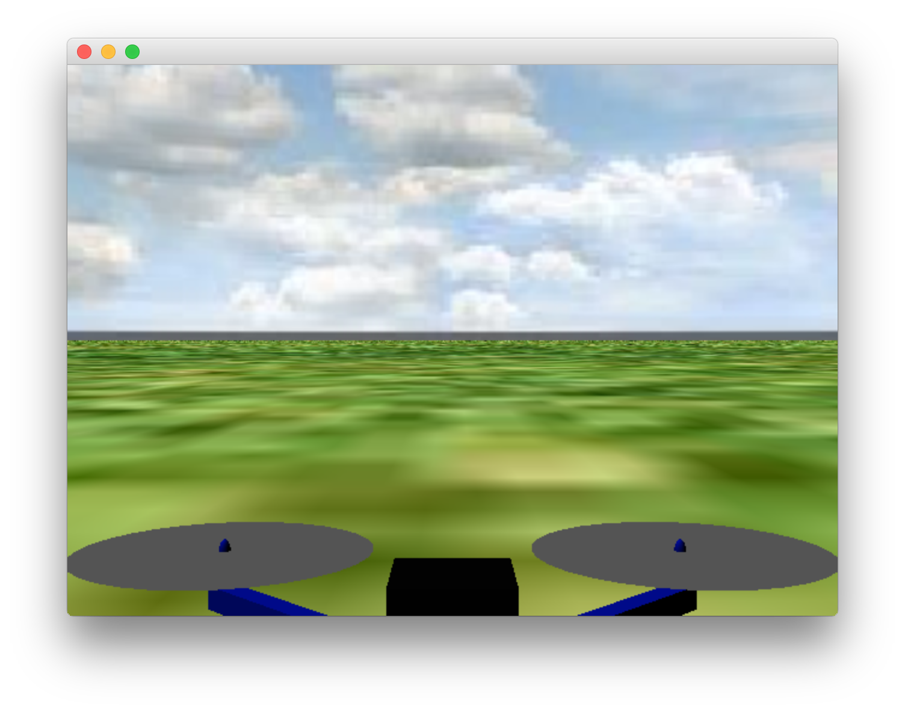

# Software in the Loop (SITL) Simulation

SITL은 호스트 머신에서 완전한 시스템을 실행시키고 autopilot을 시뮬레이션합니다. 로컬 네트워크로 시뮬레이터에 연결합니다. 셋업은 다음과 같습니다 :


graph LR;
  Simulator-->MAVLink;
  MAVLink-->SITL;


## SITL 실행

[simulation 전제조건](../setup/dev_env.md)들이 시스템에 설치되고 난 후라면, 그냥 런치만 하면 됩니다 : make 타겟으로 POSIX 호스트 빌드 컴파일하고 시뮬레이션을 실행합니다.

```sh
make posix_sitl_default jmavsim
```

PX4 쉘이 나타납니다:

```sh
[init] shell id: 140735313310464
[init] task name: px4

______  __   __    ___
| ___ \ \ \ / /   /   |
| |_/ /  \ V /   / /| |
|  __/   /   \  / /_| |
| |     / /^\ \ \___  |
\_|     \/   \/     |_/

Ready to fly.


pxh>
```

## 중요 파일

  * 시작 스크립트는 [posix-configs/SITL/init](https://github.com/PX4/Firmware/tree/master/posix-configs/SITL/init) 폴더에 있고 이름은 `rcS_SIM_AIRFRAME`입니다. 디폴트는 `rcS_jmavsim_iris`입니다.
  * root 파일 시스템(`/`와 동일)은 빌드 디렉토리 내부에 위치:
 `build_posix_sitl_default/src/firmware/posix/rootfs/`

## 하늘로 올리기

그리고 [jMAVSim](http://github.com/PX4/jMAVSim.git) 시뮬레이터의 3D 뷰를 가지는 윈도우 :



시스템은 일단 초기화를 마치면 home position을 출력합니다. (`telem> home: 55.7533950, 37.6254270, -0.00`) 다음을 입력해서 공중으로 띄웁니다 :

```sh
pxh> commander takeoff
```

> **Info** 조이스틱 지원은 QGroundControl(QGC)를 통해서 가능합니다. 수동 입력을 사용하기 위해서는 메뉴얼 비행 모드로(POSCTL, position control) 시스템을 둡니다. QGC preferences 메뉴에서 조이스틱을 활성화시킬 수 있습니다.

## Wifi 드론 시뮬레이팅

로컬 네트워크에 있는 Wifi를 통해 연결한 드론을 시뮬레이션하기 위한 특별한 타겟이 있습니다:

```sh
make broadcast jmavsim
```

시뮬레이터는 실제 드론이 하는 것처럼 로컬 네트워크에 자신의 주소를 브로드캐스팅합니다.

## 확장과 커스터마이징

시뮬레이션 인터페이스를 확장하고 커스터마이징하기 위해서 `Tools/jMAVSim` 폴더에 있는 파일을 수정합니다. 코드는 Github에 [jMAVSim repository](https://github.com/px4/sitl_gazebo)를 참고하세요.

> ** Info ** 빌드 시스템은 시뮬레이터를 포함해서 의존하는 모든 모듈의 올바른 버전을 체크아웃해야 합니다. 디렉토리에 있는 파일의 변경을 덮어쓰기를 하지는 않습니다. 하지만 변경 사항이 서브모듈에 커밋되는 경우 새로운 commit hash로 Firmware repo에 등록되어야 합니다. 이렇게 하기 위해서 `git add Tools/jMAVSim`와 변경을 커밋합니다. 이것은 시뮬레이터의 GIT hash를 업데이트합니다.

## ROS 인터페이스

시뮬레이션은 실제 비행체와 동일한 방식으로 [ROS 인터페이스](../simulation/ros_interface.md)를 사용합니다.
