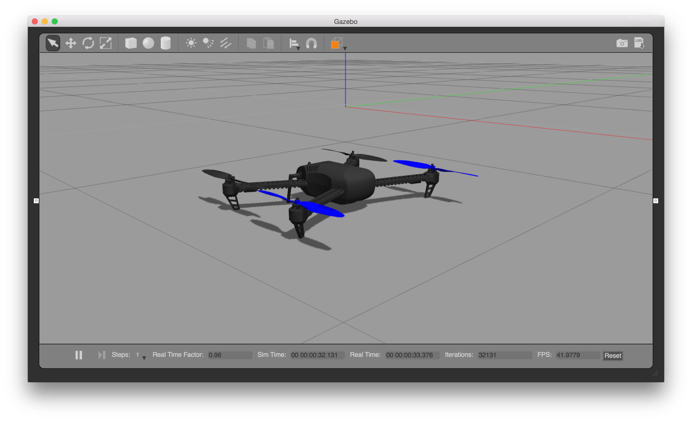

# Gazebo Simulation

[Gazebo](http://gazebosim.org) is a 3D simulation environment for autonomous robots. It supports standalone use (without ROS) or SITL + ROS.

https://www.youtube.com/watch?v=qfFF9-0k4KA&vq=hd720



graph LR;
  Gazebo-->Plugin;
  Plugin-->MAVLink;
  MAVLink-->SITL;


## Installation

The installation requires to install Gazebo and our simulation plugin.

> ** Note ** Gazebo version 7 is recommended (the minimum version is Gazebo 6). If you run Linux and installed a ROS version earlier than Jade, be sure to uninstall the bundled Gazebo (sudo apt-get remove ros-indigo-gazebo) version as it is too old.

### Mac OS

Mac OS requires Gazebo 7.

```sh
brew install gazebo7
```

### Linux

The PX4 SITL uses the Gazebo simulator, but does not depend on ROS. The simulation can be [interfaced to ROS](simulation-ros-interface.md) the same way as normal flight code is.

#### ROS Users

If you plan to use PX4 with ROS, make sure to follow the [Gazebo version guide for version 7](http://gazebosim.org/tutorials?tut=ros_wrapper_versions#Gazebo7.xseries) for ROS.

#### Normal Installation

Follow the [Linux installation instructions](http://gazebosim.org/tutorials?tut=install_ubuntu&ver=7.0&cat=install) for Gazebo 7.

## Running the Simulation

From within the source directory of the PX4 Firmware run the PX4 SITL with one of the airframes (Quads, planes and VTOL are supported, including optical flow):

### Quadrotor

```sh
cd ~/src/Firmware
make posix_sitl_default gazebo
```

### Quadrotor with Optical Flow

```sh
cd ~/src/Firmware
make posix gazebo_iris_opt_flow
```

### Standard VTOL

```sh
cd ~/src/Firmware
make posix_sitl_default gazebo_standard_vtol
```

### Tailsitter VTOL

```sh
cd ~/src/Firmware
make posix_sitl_default gazebo_tailsitter
```

> ** Note ** Please refer to the [Installing Files and Code](http://dev.px4.io/starting-installing-mac.html) guide in case you run into any errors.

This will bring up the PX4 shell:

```sh
[init] shell id: 140735313310464
[init] task name: px4

______  __   __    ___
| ___ \ \ \ / /   /   |
| |_/ /  \ V /   / /| |
|  __/   /   \  / /_| |
| |     / /^\ \ \___  |
\_|     \/   \/     |_/

px4 starting.


pxh>
```

> ** Note ** Right-clicking the quadrotor model allows to enable follow mode from the context menu, which is handy to keep it in view.

## Taking it to the Sky



The system will print the home position once it finished intializing (`telem> home: 55.7533950, 37.6254270, -0.00`). You can bring it into the air by typing:

```sh
pxh> commander takeoff
```

> ** Note ** Joystick or thumb-joystick support is available through QGroundControl (QGC). To use manual input, put the system in a manual flight mode (e.g. POSCTL, position control). Enable the thumb joystick from the QGC preferences menu.

## Extending and Customizing

To extend or customize the simulation interface, edit the files in the `Tools/sitl_gazebo` folder. The code is available on the [sitl_gazebo repository](https://github.com/px4/sitl_gazebo) on Github.

> ** Note ** The build system enforces the correct GIT submodules, including the simulator. It will not overwrite changes in files in the directory.

## Interfacing to ROS

The simulation can be [interfaced to ROS](simulation-ros-interface.md) the same way as onboard a real vehicle.
