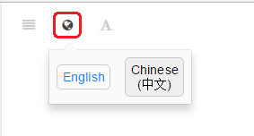

# PX4 开发指南 ({{ book.px4_version }})

  

> **Info** 本手册主要面向软件开发人员及（新的）硬件集成商。 To fly, build and modify vehicles using supported hardware see the [PX4 User Guide](https://docs.px4.io/master/en/).

本指南介绍了如下内容：

* Get a [minimum developer setup](setup/config_initial.md), [build PX4 from source](setup/building_px4.md) and deploy on [numerous supported autopilots](https://docs.px4.io/master/en/flight_controller/).
* 理解 [PX4 系统架构](concept/architecture.md) 以及核心概念。
* 学习如何更改飞行栈及中间层： 
  * 更改飞行算法和添加新的 [飞行模式](concept/flight_modes.md)。
  * 支持新的 [机型](airframes/README.md)。
* 学习如何将PX4集成到新的硬件上： 
  * 支持新的传感器和执行器, 包括摄像头、测距仪等。
  * 修改PX4使之能够在新的自驾仪硬件上运行。
* 对 PX4 进行 [仿真](simulation/README.md)、[测试](test_and_ci/README.md) 和 [调试/查看日志](debug/README.md)。
* 与外部机器人的 API 进行联调通信/集成。

## 支持 {#support}

[Support](contribute/support.md) provide links to the [discussion boards](http://discuss.px4.io/) and other support channels.

> **Tip** The [Weekly Dev Call](contribute/dev_call.md) is another great opportunity to meet the PX4 dev team and discuss platform technical details, pull requests, major impacting issues etc. There is also time for Q&A.

## 贡献

[Contributing](contribute/README.md) explains how to work with our [source codelines](contribute/code.md), [documentation](contribute/docs.md), [translations](contribute/translation.md), and [licenses](contribute/licenses.md).

## Licence

The code is free to use and modify under terms of the permissive [BSD 3-clause license](https://opensource.org/licenses/BSD-3-Clause). The documentation is licensed under [CC BY 4.0](https://creativecommons.org/licenses/by/4.0/). For more information see: [Licences](contribute/licenses.md).

## 翻译

There are Chinese and Korean [translations](contribute/docs.md#translation) of this guide. You can access these by clicking the language-switcher icon:

## 日历 & 活动 {#calendar}

The *Dronecode Calendar* shows important events for platform developers and users. Select the links below to display the calendar in your timezone (and to add it to your own calendar):

* [Switzerland – Zurich](https://calendar.google.com/calendar/embed?src=linuxfoundation.org_g21tvam24m7pm7jhev01bvlqh8%40group.calendar.google.com&ctz=Europe%2FZurich)
* [Pacific Time – Tijuana](https://calendar.google.com/calendar/embed?src=linuxfoundation.org_g21tvam24m7pm7jhev01bvlqh8%40group.calendar.google.com&ctz=America%2FTijuana)
* [Australia – Melbourne/Sydney/Hobart](https://calendar.google.com/calendar/embed?src=linuxfoundation.org_g21tvam24m7pm7jhev01bvlqh8%40group.calendar.google.com&ctz=Australia%2FSydney)

**Note:** calendar defaults to CET.

 <iframe src="https://calendar.google.com/calendar/embed?title=Dronecode%20Calendar&amp;mode=WEEK&amp;height=600&amp;wkst=1&amp;bgcolor=%23FFFFFF&amp;src=linuxfoundation.org_g21tvam24m7pm7jhev01bvlqh8%40group.calendar.google.com&amp;color=%23691426&amp;ctz=Europe%2FZurich" style="border-width:0" width="800" height="600" frameborder="0" scrolling="no" mark="crwd-mark"></iframe> 



## Governance

The PX4 flight stack is hosted under the governance of the [Dronecode Project](https://www.dronecode.org/).

&nbsp;

