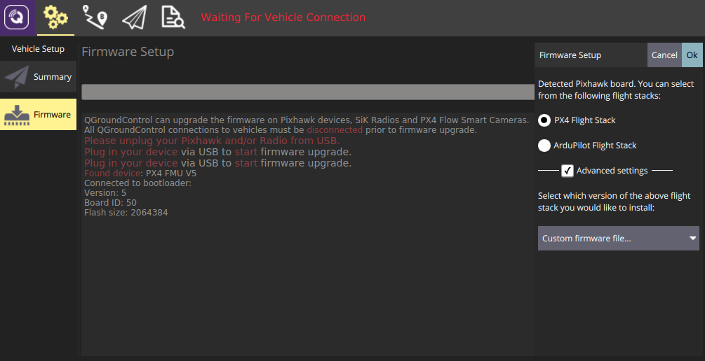

# 添加一个新的机型

PX4使用存储的配置作为机型的起始点。 机体的配置在[ROMFS/px4fmu_common/init.d](https://github.com/PX4/Firmware/tree/master/ROMFS/px4fmu_common/init.d)文件夹下的[配置文件](#config-file)中定义。 配置文件中引用了用于描述机体物理结构的[混控文件](#mixer-file)，该类文件存储在[ROMFS/px4fmu_common/mixers](https://github.com/PX4/Firmware/tree/master/ROMFS/px4fmu_common/mixers)文件夹下。

添加配置是非常简单的：在 [init.d](https://github.com/PX4/Firmware/tree/master/ROMFS/px4fmu_common/init.d) 文件夹下创建一个新的文件（使用未使用的 autostart ID 作为文件名的前缀），然后[构建并上传](../setup/building_px4.md)固件即可。

如果不想创建自己的配置文件，也可以用SD卡上的文本文件替换掉已有的自定义配置文件，具体细节请查看[自定义系统启动页。](../concept/system_startup.md)

## 配置文件概述

配置和混控文件中的机型配置包括如下几个主要模块：

* 机架说明文档(被[Airframes Reference](../airframes/airframe_reference.md)和*QGroundControl*) 使用。
* 飞机特定的参数设置，包括[参数整定增益](#tuning-gains)。
* 应该启动的应用，例如多旋翼或者固定翼的控制器，着陆检测等等。
* 系统（固定翼，飞翼或者多旋翼）的物理配置。 在这里我们称之为 [混控器](../concept/mixing.md)。

上述几个模块在很大程度上都是相互独立的，这就意味着很多配置共用同一套机架的物理结构、启动同样的应用，仅在参数整定增益上有较大区别。

> **Note** 新的机型配置文件仅在执行干净的构建后（运行命令 `make clean`）才会被自动添加到构建系统中。

### 配置文件 {#config-file}

A typical configuration file is shown below ([original file here](https://github.com/PX4/Firmware/blob/master/ROMFS/px4fmu_common/init.d/airframes/3033_wingwing)).

第一部分是关于机身框架的文档说明。 [Airframes Reference](../airframes/airframe_reference.md) 和 *QGroundControl* 会用到该部分内容。

```bash
#!nsh
#
# @name Wing Wing (aka Z-84) Flying Wing
#
# @url https://docs.px4.io/en/framebuild_plane/wing_wing_z84.html
#
# @type Flying Wing
# @class Plane
#
# @output MAIN1 left aileron
# @output MAIN2 right aileron
# @output MAIN4 throttle
#
# @output AUX1 feed-through of RC AUX1 channel
# @output AUX2 feed-through of RC AUX2 channel
# @output AUX3 feed-through of RC AUX3 channel
#
# @maintainer Lorenz Meier <lorenz@px4.io>
#
```

接下来的一部分指定飞机特定的参数，包括[调整增益](#tuning-gains)：

```bash
sh /etc/init.d/rc.fw_defaults

if [ $AUTOCNF == yes ]
then
  param set BAT_N_CELLS 2
  param set FW_AIRSPD_MAX 15
  param set FW_AIRSPD_MIN 10
  param set FW_AIRSPD_TRIM 13
  param set FW_R_TC 0.3
  param set FW_P_TC 0.3
  param set FW_L1_DAMPING 0.74
  param set FW_L1_PERIOD 16
  param set FW_LND_ANG 15
  param set FW_LND_FLALT 5
  param set FW_LND_HHDIST 15
  param set FW_LND_HVIRT 13
  param set FW_LND_TLALT 5
  param set FW_THR_LND_MAX 0
  param set FW_PR_FF 0.35
  param set FW_RR_FF 0.6
  param set FW_RR_P 0.04
fi
```

设置机身框架类型（MAV_TYPE）

```bash
# 配置此为固定翼
set MAV_TYPE 1
```

设置需要使用的混控器:

```bash
# 设定混控
set MIXER wingwing
```

配置PWM输出(指定驱动/激活的输出和级别)。

```bash
# 向 ESC 提供一个常值 1000 us 脉冲
set PWM_OUT 4
set PWM_DISARMED 1000
```

> **Warning**：如果你想将某一个通道反相, 千万不要在你的遥控器上这样做或者改变例如 `RC1_REV` 这样的参数. 这些参数只会在你使用手动模式飞行的时候才会反相, 当你切换到飞控控制的飞行模式时, 这些通道输出依然是错误的(它只会改变你的遥控器的信号) 因此，对于一个正确的通道分配，要么改变PWM信号与`PWM_MAIN_REV1`（例如，对于通道1），要么改变相应混控器的输出缩放系数（见下文）。

### 混控器文件 {#mixer-file}

> **Note** 你应首先阅读 [概念 > 混控器](../concept/mixing.md) 页面， 该页面中的内容提供了理解如下混控器文件所需的背景知识。

下面展示了一个典型的混控器文件（[原始文件在这里](https://github.com/PX4/Firmware/blob/master/ROMFS/px4fmu_common/mixers/wingwing.main.mix)）。 混控器文件的文件名，在这里的案例中也就是 `wingwing.main.mix`，向我们提供了包括机型类型（`wingwing`），输出类型（`.main` 或者 `.aux`）和它是一个混控器定义文件（`.mix`）这三个重要信息。

混频器文件包含多个代码块，每个代码块都针对一个执行器或电调。 因此，如果你有两个执行器和一个 ESC，那么你的混控器文件应该包含三个代码块。

> **Note** 舵机 / 电机应按照混控器文件中的定义顺序对应地接入飞控。

所以 MAIN1 应为左副翼，MAIN2 应为为右副翼 ，MAIN3 为空 （这里需要注意的是 Z: 表示混控器为空），MAIN4 为油门（在常规固定翼机型配置中应保持油门在 4 号输出位置上）。

混控器以 -10000 到 10000 这一范围进行单位化编码，其分别对应于 -1.. + 1。

    M: 2
    O:      10000  10000      0 -10000  10000
    S: 0 0  -6000  -6000      0 -10000  10000
    S: 0 1   6500   6500      0 -10000  10000
    

上述定义中从左到右每一个数字所代表的意思是：

* M: 数字 2 表示该输出通道对应两个控制输入， 该参数表示混控器将接受到的控制输入的数量。
* O: Indicates the output scaling (*1 in negative, *1 in positive), offset (zero here), and output range (-1..+1 here).  
  * If you want to invert your PWM signal, the signs of the output scalings have to be changed: ```O:      -10000  -10000      0 -10000  10000```
  * 如果这一行设定的是如下默认值，那么我们也可以（也应该）完全省略这一行： ```O:      10000  10000   0 -10000  10000```
* S：表示第一个输入的缩放器：它取控制组 #0 (Flight Control) 的第一个控制量（滚转）作为输入。 它将滚转控制输入 * 0.6 进行缩放并反转输入量的正负号（-0.6 在缩放后的单位中变成了 -6000）。 该混控器不施加任何偏移量（0）且输出量幅值在 （-1.. +1）这个范围内。
* S：表示第二个输入的缩放器：它取控制组 #0 (Flight Control) 的第二个控制量（俯仰）作为输入。 它将对俯仰控制输入 *0.65 进行缩放， 不施加任何偏移量（0）并且输出量的幅值在 （-1.. +1）这个范围内。

> **Note** In short, the output of this mixer would be SERVO = ( (roll input \* -0.6 + 0) \* 1 + (pitch input \* 0.65 + 0) \* 1 ) \* 1 + 0

程序后台会对两个缩放器的值进行求和，这就意味着对于这个飞翼来说该控制舵面最大从滚转信号中取 60% 的舵面偏转、从俯仰信号中最大取 65% 的舵面偏转。

完整的混控器如下所示:

```bash
Delta-wing mixer for PX4FMU
===========================

Designed for Wing Wing Z-84

This file defines mixers suitable for controlling a delta wing aircraft using
PX4FMU. The configuration assumes the elevon servos are connected to PX4FMU
servo outputs 0 and 1 and the motor speed control to output 3. Output 2 is
assumed to be unused.

Inputs to the mixer come from channel group 0 (vehicle attitude), channels 0
(roll), 1 (pitch) and 3 (thrust).

See the README for more information on the scaler format.

Elevon mixers
-------------
Three scalers total (output, roll, pitch).

The scaling factor for roll inputs is adjusted to implement differential travel
for the elevons. 

This first block of code is for Servo 0...

M: 2
O:      10000  10000      0 -10000  10000
S: 0 0  -6000  -6000      0 -10000  10000
S: 0 1   6500   6500      0 -10000  10000

And this is for Servo 1...

M: 2
O:      10000  10000      0 -10000  10000
S: 0 0  -6000  -6000      0 -10000  10000
S: 0 1  -6500  -6500      0 -10000  10000

Note that in principle, you could implement left/right wing asymmetric mixing, but in general the two blocks of code will be numerically equal, and just differ by the sign of the third line (S: 0 1), since to roll the plane, the two ailerons must move in OPPOSITE directions. 
The signs of the second lines (S: 0 0) are indentical, since to pitch the plane, both servos need to move in the SAME direction. 

Output 2
--------
This mixer is empty.

Z:

Motor speed mixer
-----------------
Two scalers total (output, thrust).

This mixer generates a full-range output (-1 to 1) from an input in the (0 - 1)
range.  Inputs below zero are treated as zero.

M: 1
O:      10000  10000      0 -10000  10000
S: 0 3      0  20000 -10000 -10000  10000

```

## 增加一个新的机型组（Airframe Group）

机型 "组" 用于对相似的机型进行分组，以方便在 [QGroundControl](https://docs.qgroundcontrol.com/en/SetupView/Airframe.html) 中进行选取，同时方便在 *Airframe Reference* 中进行文档记录（[PX4 DevGuide](../airframes/airframe_reference.md) 和 [PX4 UserGuide](https://docs.px4.io/en/airframes/airframe_reference.html) 文档）。 每个组都有一个名称和与之相关联的 svg 图像，该图像展示了该分组内的机型的通用几何形状、电机数量和电机旋转方向。

使用编译指令 `make airframe_metadata` 可以运行脚本自动根据机型描述语句生成需要在 *QGroundControl* 中使用的机型元数据文件和文档源代码。

如果新机型属于现有某一个分组，那么你只需要在向位于 [ROMFS/px4fmu_common/init.d](https://github.com/PX4/Firmware/tree/master/ROMFS/px4fmu_common/init.d) 文件夹下的机型描述文件中提供相关文档即可。

如果机型属于一个 **新的组** 那么你还需要进行如下操作：

1. 向文档仓库添加该机型组的 svg 图像文件（如果未添加图像文件则会显示一个占位符图像）： 
  * PX4 开发指南： [assets/airframes/types](https://github.com/PX4/Devguide/tree/master/assets/airframes/types)
  * PX4 用户指南： [assets/airframes/types](https://github.com/PX4/px4_user_guide/tree/master/assets/airframes/types)
2. 在 [srcparser.py](https://github.com/PX4/Firmware/blob/master/Tools/px4airframes/srcparser.py) 文件的 `GetImageName()` 中添加机型组名称与图像文件名的映射关系（遵循如下模式）： 
      def GetImageName(self):
           """
           Get parameter group image base name (w/o extension)
           """
           if (self.name == "Standard Plane"):
               return "Plane"
           elif (self.name == "Flying Wing"):
               return "FlyingWing"
            ...
      ...
           return "AirframeUnknown"

3. 更新 *QGroundControl*： 
  * 将该机型组的 svg 图像文件添加至： [src/AutopilotPlugins/Common/images](https://github.com/mavlink/qgroundcontrol/tree/master/src/AutoPilotPlugins/Common/Images)
  * Add reference to the svg image into [qgcimages.qrc](https://github.com/mavlink/qgroundcontrol/blob/master/qgcimages.qrc), following the pattern below: 
        <qresource prefix="/qmlimages">
            ...
            <file alias="Airframe/AirframeSimulation">src/AutoPilotPlugins/Common/Images/AirframeSimulation.svg</file>
            <file alias="Airframe/AirframeUnknown">src/AutoPilotPlugins/Common/Images/AirframeUnknown.svg</file>
            <file alias="Airframe/Boat">src/AutoPilotPlugins/Common/Images/Boat.svg</file>
            <file alias="Airframe/FlyingWing">src/AutoPilotPlugins/Common/Images/FlyingWing.svg</file>
            ... > 
    
    **Note** 剩下的机型元数据会自动包含在固件中（只要 **srcparser.py** 完成了更新）。 

## 调参

下面的 *PX4 User Guide* 话题解释了如何对那些需要在配置文件中明确的参数进行调整：

* [多轴飞行器 PID 调参指南](https://docs.px4.io/en/advanced_config/pid_tuning_guide_multicopter.html)
* [固定翼 PID 调参指南](https://docs.px4.io/en/advanced_config/pid_tuning_guide_fixedwing.html)
* [垂直起降（VTOL）配置](https://docs.px4.io/en/config_vtol/)

## 将新的机型加入到 QGroundControl

为了令一个新的机型可以在 *QGroundControl* 软件的 [airframe configuration](https://docs.px4.io/en/config/airframe.html) 页面中可用，你应进行如下操作：

1. 创建一个干净的生成（例如，先运行 `make clean` 指令，然后再运行 `make px4_fmu-v5_default`）
2. 打开 QGC 然后如下图所示单击 **Custom firmware file...**：
  
  
  
  随后你将会被要求选择需要被载入的 **.px4** 固件文件（该文件是一个被压缩的 JSON 文件，文件内包含了机型的元数据）。

3. 导航到构建文件夹然后选择相应的固件文件 （例如， **Firmware/build/px4_fmu-v5_default/px4_fmu-v5_default.px4**）。

4. 单击 **OK** 开始载入固件。
5. 重启 *QGroundControl*。

新的机型现在应可以在 *QGroundControl* 中进行选择了。