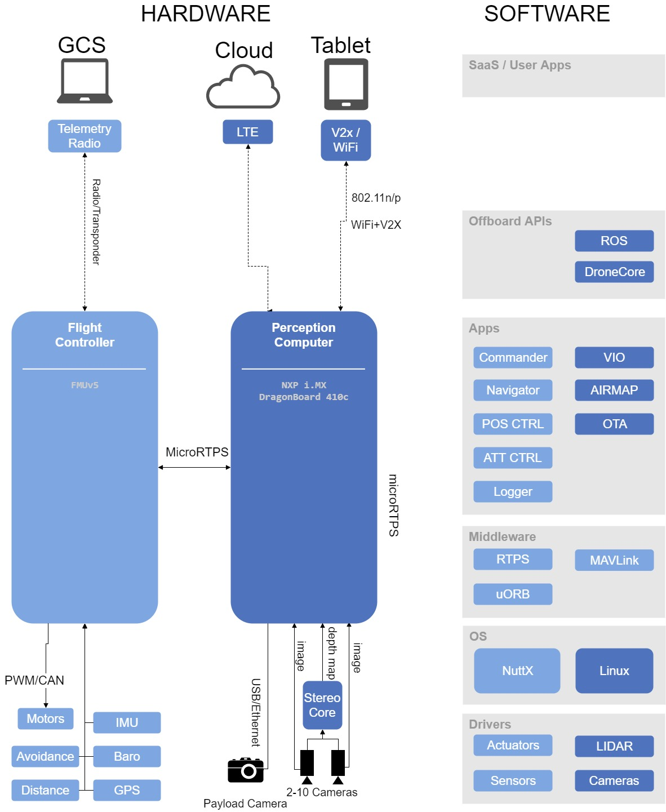

# PX4 平台硬件/软件结构

下面的图表提供了对完整的PX4号板载和离线堆栈的前瞻性高层概览。 图的左侧展示的是一种可能的 *飞行控制器 （flight controller）* （亮蓝色）通过 [RTPS](../middleware/micrortps.md) 与 *视觉感知计算机（perception computer）* (深蓝色) 相连接的硬件配置。 感知计算机配备一个单独的相机载荷，并使用相机传感器阵列提供视觉控制和目标回避功能。

图的右侧显示了端到端的软件堆栈。 堆栈 "近似" 与关系图的硬件部分水平对齐, 并使用颜色进行了编码以显示哪些软件在飞行控制器上运行、哪些软件在配套计算机上运行。

> **Note** [PX4 Architectural Overview](../concept/architecture.md) 页面提供了有关飞行控制栈和中间件的相关信息。 Offboard API 的相关内容见 [ROS](../ros/README.md) 和 [DroneCore](https://mavsdk.mavlink.io/develop/en/index.html) 。

<!-- The drawing is on draw.io: https://drive.google.com/file/d/14sgSpcs7NcBatW-qn0dLtyMHvwNMSSlm/view?usp=sharing. Request access from dev team. -->