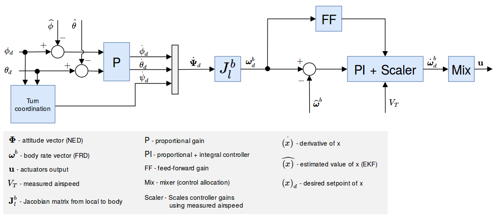

# 控制器图解

本节包括PX4主要控制器的图解。

图解使用标准的 [PX4 符号](../contribute/notation.md) (附有详细图例注解)。

## 多旋翼位置控制器

<!-- The drawing is on draw.io: https://drive.google.com/open?id=13Mzjks1KqBiZZQs15nDN0r0Y9gM_EjtX
Request access from dev team. -->

* Estimates come from [EKF2](https://docs.px4.io/master/en/advanced_config/tuning_the_ecl_ekf.html).
* 这是一个标准的位置-速度级联控制回路。
* 在某些模式，外环(位置回路) 可能会被绕过 (图中在外环之后增加一个多路开关来表示)。 只有在位置保持模式或某轴无速度请求时，位置回路才会发挥作用。
* 内环（加速度）控制器使用箝位法对积分器做了抗饱和处理（ARW）。

## 固定翼位置控制器

### 总能量控制系统

通过总能量控制系统(TECS)，PX4可以持续得对固定翼飞行器的真空速和高度进行控制。 这其中的代码通过一个用库（这个库是用于固定翼位置控制模块）作为接口。

从上面的图表可以看出，总能量控制系统接受空速和高度需求量，然后输出油门和俯仰角控制量。 这两个输出控制量输入到固定翼的姿态控制器（姿态控制器实施姿态控制） 因此，总能量控制系统是直接受到俯仰控制逻辑环的性能影响 对飞行器俯仰角度的预测不准往往会导致对空速和高度的预测不准。

> **Note** 在试图调试总能量控制系统前，请一定要调试好姿态控制器。

对真空速和高度的持续跟踪控制不是一个简单的事情。 增加飞行器的俯仰角度不仅会导致高度上升还会导致空速下降。 增加油门会使空速增加但是也会使升力变大从而使高度也增加。 因此，俯仰角和油门两个输入量都会对空速和高度产生影响，从而使控制问题变得难了。

总能量控制系统通过能量法来解决这个问题，而不是通过之前的那种设定点进行控制。 一架飞行器的总能量包括动能和势能。 推力（通过油门控制）增加整个飞机的总能量。 势能和动能的任意组合可以组成总能量 换句话说，飞行器在高海拔以低空速飞行和在低海拔以高空速飞行时的总能量是等价的 我们称这种情况叫做特殊能量平衡，通过当前高度海拔和真空速设定值来计算 特定能量平衡通过飞行器的俯仰角来控制 俯仰角增加将动能转变为势能，减少则情况相反。 这样就把控制问题解耦成最初的空速设定点转化了多少势能能量，而转化多少能量可以独立控制。 我们利用推力调节飞行器的特定总能量，俯仰角来维持势能（高度）和动能（真空速）的特定平衡点。

#### 总能量控制逻辑环

#### Total energy balance control loop

The total energy of an aircraft is the sum of kinetic and potential energy:

$$E_T = \frac{1}{2} m V_T^2 + m g h$$,

Taking the derivative with respect to time leads to the total energy rate:

$$\dot{E_T} = m V_T \dot{V_T} + m g \dot{h}$$.

From this, the specific energy rate can be formed as:

$$\dot{E} = \frac{\dot{E_T}}{mgV_T} = \frac{\dot{V_T}}{g} + \frac{\dot{h}}{V_T} = \frac{\dot{V_T}}{g} + sin(\gamma) $$

where $$\gamma$$ is the flight plan angle. For small $$\gamma$$ we can approximate this as

$$ \dot{E} \approx \frac{\dot{V_T}}{g} + \gamma $$.

From the dynamic equations of an aircraft we get the following relation:

$$ T - D = mg(\frac{\dot{V_T}}{g} + sin(\gamma)) \approx mg(\frac{\dot{V_T}}{g} + \gamma) $$,

where T and D are the thrust and drag forces. In level flight, initial thrust is trimmed against the drag and a change in thrust results thus in:

$$ \Delta T = mg(\frac{\dot{V_T}}{g} + \gamma) $$.

As can be seen, $$\Delta T$$ is proportional to $$\dot{E}$$, and thus the thrust setpoint should be used for total energy control.

Elevator control on the other hand is energy conservative, and is thus used for exchanging potentional energy for kinetic energy and vice versa. To this end, a specific energy balance rate is defined as

$$\dot{B} = \gamma - \frac{\dot{V_T}}{g}$$.

## Fixed-Wing Attitude Controller

<!-- The drawing is on draw.io: https://drive.google.com/file/d/1ibxekmtc6Ljq60DvNMplgnnU-JOvKYLQ/view?usp=sharing
Request access from dev team. -->

The attitude controller works using a cascaded loop method. The outer loop computes the error between the attitude setpoint and the estimated attitude that, multiplied by a gain (P controller), generates a rate setpoint. The inner loop then computes the error in rates and uses a PI (proportional + integral) controller to generate the desired angular acceleration.

The angular position of the control effectors (ailerons, elevators, rudders, ...) is then computed using this desired angular acceleration and a priori knowledge of the system through control allocation (also known as mixing). Furthermore, since the control surfaces are more effective at high speed and less effective at low speed, the controller - tuned for cruise speed - is scaled using the airspeed measurements (if such a sensor is used).

> **Note** If no airspeed sensor is used then gain scheduling for the FW attitude controller is disabled (it's open loop); no correction is/can be made in TECS using airspeed feedback.

The feedforward gain is used to compensate for aerodynamic damping. Basically, the two main components of body-axis moments on an aircraft are produced by the control surfaces (ailerons, elevators, rudders, - producing the motion) and the aerodynamic damping (proportional to the body rates - counteracting the motion). In order to keep a constant rate, this damping can be compensated using feedforward in the rate loop.

The roll and pitch controllers have the same structure and the longitudinal and lateral dynamics are assumed to be uncoupled enough to work independently. The yaw controller, however, generates its yaw rate setpoint using the turn coordination constraint in order to minimize lateral acceleration, generated when the aircraft is slipping. The yaw rate controller also helps to counteract adverse yaw effects (https://youtu.be/sNV_SDDxuWk) and to damp the [Dutch roll mode](https://en.wikipedia.org/wiki/Dutch_roll) by providing extra directional damping.

## VTOL 飞行控制器

<!-- The drawing is on draw.io: https://drive.google.com/file/d/1tVpmFhLosYjAtVI46lfZkxBz_vTNi8VH/view?usp=sharing
Request access from dev team. -->

本节简要介绍垂直起降（VTOL）无人机的控制结构。 垂直起降飞行控制器由多旋翼控制器和固定翼控制器组成，多旋翼控制器在垂直起降模式下运行，固定翼控制器在平飞模式下运行，二者在过渡模式下同时运行。 上图是一个简化的控制流程图。 注意到 VTOL 姿态控制器模块，它主要对不同 VTOL 模式间的必要切换和混控逻辑，以及过渡模式下 VTOL 机型的特定控制动作（例如，在前向过渡期间加速标准 VTOL 的推进马达）起到促进作用。 此模块的输入称为“虚拟输入”，因为控制器会根据当前的 VTOL 模式而忽略一些输入。

对于标准和倾转旋翼 VTOL，在过渡期间，固定翼姿态控制器产生角速率设定值，然后将其输入到单独的角速率控制器中，从而产生多旋翼和固定翼执行器的扭矩指令。 而对尾座式 VTOL，在过渡期间，多旋翼姿态控制器独立运行。

VTOL姿态模块的输出是多旋翼执行器（典型的 `actuator_controls_0`）和固定翼（典型的 `actuator_controls_1`）执行器的独立的扭矩和力指令。 这些是在一个特定机型的混控器文件中处理的（参见[ Mixing](../concept/mixing.md)）。

For more information on the tuning of the transition logic inside the VTOL block, see [VTOL Configuration](https://docs.px4.io/master/en/config_vtol/).

### 空速缩放

本节的目的是：通过公式来解释为何以及怎样根据空速调整角速率回路 (PI) 和前馈控制器 (FF) 的输出。 我们首先给出简化的滚转轴线性力矩方程，然后分析空速对直接力矩产生的影响，最后分析了空速对匀速滚转运动的影响。

如上图中的固定翼姿态控制器所示，角速率控制器为控制分配器（这里称为“混控器”）输出角加速度设定值。 为了达到期望的角加速度，混控器利用可行的气动控制面 (例如：典型的飞机通常有两个副翼，两个升降舵和一个方向舵) 产生力矩。 气动控制面产生的力矩在很大程度上受飞机的相对空速和空气密度的影响，更准确地说，是受气动压力的影响。 如果不进行空速缩放，在某一特定巡航速度下调参的控制器，将会使飞机在高速下发生振荡，或者在低速下产生不良的跟踪性能。

读者们应注意 [真实空速（TAS）](https://en.wikipedia.org/wiki/True_airspeed)和 [指示空速 （IAS）](https://en.wikipedia.org/wiki/Indicated_airspeed)之间的不同，因为它们的值在非海面飞行时有显著差异。

气动压力的定义是

$$\bar{q} = \frac{1}{2} \rho V_T^2$$,

其中，$$\rho$$ 代表空气密度，$$V_T$$ 代表真实空速（TAS）。

本节剩余部分以滚转轴为例，写出带量纲的滚转轴力矩

$$\ell = \frac{1}{2}\rho V_T^2 S b C_\ell = \bar{q} S b C_\ell$$,

其中，$$\ell$$ 代表滚转力矩，$$b$$ 代表飞机翼展，$$S$$ 代表参考面。

无量纲的滚转力矩导数 $$C_\ell$$ 可以通过以下几个系数建模得到：副翼效率导数 $$C_{\ell_{\delta_a}}$$，滚转阻尼导数 $$C_{\ell_p}$$ 和二面角导数 $$C_{\ell_\beta}$$。

$$C_\ell = C_{\ell_0} + C_{\ell_\beta}\:\beta + C_{\ell_p}\:\frac{b}{2V_T}\:p + C_{\ell_{\delta_a}} \:\delta_a$$,

其中，$$\beta$$ 代表侧滑角，$$p$$ 代表滚转角速率，$$\delta_a$$ 代表副翼偏转角。

假设一架飞机对称 ($$C_{\ell_0} = 0$$) 且无协调（$$\beta = 0$$），则上面的方程可以简化到只用滚转率阻尼和副翼产生的滚转力矩表示。

$$\ell = \frac{1}{2}\rho V_T^2 S b \left [C_{\ell_{\delta_a}} \:\delta_a + C_{\ell_p}\:\frac{b}{2V_T} \: p \right ]$$.

最后一个方程将作为以下两个小节的基准，以推导 PI 和 FF 控制器所需的空速缩放表达式。

#### 静态力矩 (PI) 缩放

在滚转角速率为0（$$p = 0$$）的情况下，阻尼项将会消失，并且可以通过以下方式生成一个恒定-瞬时力矩

$$\ell = \frac{1}{2}\rho V_T^2 S b \: C_{\ell_{\delta_a}} \:\delta_a = \bar{q} S b \: C_{\ell_{\delta_a}} \:\delta_a$$.

提取 $$\delta_a$$，如下所示

$$\delta_a = \frac{2bS}{C_{\ell_{\delta_a}}} \frac{1}{\rho V_T^2} \ell = \frac{bS}{C_{\ell_{\delta_a}}} \frac{1}{\bar{q}} \ell$$,

其中，第一项是常数，第二项则取决于空气密度和真实空速的平方。

此外，不用空气密度和真实空速进行缩放，可以发现指示空速（IAS，$$V_I$$）在本质上是受空气密度影响的，在低空低速情况下，指示空速可以乘以一个简单的密度误差因子而转换成真实空速。

$$V_T = V_I \sqrt{\frac{\rho_0}{\rho}}$$,

其中，$$\rho_o$$ 代表海平面15°C场景下的空气密度。

经过一系列重组变换（平方、重排列并使左右两侧同时乘以 1/2 倍），将气动压力 $$\bar{q}$$ 表示如下

$$\bar{q} = \frac{1}{2} \rho V_T^2 = \frac{1}{2} V_I^2 \rho_0$$.

现在我们能清楚地看到气动压力与 IAS 的平方成正比

$$\bar{q} \propto V_I^2$$.

之前用 TAS 和空气密度表示的缩放因数，最终可以用 IAS 重写成以下形式

$$\delta_a = \frac{2bS}{C_{\ell_{\delta_a}}\rho_0} \frac{1}{V_I^2} \ell$$.

#### 角速率回路 (FF) 缩放

角速率控制器前馈通道的主要作用是补偿自然速率阻尼。 回到基准方程，这次在匀速滚转的条件下做简化，副翼产生的力矩应当恰好完全补偿阻尼项

$$- C_{\ell_{\delta_a}} \:\delta_a = C_{\ell_p} \frac{b}{2 V_T} \: p$$.

重组公式以得到理想的副翼偏转角

$$\delta_a = -\frac{b \: C_{\ell_p}}{2 \: C_{\ell_{\delta_a}}} \frac{1}{V_T} \: p$$.

第一项给出了理想的前馈值，我们可以看到缩放因数相对TAS是线性的。 请注意式中的负号，随后它会与滚转阻尼系数的负号相互抵消。

#### 结论

角速率回路 PI 控制器的输出必须由指示空速（IAS）的平方进行缩放，角速率回路前馈通道（FF）必须由真实空速（TAS）进行缩放。

$$\delta_{a} = \frac{V_{I_0}^2}{V_I^2} \delta_{a_{PI}} + \frac{V_{T_0}}{V_T} \delta_{a_{FF}}$$,

其中，$$V_{I_0}$$ 和 $$V_{T_0}$$ 分别代表配平条件下的 IAS 和 TAS。

最后，由于执行器的输出是归一化的，且混控和伺服模块被假定为线性的，因此我们可以将上述方程重写如下

$$\dot{\mathbf{\omega}}*{sp}^b = \frac{V*{I_0}^2}{V_I^2} \dot{\mathbf{\omega}}*{sp*{PI}}^b + \frac{V_{T_0}}{V_T} \dot{\mathbf{\omega}}*{sp*{FF}}^b$$,

该方程可以直接在滚转速率，俯仰速率和偏航速率控制器中实现。

#### 调参建议

这套空速缩放算法的巧妙之处就是它不需要进行特意的调参。 然而，空速传感器的质量将直接影响它的性能。

此外，如果要使稳定的飞行包络线最大化，您应该在最小飞行速度和最大飞行速度的中点位置进行调参 (例如： 一架飞机的飞行速度在 15~25 m/s 之间，则应在 20 m/s调参)。 该“调整”空速应在 [FW_AIRSPD_TRIM](../advanced/parameter_reference.md#FW_AIRSPD_TRIM) 参数中设置。