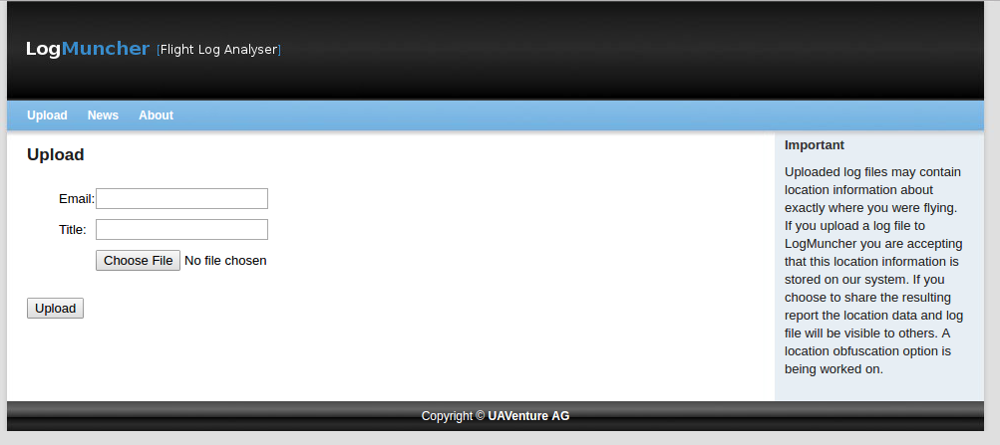
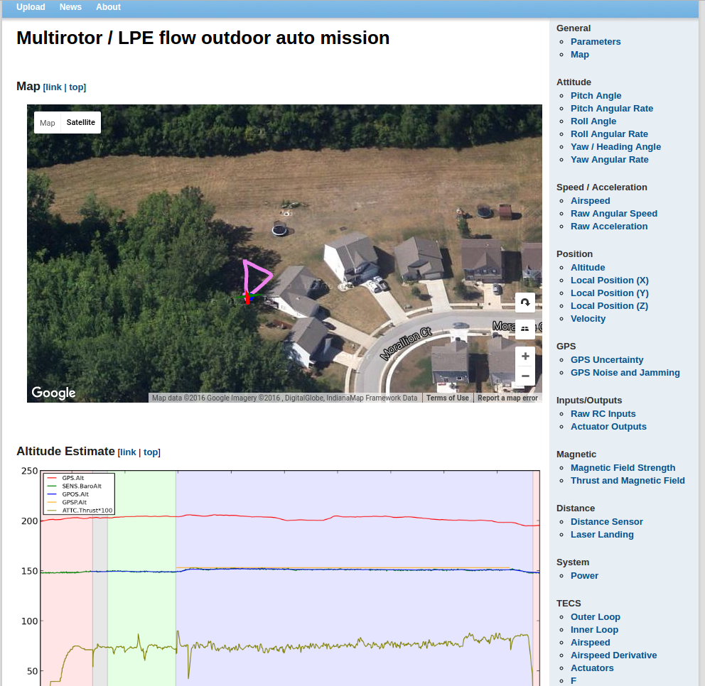

# Flight Log Analysis


这里有几个分析PX4飞行日志的软件，描述如下：

## [Log Muncher](http://logs.uaventure.com)

> **注意：** Log Muncher只可以被用来查看先前`.px4log`格式的日志。

### 上传

用户可直接访问网站并直接上传log: [http://logs.uaventure.com/](http://logs.uaventure.com/)



### 结果



[Example Log](http://logs.uaventure.com/view/KwTFDaheRueMNmFRJQ3huH)

### 优点

* 基于网页，便于终端用户

* 用户可以上传日志并和别人分享

### 缺点

* 分析非常有限，没有定制功能

## [Flight Review](http://logs.px4.io)

Flight Review是Log Muncher的继任者，与新的ULog记录格式结合使用。

### 示例


### 优点

* 基于网页，便于终端用户

* 用户可以上传并和别人分享

* 交互式的画图体验

### 缺点

* 没有定制功能

## [FlightPlot](https://github.com/DrTon/FlightPlot)


### 优点

* 基于JAVA,跨平台

* 直观的用户界面，没有编程知识的要求

### 缺点

* 分析受限于系统内置的一些特性

## [PX4Tools](https://github.com/dronecrew/px4tools)


### 安装

* 建议的方法是使用anaconda3. 详情见 [px4tools github page](https://github.com/dronecrew/px4tools) .

```bash
conda install -c https://conda.anaconda.org/dronecrew px4tools
```

### 优点

* 便于分享，用户可以查看笔记在github\(e.g. [https://github.com/jgoppert/lpe-analysis/blob/master/15-09-30%20Kabir%20Log.ipynb](https://github.com/jgoppert/lpe-analysis/blob/master/15-09-30%20Kabir%20Log.ipynb)\)

* 基于python,跨平台，产品有anaconda 2 and anaconda3

* ipython/ jupyter 笔记容易分享和分析

* 高级绘图能力允许做细节的分析


### 缺点

* 要求用户懂python

* 目前需要使用sdlog2_dump.py或px4tools嵌入的px42csv程序将日志文件转换为csv才能使用
