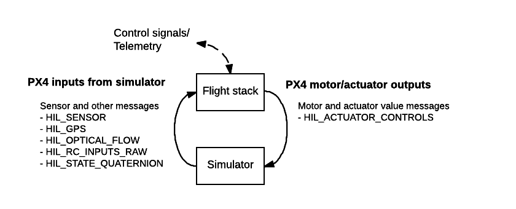
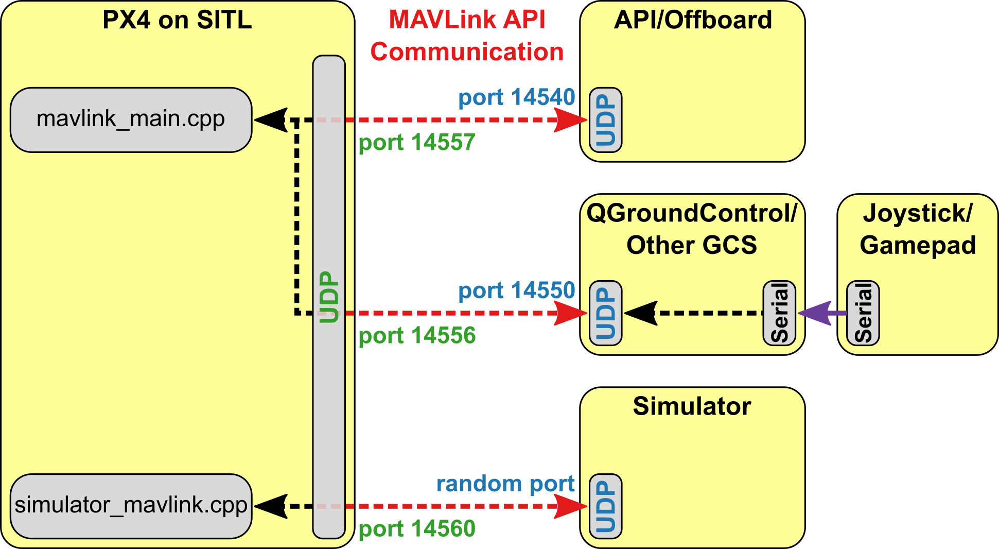

# 仿真

在仿真机中模拟器允许 px4 飞行代码来控制计算机建模工具。 您可以与此工具进行交互，就像您可以使用 *QGroundControl*、非机载 api 或无线电控制器/游戏板与真正的车辆进行交互一样。

> **Tip**仿真是一种快速、简单、最重要的方法，*safe* 的方法来测试对 px4 代码的更改，然后再尝试在现实世界中飞行。 当你还没有飞行器可以试验的时候，使用 px4 来模拟飞行的就是一种好方法。

Px4 支持 *软件在环（SITL）* 仿真，其中飞行堆栈在计算机上运行（同一台计算机或同一网络上的另一台计算机），也支持 *硬件在环（HITL）*仿真，即使用真实飞行电路板来运行仿真。

下一节将提供有关可用仿真器以及如何配置仿真仿真器的信息。 其他部分提供了有关仿真器如何工作的普通信息, 并且不需要 *use* 模拟器。

## 支持的仿真器

以下仿真器与 px4 一起工作，用于 HITL 和/或 SITL 仿真。

| 仿真器                               | 描述 |
| --------------------------------- | -- |
| [Gazebo](../simulation/gazebo.md) |    |

**强烈建议使用此仿真器。**

它具有功能强大的 3D 仿真环境, 特别适用于测试对象避障和计算机视觉。 它还可用于 [多工具仿真](../simulation/multi-vehicle-simulation.md)，通常用于 [ROS](../simulation/ros_interface.md)，这是一种用于自动控制的工具集。 

**支持机型：**四旋翼 ([Iris](../airframes/airframe_reference.md#copter_quadrotor_wide_3dr_iris_quadrotor) 和 [Solo](../airframes/airframe_reference.md#copter_quadrotor_x_3dr_solo))，六旋翼 (Typhoon h480)，[通用四旋翼 delta VTOL 无人机](../airframes/airframe_reference.md#vtol_standard_vtol_generic_quad_delta_vtol)，尾翼，飞机，探测车，潜艇（即将推出！） 

[jMAVSim](../simulation/jmavsim.md) | 一个简单的多旋翼仿真器，允许在仿真机中使用 *copter* 型无人机。

它易设置，可以用来测试您的工具是否可以起飞、飞行、降落、并对各种故障条件 (例如 gps 故障) 做出适当的反应。 它也可用于 多机仿真 </0 >。</p> 

**支持机型： **四旋翼

[AirSim](../simulation/airsim.md) | 提供物理和视觉逼真模拟的跨平台仿真器。 这个模拟器需要大量的资源，需要一台比这里描述的其他仿真器更强大的计算机。

**支持机型: </0 >Iris （多转子模型和 x 配置中 px4 quadrotor 的配置）。</p> 

[Simulation-In-Hardware](../simulation/simulation-in-hardware.md) (SIH) | An alternative to HITL that offers a hard real-time simulation directly on the hardware autopilot.  


**Supported Vehicles:** Quad

Instructions for how to setup and use the simulators are in the topics linked above.

* * *

The remainder of this topic is a "somewhat generic" description of how the simulation infrastructure works. It is not required to *use* the simulators.

## 仿真器 MAVLink API

All simulators communicate with PX4 using the Simulator MAVLink API. This API defines a set of MAVLink messages that supply sensor data from the simulated world to PX4 and return motor and actuator values from the flight code that will be applied to the simulated vehicle. The image below shows the message flow.



> **注意** PX4 的 SITL 版本使用[仿真器 mavlink.cpp](https://github.com/PX4/Firmware/blob/master/src/modules/simulator/simulator_mavlink.cpp)来处理这些消息，而在HITL模式下的硬件构建使用[mavlink receiver.cpp](https://github.com/PX4/Firmware/blob/master/src/modules/mavlink/mavlink_receiver.cpp)。 模拟器中的传感器数据将写入 PX4 uORB 主题。 所有电机/执行器都被卡停，但内部软件可以完全正常运行。

The messages are described below (see links for specific detail).

| 消息                                                                                                             | 方向        | 描述                                                                              |
| -------------------------------------------------------------------------------------------------------------- | --------- | ------------------------------------------------------------------------------- |
| [MAV_MODE:MAV_MODE_FLAG_HIL_ENABLED](https://mavlink.io/en/messages/common.html#MAV_MODE_FLAG_HIL_ENABLED) | 不可用       | 使用模拟时的模式标志。 所有电机/执行器都被卡停，但内部软件可以完全正常运行。                                         |
| [HIL_ACTUATOR_CONTROLS](https://mavlink.io/en/messages/common.html#HIL_ACTUATOR_CONTROLS)                    | PX4 至 Sim | PX4 控制输出 （电机、执行器）。                                                              |
| [HIL_SENSOR](https://mavlink.io/en/messages/common.html#HIL_SENSOR)                                            | Sim 至 PX4 | 在 NED 体框架中以 SI 单位模拟 IMU 读数。                                                     |
| [HIL_GPS](https://mavlink.io/en/messages/common.html#HIL_GPS)                                                  | Sim 至 PX4 | 模拟的 GPS RAW 传感器值。                                                               |
| [HIL_OPTICAL_FLOW](https://mavlink.io/en/messages/common.html#HIL_OPTICAL_FLOW)                              | Sim 至 PX4 | 来自流量传感器的模拟光流 （例如 PX4FLOW 或光学鼠标传感器）。                                             |
| [HIL_STATE_QUATERNION](https://mavlink.io/en/messages/common.html#HIL_STATE_QUATERNION)                      | Sim 至 PX4 | 包含实际的“仿真”无人机位置、姿态、速度等。 这可以记录并与 px4 的分析和调试估计进行比较 （例如，检查估计器在噪声 （仿真） 传感器输入中的工作情况）。 |
| [HIL_RC_INPUTS_RAW](https://mavlink.io/en/messages/common.html#HIL_RC_INPUTS_RAW)                            | Sim 至 PX4 | 收到 RC 通道的 RAW 值。                                                                |

## 默认 PX4 MAVLink UDP 端口

By default, PX4 uses commonly established UDP ports for MAVLink communication with ground control stations (e.g. *QGroundControl*), Offboard APIs (e.g. MAVSDK, MAVROS) and simulator APIs (e.g. Gazebo). These ports are:

- UDP Port **14540** is used for communication with offboard APIs. 期望外接 APIs 监听此端口上的连接。
- UDP Port **14550** is used for communication with ground control stations. 期望 GCS 将侦听此端口上的连接。 *QGroundControl*默认侦听此端口。
- The simulator's local TCP Port **4560** is used for communication with PX4. PX4 侦听此端口，仿真器应通过向该端口广播数据来启动通信。

> **注意**GCS 和外置 API 的端口设置在配置文件中，而仿真器广播端口在模拟 MAVlink 模块中硬编码．

## SITL 仿真环境

The diagram below shows a typical SITL simulation environment for any of the supported simulators. The different parts of the system connect via UDP, and can be run on either the same computer or another computer on the same network.

- PX4 uses a simulation-specific module to connect to the simulator's local TCP port 4560. Simulators then exchange information with PX4 using the [Simulator MAVLink API](#simulator-mavlink-api) described above. SITL 和模拟器上的 PX4 可以在同一台计算机上运行，也可以在同一网络上运行不同的计算机。
- PX4 uses the normal MAVLink module to connect to ground stations (which listen on port 14550) and external developer APIs like MAVSDK or ROS (which listen on port 14540).
- 串行连接用于通过 *QGroundControl* 连接 Joystick/Gamepad 硬件。



If you use the normal build system SITL `make` configuration targets (see next section) then both SITL and the Simulator will be launched on the same computer and the ports above will automatically be configured. You can configure additional MAVLink UDP connections and otherwise modify the simulation environment in the build configuration and initialisation files.

### 启动/构建 SITL 模拟

The build system makes it very easy to build and start PX4 on SITL, launch a simulator, and connect them. The syntax (simplified) looks like this:

    make px4_sitl simulator[_vehicle-model]
    

where `simulator` is `gazebo`, `jmavsim` or some other simulator, and vehicle-model is a particular vehicle type supported by that simulator ([jMAVSim](../simulation/jmavsim.md) only supports multicopters, while [Gazebo](../simulation/gazebo.md) supports many different types).

A number of examples are shown below, and there are many more in the individual pages for each of the simulators:

```sh
# 启动固定翼机型的 Gazebo
make px4_sitl gazebo_plane

# 启动有光流的Iris机型的 Gazebo
make px4_sitl gazebo_iris_opt_flow

# 启动Iris（默认机型）的 JMavSim
make px4_sitl jmavsim
```

The simulation can be further configured via environment variables:

- `PX4_ESTIMATOR`：此变量配置要使用的估算器。 Possible options are: `ekf2` (default), `lpe` (deprecated). 在运行模拟之前，可以通过 `export PX4_ESTIMATOR=lpe` 进行设置。

The syntax described here is simplified, and there are many other options that you can configure via *make* - for example, to set that you wish to connect to an IDE or debugger. For more information see: [Building the Code > PX4 Make Build Targets](../setup/building_px4.md#make_targets).

### 以比实际时间更快的流速运行仿真 {#simulation_speed}

SITL can be run faster or slower than realtime when using jMAVSim or Gazebo.

The speed factor is set using the environment variable `PX4_SIM_SPEED_FACTOR`. For example, to run the jMAVSim simulation at 2 times the real time speed:

    PX4_SIM_SPEED_FACTOR=2 make px4_sitl jmavsim
    

To run at half real-time:

    PX4_SIM_SPEED_FACTOR=0.5 make px4_sitl jmavsim
    

You can apply the factor to all SITL runs in the current session using `EXPORT`:

    export PX4_SIM_SPEED_FACTOR=2
    make px4_sitl jmavsim
    

> **Note** 在某些情况下当你的电脑的 IO 或者 CPU 性能不足以支撑仿真以设定的速度运行时，该速度会 “自动”降低。 性能强劲的台式机通常可以以 6-10 倍的流速运行仿真，而笔记本测通常可以实现 3-4 倍的流速。

<span></span>

> **Note** To avoid PX4 detecting data link timeouts, increase the value of param [COM_DL_LOSS_T](../advanced/parameter_reference.md#COM_DL_LOSS_T) proportional to the simulation rate. For example, if `COM_DL_LOSS_T` is 10 in realtime, at 10x simulation rate increase to 100.

### Lockstep Simulation

PX4 SITL and the simulators (jMAVSim or Gazebo) have been set up to run in *lockstep*. What this means is that PX4 and the simulator wait on each other for sensor and actuator messages, rather than running at their own speeds.

> **Note** Lockstep makes it possible to [run the simulation faster or slower than realtime](#simulation_speed), and also to pause it in order to step through code.

The sequence of steps for lockstep are:

1. The simulation sends a sensor message [HIL_SENSOR](https://mavlink.io/en/messages/common.html#HIL_SENSOR) including a timestamp `time_usec` to update the sensor state and time of PX4.
2. PX4 receives this and does one iteration of state estimation, controls, etc. and eventually sends an actuator message [HIL_ACTUATOR_CONTROLS](https://mavlink.io/en/messages/common.html#HIL_ACTUATOR_CONTROLS).
3. The simulation waits until it receives the actuator/motor message, then simulates the physics and calculates the next sensor message to send to PX4 again.

The system starts with a "freewheeling" period where the simulation sends sensor messages including time and therefore runs PX4 until it has initialized and responds with an actautor message.

#### Disable Lockstep Simulation

The lockstep simulation can be disabled if, for example, SITL is to be used with a simulator that does not support this feature. In this case the simulator and PX4 use the host system time and do not wait on each other.

To disable lockstep in PX4, use `set(ENABLE_LOCKSTEP_SCHEDULER no)` in the [SITL board config](https://github.com/PX4/Firmware/blob/77097b6adc70afbe7e5d8ff9797ed3413e96dbf6/boards/px4/sitl/default.cmake#L104).

To disable lockstep in Gazebo, edit [the model SDF file](https://github.com/PX4/sitl_gazebo/blob/3062d287c322fabf1b41b8e33518eb449d4ac6ed/models/plane/plane.sdf#L449) and set `<enable_lockstep>false</enable_lockstep>` (or for Iris edit the [xacro file](https://github.com/PX4/sitl_gazebo/blob/3062d287c322fabf1b41b8e33518eb449d4ac6ed/models/rotors_description/urdf/iris_base.xacro#L22).

To disable lockstep in jMAVSim, remove `-l` in [jmavsim_run.sh](https://github.com/PX4/Firmware/blob/77097b6adc70afbe7e5d8ff9797ed3413e96dbf6/Tools/sitl_run.sh#L75), or make sure otherwise that the java binary is started without the `-lockstep` flag.

### Startup Scripts {#scripts}

Scripts are used to control which parameter settings to use or which modules to start. They are located in the [ROMFS/px4fmu_common/init.d-posix](https://github.com/PX4/Firmware/tree/master/ROMFS/px4fmu_common/init.d-posix) directory, the `rcS` file is the main entry point. See [System Startup](../concept/system_startup.md) for more information.

## HITL 仿真环境

With Hardware-in-the-Loop (HITL) simulation the normal PX4 firmware is run on real hardware. The HITL Simulation Environment in documented in: [HITL Simulation](../simulation/hitl.md).

## 操纵杆／手柄集成

*QGroundControl* desktop versions can connect to a USB Joystick/Gamepad and send its movement commands and button presses to PX4 over MAVLink. This works on both SITL and HITL simulations, and allows you to directly control the simulated vehicle. If you don't have a joystick you can alternatively control the vehicle using QGroundControl's onscreen virtual thumbsticks.

For setup information see the *QGroundControl User Guide*:

- [操纵杆设置](https://docs.qgroundcontrol.com/en/SetupView/Joystick.html)
- [虚拟操纵杆](https://docs.qgroundcontrol.com/en/SettingsView/VirtualJoystick.html)

<!-- FYI Airsim info on this setting up remote controls: https://github.com/Microsoft/AirSim/blob/master/docs/remote_controls.md -->

## 相机模拟

PX4 supports capture of both still images and video from within the [Gazebo](../simulation/gazebo.md) simulated environment. This can be enabled/set up as described in [Gazebo > Video Streaming](../simulation/gazebo.md#video-streaming).

The simulated camera is a gazebo plugin that implements the [MAVLink Camera Protocol](https://mavlink.io/en/protocol/camera.html)<!-- **Firmware/Tools/sitl_gazebo/src/gazebo_geotagged_images_plugin.cpp -->. PX4 connects/integrates with this camera in 

*exactly the same way* as it would with any other MAVLink camera:

1. [TRIG_INTERFACE](../advanced/parameter_reference.md#TRIG_INTERFACE) must be set to `3` to configure the camera trigger driver for use with a MAVLink camera > **Tip** In this mode the driver just sends a [CAMERA_TRIGGER](https://mavlink.io/en/messages/common.html#CAMERA_TRIGGER) message whenever an image capture is requested. For more information see [Camera](https://docs.px4.io/en/peripherals/camera.html).
2. PX4 must forward all camera commands between the GCS and the (simulator) MAVLink Camera. You can do this by starting [MAVLink](../middleware/modules_communication.md#mavlink) with the `-f` flag as shown, specifying the UDP ports for the new connection. ```mavlink start -u 14558 -o 14530 -r 4000 -f -m camera``` > **Note** More than just the camera MAVLink messages will be forwarded, but the camera will ignore those that it doesn't consider relevant.

The same approach can be used by other simulators to implement camera support.

## 在远程服务器上运行仿真

It is possible to run the simulator on one computer, and access it from another computer on the same network (or on another network with appropriate routing). This might be useful, for example, if you want to test a drone application running on real companion computer hardware running against a simulated vehicle.

This does not work "out of the box" because PX4 does not route packets to external interfaces by default (in order to avoid spamming the network and different simulations interfering with each other). Instead it routes traffic internally - to "localhost".

There are a number of ways to make the UDP packets available on external interfaces, as outlined below.

### Enable MAV_BROADCAST

Enable [MAV_BROADCAST](../advanced/parameter_reference.md#MAV_BROADCAST) to broadcast heartbeats on the local network.

A remote computer can then connect to the simulator by listening to the appropriate port (i.e. 14550 for *QGroundControl*).

### Use MAVLink Router

The [mavlink-router](https://github.com/intel/mavlink-router) can be used to route packets from localhost to an external interface.

To route packets between SITL running on one computer (sending MAVLink traffic to localhost on UDP port 14550), and QGC running on another computer (e.g. at address `10.73.41.30`) you could:

- Start *mavlink-router* with the following command: ```mavlink-routerd -e 10.73.41.30:14550 127.0.0.1:14550```
- Use a *mavlink-router* conf file.
    
        [UdpEndpoint QGC]
        Mode = Normal
        Address = 10.73.41.30
        Port = 14550
        
        [UdpEndpoint SIM]
        Mode = Eavesdropping
        Address = 127.0.0.1
        Port = 14550
        

> **Note** More information about *mavlink-router* configuration can be found [here](https://github.com/intel/mavlink-router/#running).

### Modify Configuration for External Broadcasting

The [mavlink](../middleware/modules_communication.md#mavlink_usage) module routes to *localhost* by default, but you can specify an external IP address to broadcast to using its `-t` option.

This should be done in various configuration files where `mavlink start` is called. For example: [/ROMFS/px4fmu_common/init.d-posix/rcS](https://github.com/PX4/Firmware/blob/master/ROMFS/px4fmu_common/init.d-posix/rcS).

### SSH Tunneling

SSH tunneling is a flexible option because the simulation computer and the system using it need not be on the same network.

> **Note** You might similarly use VPN to provide a tunnel to an external interface (on the same network or another network).

One way to create the tunnel is to use SSH tunneling options. The tunnel itself can be created by running the following command on *localhost*, where `remote.local` is the name of a remote computer:

    ssh -C -fR 14551:localhost:14551 remote.local
    

The UDP packets need to be translated to TCP packets so they can be routed over SSH. The [netcat](https://en.wikipedia.org/wiki/Netcat) utility can be used on both sides of the tunnel - first to convert packets from UDP to TCP, and then back to UDP at the other end.

> **Tip** QGC must be running before executing *netcat*.

On the *QGroundControl* computer, UDP packet translation may be implemented by running following commands:

    mkfifo /tmp/tcp2udp
    netcat -lvp 14551 < /tmp/tcp2udp | netcat -u localhost 14550 > /tmp/tcp2udp
    

On the simulator side of the SSH tunnel, the command is:

    mkfifo /tmp/udp2tcp
    netcat -lvup 14550 < /tmp/udp2tcp | netcat localhost 14551 > /tmp/udp2tcp
    

The port number `14550` is valid for connecting to QGroundControl or another GCS, but should be adjusted for other endpoints (e.g. developer APIs etc.).

The tunnel may in theory run indefinitely, but *netcat* connections may need to be restarted if there is a problem.

The [QGC_remote_connect.bash](https://raw.githubusercontent.com/ThunderFly-aerospace/sitl_gazebo/autogyro-sitl/scripts/QGC_remote_connect.bash) script can be run on the QGC computer to automatically setup/run the above instructions. The simulation must already be running on the remote server, and you must be able to SSH into that server.