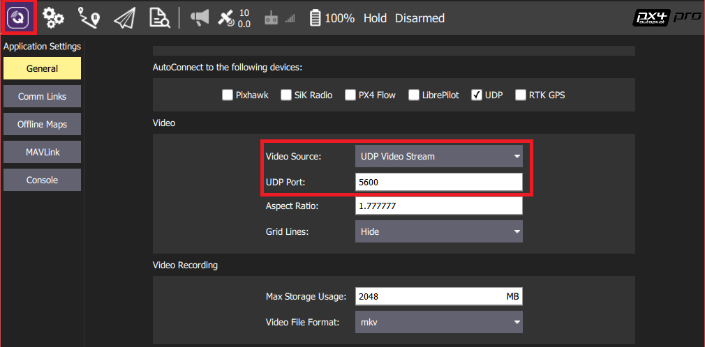

# Gazebo 仿真

<!-- Check if updates required - ie that following are fixed:

- Gazebo8 not supported and should be: https://github.com/PX4/sitl_gazebo/pull/118#pullrequestreview-86032497
- Video functionality disabled by default (should be enabled): https://github.com/PX4/Devguide/pull/418#pullrequestreview-86789154
- Find out actual gstreamer dependencies and update both this doc and build scripts - should be done when the camera plugin is a default.
-->

[ Gazebo ](http://gazebosim.org)是用于自主机器人的强大3D模拟环境，其特别适用于测试物体避障和计算机视觉。 本文描述了如何使用它来进行单机的软件在环仿真。 Gazebo 也可以适用于 [硬件在环仿真](../simulation/hitl.md) 和 [多机仿真](../simulation/multi-vehicle-simulation.md) 。

**支持机型：**四旋翼 ([Iris](../airframes/airframe_reference.md#copter_quadrotor_wide_3dr_iris_quadrotor) 和 [Solo](../airframes/airframe_reference.md#copter_quadrotor_x_3dr_solo))，六旋翼 (Typhoon h480)，[通用四旋翼 delta VTOL 无人机](../airframes/airframe_reference.md#vtol_standard_vtol_generic_quad_delta_vtol)，尾翼，飞机，探测车，潜艇（即将推出！）

> **Tip** Gazebo 通常与 [ROS](../ros/README.md) 一起使用，板外自动飞行控制的 API 工具包。 如果您计划将 PX4 与 ROS 一起使用，则应该先安装 Gazebo [在这看说明教程](../simulation/ros_interface.md) 。

https://www.youtube.com/watch?v=qfFF9-0k4KA&vq=hd720

 graph LR; Gazebo-->Plugin; Plugin-->MAVLink; MAVLink-->SITL; 

> **Note** 有关仿真器，仿真环境和仿真变量配置（例如支持的机型）的一般信息，请参见 [仿真](/simulation/README.md)。

## 安装

Gazebo 9 的安装在标准的环境编译已有说明。

* ** macOS：** [ Mac 上的开发环境](../setup/dev_env_mac.md)
* **Linux:** [在Linux（Ubuntu 16.04）开发环境 -> jMAVSim/Gazebo 仿真](../setup/dev_env_linux_ubuntu.md#sim_nuttx)
* ** Windows：**还不支持。

其他安装说明可在 [gazebosim.org](http://gazebosim.org/tutorials?cat=guided_b&tut=guided_b1) 上找到。

## 运行仿真

您可以通过启动 PX4 SITL和 Gazebo 来运行模拟，并加载机身配置（支持多旋翼飞机，飞机，VTOL，光流和多机仿真）。

最简单的方法是在 PX4 * Firmware *存储库的根目录中打开一个终端，并为目标调用` make `，如以下部分所示。

> **Tip** 你可以使用 [ instructions below ](#start_px4_sim_separately) 来保持 Gazebo 在后台运行然后只重启 PX4。 这样比同时重启两者要快一些。

<span></span>

> **Tip** 使用命令 `make px4_sitl list_vmd_make_targets` 获取所有支持的平台（你还可以过滤掉以 `gazebo_` 开头的平台）。

### 四旋翼

```sh
cd ~/src/Firmware
make px4_sitl gazebo
```

### 带光流的四旋翼

```sh
make px4_sitl gazebo_iris_opt_flow
```

### 3DR Solo

```sh
make px4_sitl gazebo_solo
```


### 标准构型的固定翼飞机

```sh
make px4_sitl gazebo_plane
```


### 标准垂起

```sh
make px4_sitl gazebo_standard_vtol
```


### 尾座式垂起

```sh
make px4_sitl gazebo_tailsitter
```


### Ackerman 车 （UGV/Rover） {#ugv}

```sh
make px4_sitl gazebo_rover
```


### 海马体 TUHH (UUV: 无人水下航行器) {#uuv}

```sh
make px4_sitl gazebo_hippocampus
```


## 改变仿真环境中的世界

当前的默认世界是位于目录 [worlds](https://github.com/PX4/sitl_gazebo/tree/b59e6e78e42d50f70224d1d0e506825590754d64/worlds) 中的 **iris.world**。 **iris.world** 中默认使用高度图生成地面景物。 这样生成的地面可能会导致使用距离传感器时较为困难， 如果使用高程图会导致任何出乎意料的结果，我们建议你将 **iris.model** 中的模型默认设定从 `uneven_ground` 改为 `asphalt_plane`.

## 简单上天

> **Note** 如遇到任何错误请参考： [工具链安装](../setup/dev_env.md) 。

该命令最终将得到如下 PX4 控制台显示界面：

```sh
[init] shell id: 140735313310464
[init] task name: px4

______  __   __    ___
| ___ \ \ \ / /   /   |
| |_/ /  \ V /   / /| |
|  __/   /   \  / /_| |
| |     / /^\ \ \___  |
\_|     \/   \/     |_/

px4 starting.


pxh>
```

> **Note** 在 gazebo 中右击四旋翼模型允许从上下文菜单启用跟随模式，这样可以方便地将其保持在视图中。


完成初始化后系统将输出 home 点的位置 (`telem> home: 55.7533950, 37.6254270, -0.00`)。 现在你可以输入如下命令让飞机起飞了：

```sh
pxh> commander takeoff
```

## 可选配置

### 无航向模式

Gazebo 可以在* headless *模式下运行，其中 Gazebo UI 界面未启动的。 这样可以更快地启动并使用更少的系统资源（即，它是运行模拟的更“轻量级”方式）。

只需在正常的* make *命令前加上` HEADLESS=1 `，如下所示：

```bash
HEADLESS=1 make px4_sitl gazebo_plane
```

### 设置自定义起飞位置

可以使用环境变量重写 SITL Gazebo 中的默认起飞位置。

要设置的变量有：`PX4_HOME_LAT`、`PX4_HOME_LON` 和 `PX4_HOME_ALT`。

下面是一个例子：

    export PX4_HOME_LAT=28.452386
    export PX4_HOME_LON=-13.867138
    export PX4_HOME_ALT=28.5
    make px4_sitl gazebo
    

### 更改仿真的时间流速

可以设置环境变量 `PX4_SIM_SPEED_FACTOR` 增长或者缩短仿真环境的时间流速相对于实际时间流速。

    export PX4_SIM_SPEED_FACTOR=2
    make px4_sitl_default gazebo
    

更多相关信息请参考：[仿真 > 仿真速度快于实际速度](../simulation/README.md#simulation_speed)。

### 使用游戏手柄

通过 *QGroundControl* 可引入游戏手柄或者拇指操纵杆（[如何进行设置看这里](../simulation/README.md#joystickgamepad-integration)）。

### 模拟 GPS 噪声

Gazebo 可以模拟类似于实际系统中常见的 GPS 噪声（否则报告的GPS值将是无噪声/完美的）。 这在处理可能受 GPS 噪声影响的应用时非常有用，例如精度定位。

果目标设备的 SDF 文件包含` gpsNoise `元素的值（即，它具有行：`&lt;gpsNoise&gt;true&lt;/gpsNoise&gt;`），则启用GPS噪声。 默认情况下, 它在许多设备 SDF 文件中启用：**solo.sdf**、**iris.sdf**、**standard_vtol.sdf**、**delta_wing.sdf**、**plane.sdf**、**typhoon_h480** **tailsitter.sdf**。

启用/禁用GPS噪音：

1. 构建任何 gazebo 目标以生成 SDF 文件（适用于所有机型）。 例如： ```make px4_sitl gazebo_iris``` >**Tip**在后续版本中不会覆盖 SDF 文件。 
2. 打开目标车辆的 SDF 文件（例如**./Tools/sitl_gazebo/models/iris/iris.sdf **）。
3. 搜索 `gpsNoise` 元素： 
        xml
        <plugin name='gps_plugin' filename='libgazebo_gps_plugin.so'>
         <robotNamespace/>
         <gpsNoise>true</gpsNoise>
        </plugin>
    
    * 如果存在，则启用 GPS。 您可以通过删除以下行来禁用它：`<gpsNoise> true </gpsNoise>`
    * 如果未预设，则禁用 GPS 。 您可以通过将` gpsNoise `元素添加到` gps_plugin `部分来启用它（如上所示）。

下次构建/重新启动 Gazebo 时，它将使用新的 GPS 噪声设置。

## 单独启动 Gazebo 和 PX4 {#start_px4_sim_separately}

对于扩展开发会话，单独启动 Gazebo 和 PX4 可能更方便，甚至可以在 IDE 中启动。

除了运行` sitl_run.sh `的现有 cmake 目标以及 px4 的参数加载正确的模型之外，它还会创建一个名为` px4_ &lt;mode&gt;`的启动器目标，这是一个包装器，围绕原始 sitl px4 应用程序。 这个包装器只是嵌入应用程序参数，如当前工作目录和模型文件的路径。

单独启动 Gazebo 和 PX4:

* 通过终端运行 gazebo（或任何其他 sim）服务器和客户端查看器： ```make px4_sitl gazebo_none_ide```
* 在 IDE 中选择要调试的` px4_ <mode> `目标（例如` px4_iris `）
* 直接从 IDE 启动调试会话

这种方法显着缩短了调试周期时间，因为模拟器（例如 gazebo）总是在后台运行，而你只重新运行 px4 进程是非常轻松的。

## 视频流

用于 Gazebo 的 PX4 SITL 支持来自连接到设备型号的 Gazebo 相机传感器的 UDP 视频流。 您可以从* QGroundControl *（在 UDP 端口 5600 上）连接到此流，并从模拟设备查看 Gazebo 环境的视频 - 就像您从真实摄像机那样。 使用* gstreamer *流水线流式传输视频。

> **Note**默认情况下，来自 Gazebo 和 Gazebo 小部件中的视频流以打开/关闭流式传输是未启用的。 本文介绍了如何启用它们。 在不久的将来，我们希望默认情况下启用这些功能。

### 系统必备组件

安装* Gstreamer 1.0 *及其依赖项：

    sudo apt-get install $(apt-cache --names-only search ^gstreamer1.0-* | awk '{ print $1 }' | grep -v gstreamer1.0-hybris) -y
    

### 如何查看 Gazebo 视频流

最简单的方式就是在 *QGroundControl* 中查看 Gazebo 软件在环仿真 视频流。 只需打开 QGroundControl 中 **软件配置> 通用设置** 找到 **视频源** 选择 *UDP 视频流* 然后 **UDP 端口号** 默认设置为 *5600*：



来自 Gazebo 的视频应该像从真实相机那样显示在* QGroundControl *中。

It is also possible to view the video using the *Gstreamer Pipeline*. Simply enter the following terminal command:

    gst-launch-1.0  -v udpsrc port=5600 caps='application/x-rtp, media=(string)video, clock-rate=(int)90000, encoding-name=(string)H264' \
    ! rtph264depay ! avdec_h264 ! videoconvert ! autovideosink fps-update-interval=1000 sync=false
    

### Gazebo GUI to Start/Stop Video Streaming

> **Note** This feature is supported for Gazebo version 7.

Video streaming can be enabled/disabled using the Gazebo UI *Video ON/OFF* button.


To enable the button:

1. 打开要修改的“ world ”文件（例如[&lt;Firmware>/Tools/sitl_gazebo/worlds/typhoon_h480.world ](https://github.com/PX4/sitl_gazebo/blob/master/worlds/typhoon_h480.world)）。
2. 在默认的` world name =“default”`部分中，为` libgazebo_video_stream_widge `添加` gui `部分（如下所示）：
    
    ```xml
    <?xml version="1.0" ?>
    <sdf version="1.5">
     <world name="default">
    ```
    
    ```xml
       <gui>
         <plugin name="video_widget" filename="libgazebo_video_stream_widget.so"/>
       </gui>
    ```
    
    ```xml
    <!-- A global light source -->
    <include>
    ...
    ```
    
    > **Tip** 此部分出现在** typhoon_h480.world **中 - 您只需要取消注释该部分。

3. 重建 SITL：
    
        make clean
        make px4_sitl gazebo_typhoon_h480
        

## 扩展和定制

To extend or customize the simulation interface, edit the files in the `Tools/sitl_gazebo` folder. The code is available on the [sitl_gazebo repository](https://github.com/px4/sitl_gazebo) on Github.

> **Note** The build system enforces the correct GIT submodules, including the simulator. It will not overwrite changes in files in the directory.

## 与 ROS 对接交互

The simulation can be [interfaced to ROS](../simulation/ros_interface.md) the same way as onboard a real vehicle.

## 更多信息：

* [另见 Gazebo 模拟。](../simulation/ros_interface.md)
* [Gazebo Octomap](../simulation/gazebo_octomap.md)