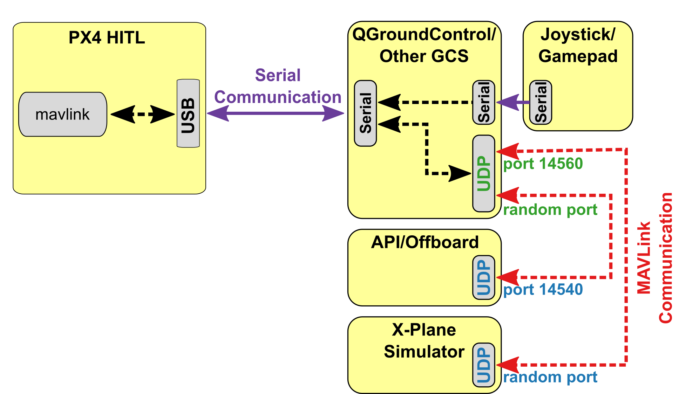

# 硬件在环仿真（HITL）

硬件在环仿真模式 (HITL 或 HIL) 下 PX4 固件代码运行在真实的飞行控制器硬件平台上。 这种方法的优点是可以在实际硬件上测试大多数的实际飞行代码。

HITL 模式下 PX4 支持多旋翼 (使用 jMAVSim 或者 Gazebo) 和固定翼 (使用 Gazebo 或者 X-Plane demo/full version) 无人机的仿真。

## HITL兼容机架 {#compatible_airframe}

目前兼容的机架构型和模拟器的情况如下：

| 机架                                                                                                      | `SYS_AUTOSTART` | X-Plane | Gazebo | jMAVSim |
| ------------------------------------------------------------------------------------------------------- | --------------- | ------- | ------ | ------- |
| <a href="../airframes/airframe_reference.md#plane_simulation_(plane)_hilstar_(xplane)">HILStar (X-Plane)</a>                                                                               | 1000            | Y       |        |         |
| <a href="../airframes/airframe_reference.md#copter_simulation_(copter)_hil_quadcopter_x">HIL Quadcopter X</a>                                                                               | 1001            |         | Y      | Y       |
| <a href="../airframes/airframe_reference.md#vtol_standard_vtol_hil_standard_vtol_quadplane">HIL Standard VTOL QuadPlane</a>                                                                               | 1002            |         | Y      |         |
| [Standard planes](../airframes/airframe_reference.md#plane_standard_plane_standard_plane)               | 2100            | Y       |        |         |
| [Generic Quadrotor x](../airframes/airframe_reference.md#copter_quadrotor_x_generic_quadrotor_x) copter | 4001            |         | Y      | Y       |
| [DJI Flame Wheel f450](../airframes/airframe_reference.md#copter_quadrotor_x_dji_flame_wheel_f450)      | 4011            |         | Y      | Y       |

## HITL 仿真环境 {#simulation_environment}

硬件在环仿真（HITL）模式下标准的 PX4 固件在真实的硬件上运行。 使用Gazebo, jMAVSim 和 X-Plane 仿真平台进行 HITL 仿真的配置设定稍有不同。

> **Tip** 更多有关信息请参阅： [仿真模拟](../simulation/README.md) 。

### JMAVSim/Gazebo HITL 仿真环境

JMAVSim 或 Gazebo (运行在开发计算机上) 通过 USB/UART 完成与飞行控制器硬件平台的连接。 模拟器充当在 PX4 和 *QGroundControl* 之间共享 MAVLink 数据的网关。

> **Note** 如果飞行控制器支持网络连接且使用的是稳定、低延迟的连接（如有线以太网，WIFI 通常不太稳定），那么模拟器也可以使用 UDP 完成通讯连接。 例如，该配置已经使用一台运行 PX4 且通过以太网连接到开发计算机的 Raspberry Pi 进行了验证测试 (包括 jMAVSim 运行命令的启动配置在 [这里](https://github.com/PX4/Firmware/blob/master/posix-configs/rpi/px4_hil.config))。

The diagram below shows the simulation environment:

* 飞控板 HITL 模式被激活 (通过 *QGroundControl*) ，该模式下不会启动飞控板上任何传感器。
* *jMAVSim* 或者 *Gazebo* 通过 USB 连接到飞控板。
* 模拟器通过 UDP 连接到 *QGroundControl* 并将 MAVLink 数据传输至 PX4 。
* *Gazebo* and *jMAVSim* can also connect to an offboard API and bridge MAVLink messages to PX4.
* (Optional) A serial connection can be used to connect Joystick/Gamepad hardware via *QGroundControl*.


### X-Plane HITL 仿真环境

*QGroundControl* is connected to the flight controller hardware via USB, and acts as a gateway to forward data between the X-Plane simulator running on a development computer, PX4, and any offboard API. The diagram below shows the simulation environment:

* 飞控板 HITL 模式被激活 (通过 *QGroundControl*) ，该模式下不会启动飞控板上任何传感器。
* *QGroundControl* 通过 USB 连接到飞行控制器。
* *QGroundControl* 通过 UDP 连接到模拟器和offboard API。
* 通过串口将操纵杆/游戏手柄通过 *QGroundControl* 连接至仿真回路中。



## HITL vs SITL

SITL runs on a development computer in a simulated environment, and uses firmware specifically generated for that environment. Other than simulation drivers to provide fake environmental data from the simulator the system behaves normally.

By contrast, HITL runs normal PX4 firmware in "HITL mode", on normal hardware. The simulation data enters the system at a different point than for SITL. Core modules like commander and sensors have HIL modes at startup that bypass some of the normal functionality.

In summary, HITL runs PX4 on the actual hardware using standard firmware, but SITL actually executes more of the standard system code.

## 配置 HITL

### PX4 配置

1. 通过 USB 将自动驾驶仪直接连接到 *QGroundControl*。
2. 激活 HITL 模式
    
    1. 打开 **Setup > Safety** 选项卡。
    2. 在 *HITL Enabled* 下拉框中选择 **Enabled** 完成 HITL 模式的激活。
        
        

3. 选择机架
    
    1. 打开 **Setup > Airframes** 选项卡。
    2. 选择一个你想要进行测试的 [兼容的机架](#compatible_airframe) 。 通常情况下选择 *HILStar* 作为固定翼平台/X-Plane 模拟器，选择 *HIL QuadCopter* 作为旋翼平台 ( jMAVSim 或 Gazebo) 。 Then click **Apply and Restart** on top-right of the *Airframe Setup* page.
        
        

4. 如有必要, 校准您的 RC 遥控器 或操纵杆。

5. 设置 UDP
    
    1. 在设置菜单的 "*General*" 选项卡下, 取消选中 *AutoConnect* 一栏中除 **UDP** 外的所有复选框。
        
        

6. (可选) 配置操纵杆和故障保护。 设置以下 [parameters](https://docs.px4.io/en/advanced_config/parameters.html#finding-a-parameter) 以便使用操纵杆而不是 RC 遥控器：
    
    * [COM_RC_IN_MODE](../advanced/parameter_reference.md#COM_RC_IN_MODE) 更改为 "Joystick/No RC Checks". 这允许操纵杆输入并禁用 RC 输入检查。
    * [NAV_RCL_ACT](../advanced/parameter_reference.md#NAV_RCL_ACT) to "Disabled". 这可确保在没有无线遥控的情况下运行 HITL 时 RC 失控保护不会介入。
    
    > **Tip** *QGroundControl User Guide* 中也有如何配置 [操纵杆](https://docs.qgroundcontrol.com/en/SetupView/Joystick.html) 和 [虚拟操纵杆](https://docs.qgroundcontrol.com/en/SettingsView/VirtualJoystick.html) 的说明。

Once configuration is complete, **close** *QGroundControl* and disconnect the flight controller hardware from the computer.

### 模拟器配置

Follow the appropriate setup steps for your simulator in the following sections.

#### Gazebo

> **Note** Make sure *QGroundControl* is not running!

1. 更新环境变量：
    
    ```sh
    cd <Firmware_clone>
    make px4_sitl_default gazebo
    ```
    
    在新的终端窗口运行：
    
    ```sh
    source Tools/setup_gazebo.bash $(pwd) $(pwd)/build/px4_sitl_default
    ```

2. 打开载具模型的 sdf 文件（例如 **Tools/sitl_gazebo/models/iris/iris.sdf**）。

3. 找到文件的 `mavlink_interface plugin` 分区，将 `serialEnabled` 和 `hil_mode` 参数更改为 `true` 。
    
    

4. 如有必要的话替换掉 `serialDevice` 参数 (`/dev/ttyACM0`) 。
    
    > **Note** 串口设备参数取决于载具与计算机使用哪个端口完成连接 (通常情况下都是 `/dev/ttyACM0`)。 在 Ubuntu 上最简单的一个检测办法就是将自驾仪插入电脑，然后打开终端窗口输入 `dmesg | grep "tty"` 命令。 命令执行结果中最后一个显示的设备就是我们关心的。

5. 关闭 Gazebo ，将飞控板连接至计算机并等待其启动。

6. 在 HITL 模式下运行 Gazebo ： 
        sh
        gazebo Tools/sitl_gazebo/worlds/iris.world

7. 开启 *QGroundControl*。 它应该会自动连接 PX4 和 Gazebo 。

#### jMAVSim (仅适用于四旋翼无人机)

> **Note** 确保 *QGroundControl* 没有运行！

1. 将飞行控制器连接到计算机, 并等待其启动。
2. 在 HITL 模式下运行 jMAVSim (r如有必要，修改串口号名称 `/dev/ttyACM0` - 比如，在 Mac OS 上该参数应为 `/dev/tty.usbmodem1`)： 
        sh
        ./Tools/jmavsim_run.sh -q -s -d /dev/ttyACM0 -b 921600 -r 250

3. 开启 *QGroundControl*。 它应该会自动连接 PX4 和 Gazebo 。

#### 使用 X-Plane (仅适用于固定翼无人机)

> **Note** X-Plane is currently not recommended. Among other issues, the frame update rate is too slow to run the system realistically.

To set up X-Plane:

1. 打开 X-Plane
2. 在 **Settings > Data Input and Output** 界面中勾选以下选项：
    
    

3. 在 **Settings > Net Connections** 界面的 *Data* 选项卡，将 localhost 和 49005 端口设定为 IP 地址，如下图所示：
    
    

4. 在 *QGroundControl* 中启用 X-Plane HITL ：
    
    1. 开启 *QGroundControl*。
    2. Open **Widgets > HIL Config**. Select X-Plane 10 in the drop-down and hit connect. Once the system is connected, battery status, GPS status and aircraft position should all become valid.

## 在 HITL 仿真中执行自主飞行任务

You should be able to use *QGroundControl* to [run missions](../qgc/README.md#planning-missions) and otherwise control the vehicle.