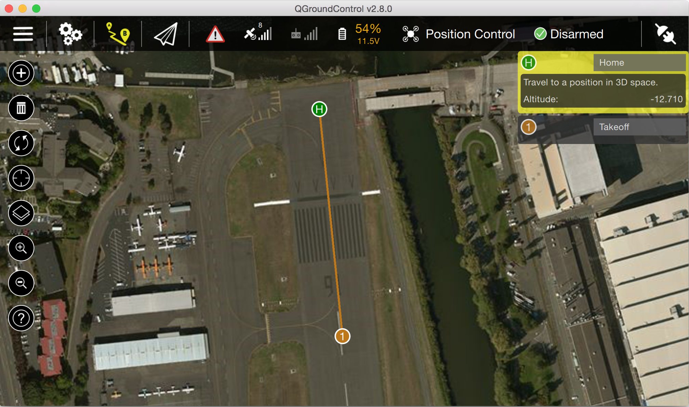

# 硬件在环仿真


硬件在环仿真指的自驾仪与仿真器相连并且所有的代码运行在自驾仪上的仿真。这种方法的优点是可以测试代码在实际处理器中的运行情况。

## 配置硬件在环仿真系统

PX4支持多旋翼（使用jMAVSim）和固定翼（使用X-Plane demo或者full）的硬件在环仿真。虽然支持Flightgear，但是推荐使用X-Plane。通过机架菜单配置来使用硬件在环仿真。


## 使用jMAVSim (四旋翼)

- 确保QGroundControl没有运行（或通过串口访问设备）

- 在HITL模式下运行jMAVSim(必要时更换串口):
  ```
  ./Tools/jmavsim_run.sh -q -d /dev/ttyACM0 -b 921600 -r 250
  ```

- 控制台将显示从自驾仪发出的mavlink信息。

- 然后运行QGroundControl并通过默认UDP配置进行连接。


## 使用X-Plane
#### 启用X-Plane的远程接口

在X-Plane中必须进行两项关键设置：在Settings -&gt; Data Input and Output中，参照图中复选框设置：


在Settings -&gt; Net Connections的Data选项卡中，设置localhost以及端口49005作为IP地址，如下图所示：


### 在QGroundControl中启用HITL

在Widgets -&gt; HIL Config中，选中下拉菜单中的X-Plane 10，点击'connect'。一旦系统成功连接，电池状态，GPS状态和飞行器位置应该变为有效：


## 切换到Joystick输入

如果相比遥控器更喜欢使用joystick，那么可以设置参数`COM_RC_IN_MODE`为1来启用joystick。可以在Command参数组中找到这个参数。

## 在HITL中执行自动飞行任务

切换到flight planning页面，在飞机前面放置一个路径点。点击同步图标向自驾仪发送路径点。

接下来在工具栏的飞行模式菜单中选择MISSION模式，点击'DISARMED'解锁飞机。飞机将起飞并围绕起飞点盘旋。




