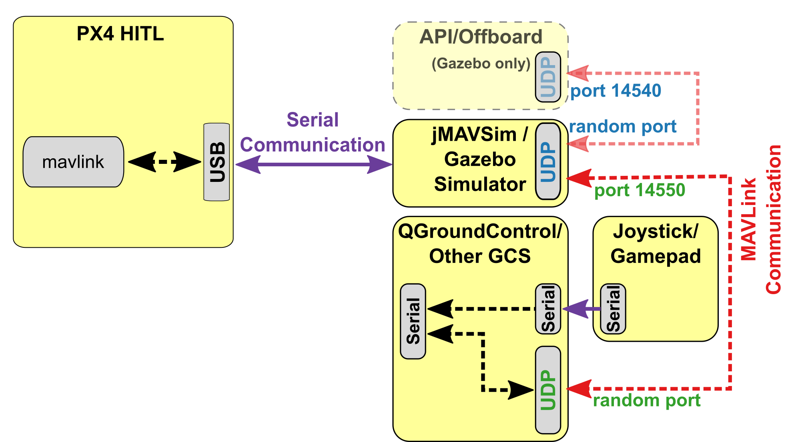

# 硬件在环仿真（HITL）

硬件在环仿真模式 (HITL 或 HIL) 下 PX4 固件代码运行在真实的飞行控制器硬件平台上。 这种方法的优点是可以在实际硬件上测试大多数的实际飞行代码。

PX4 supports HITL for multicopters (using jMAVSim or Gazebo) and VTOL (using Gazebo).

## HITL兼容机架 {#compatible_airframe}

目前兼容的机架构型和模拟器的情况如下：

| 机架                                                                                                     | `SYS_AUTOSTART` | Gazebo | jMAVSim |
| ------------------------------------------------------------------------------------------------------ | --------------- | ------ | ------- |
| <a href="../airframes/airframe_reference.md#copter_simulation_(copter)_hil_quadcopter_x">HIL Quadcopter X</a>                                                                              | 1001            | Y      | Y       |
| <a href="../airframes/airframe_reference.md#vtol_standard_vtol_hil_standard_vtol_quadplane">HIL Standard VTOL QuadPlane</a>                                                                              | 1002            | Y      |         |
| [Generic Quadrotor x](../airframes/airframe_reference.md#copter_quadrotor_x_generic_quadcopter) copter | 4001            | Y      | Y       |
| [DJI Flame Wheel f450](../airframes/airframe_reference.md#copter_quadrotor_x_dji_flame_wheel_f450)     | 4011            | Y      | Y       |

## HITL 仿真环境 {#simulation_environment}

硬件在环仿真（HITL）模式下标准的 PX4 固件在真实的硬件上运行。 JMAVSim or Gazebo (running on a development computer) are connected to the flight controller hardware via USB/UART. The simulator acts as gateway to share MAVLink data between PX4 and *QGroundControl*.

> **Note** The simulator can also be connected via UDP if the flight controller has networking support and uses a stable, low-latency connection (e.g. a wired Ethernet connection - WiFi is usually not sufficiently reliable). For example, this configuration has been tested with PX4 running on a Raspberry Pi connected via Ethernet to the computer (a startup configuration that includes the command for running jMAVSim can be found [here](https://github.com/PX4/Firmware/blob/master/posix-configs/rpi/px4_hil.config)).

The diagram below shows the simulation environment:

* 飞控板 HITL 模式被激活 (通过 *QGroundControl*) ，该模式下不会启动飞控板上任何传感器。
* *jMAVSim* 或者 *Gazebo* 通过 USB 连接到飞控板。
* 模拟器通过 UDP 连接到 *QGroundControl* 并将 MAVLink 数据传输至 PX4 。
* *Gazebo* and *jMAVSim* can also connect to an offboard API and bridge MAVLink messages to PX4.
* (Optional) A serial connection can be used to connect Joystick/Gamepad hardware via *QGroundControl*.



## HITL vs SITL

SITL runs on a development computer in a simulated environment, and uses firmware specifically generated for that environment. Other than simulation drivers to provide fake environmental data from the simulator the system behaves normally.

By contrast, HITL runs normal PX4 firmware in "HITL mode", on normal hardware. The simulation data enters the system at a different point than for SITL. Core modules like commander and sensors have HITL modes at startup that bypass some of the normal functionality.

In summary, HITL runs PX4 on the actual hardware using standard firmware, but SITL actually executes more of the standard system code.

## 配置 HITL

### PX4 Configuration

1. 通过 USB 将自动驾驶仪直接连接到 *QGroundControl*。
2. 激活 HITL 模式
    
    1. 打开 **Setup > Safety** 选项卡。
    2. 在 *HITL Enabled* 下拉框中选择 **Enabled** 完成 HITL 模式的激活。
        
        

3. 选择机架
    
    1. 打开 **Setup > Airframes** 选项卡。
    2. 选择一个你想要进行测试的 [兼容的机架](#compatible_airframe) 。 Then click **Apply and Restart** on top-right of the *Airframe Setup* page.
        
        

4. 如有必要, 校准您的 RC 遥控器 或操纵杆。

5. 设置 UDP
    
    1. 在设置菜单的 "*General*" 选项卡下, 取消选中 *AutoConnect* 一栏中除 **UDP** 外的所有复选框。
        
        

6. (可选) 配置操纵杆和故障保护。 Set the following [parameters](https://docs.px4.io/master/en/advanced_config/parameters.html) in order to use a joystick instead of an RC remote control transmitter:
    
    * [COM_RC_IN_MODE](../advanced/parameter_reference.md#COM_RC_IN_MODE) 更改为 "Joystick/No RC Checks". 这允许操纵杆输入并禁用 RC 输入检查。
    * [NAV_RCL_ACT](../advanced/parameter_reference.md#NAV_RCL_ACT) to "Disabled". 这可确保在没有无线遥控的情况下运行 HITL 时 RC 失控保护不会介入。
    
    > **Tip** *QGroundControl User Guide* 中也有如何配置 [操纵杆](https://docs.qgroundcontrol.com/en/SetupView/Joystick.html) 和 [虚拟操纵杆](https://docs.qgroundcontrol.com/en/SettingsView/VirtualJoystick.html) 的说明。

Once configuration is complete, **close** *QGroundControl* and disconnect the flight controller hardware from the computer.

### Simulator-Specific Setup

Follow the appropriate setup steps for the specific simulator in the following sections.

#### Gazebo

> **Note** Make sure *QGroundControl* is not running!

1. Build PX4 with Gazebo (in order to to build the Gazebo plugins). 
        sh
        cd <Firmware_clone>
        DONT_RUN=1 make px4_sitl_default gazebo

2. Open the vehicle model's sdf file (e.g. **Tools/sitl_gazebo/models/iris/iris.sdf**).
3. 找到文件的 `mavlink_interface plugin` 分区，将 `serialEnabled` 和 `hil_mode` 参数更改为 `true` 。
    
    
    
    > **Note** The file iris.sdf is autogenerated. Therefore you need to either keep a copy of your changed file or re-edit it for every build.

4. 如有必要的话替换掉 `serialDevice` 参数 (`/dev/ttyACM0`) 。
    
    > **Note** 串口设备参数取决于载具与计算机使用哪个端口完成连接 (通常情况下都是 `/dev/ttyACM0`)。 在 Ubuntu 上最简单的一个检测办法就是将自驾仪插入电脑，然后打开终端窗口输入 `dmesg | grep "tty"` 命令。 命令执行结果中最后一个显示的设备就是我们关心的。

5. Set up the environment variables:
    
    ```sh
    source Tools/setup_gazebo.bash $(pwd) $(pwd)/build/px4_sitl_default
    ```
    
    and run Gazebo in HITL mode:
    
    ```sh
    gazebo Tools/sitl_gazebo/worlds/iris.world
    ```

6. Start *QGroundControl*. It should autoconnect to PX4 and Gazebo.

#### jMAVSim (仅适用于四旋翼无人机)

> **Note** Make sure *QGroundControl* is not running!

1. 将飞行控制器连接到计算机, 并等待其启动。
2. Run jMAVSim in HITL mode: 
        sh
        ./Tools/jmavsim_run.sh -q -s -d /dev/ttyACM0 -b 921600 -r 250 > 
    
    **Note** Replace the serial port name `/dev/ttyACM0` as appropriate. On macOS this port would be `/dev/tty.usbmodem1`. On Windows (including Cygwin) it would be the COM1 or another port - check the connection in the Windows Device Manager.
3. 开启 *QGroundControl*。 它应该会自动连接 PX4 和 Gazebo 。

## 在 HITL 仿真中执行自主飞行任务

You should be able to use *QGroundControl* to [run missions](../qgc/README.md#planning-missions) and otherwise control the vehicle.