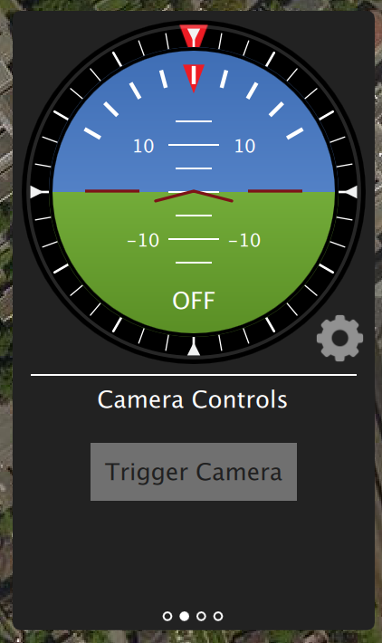
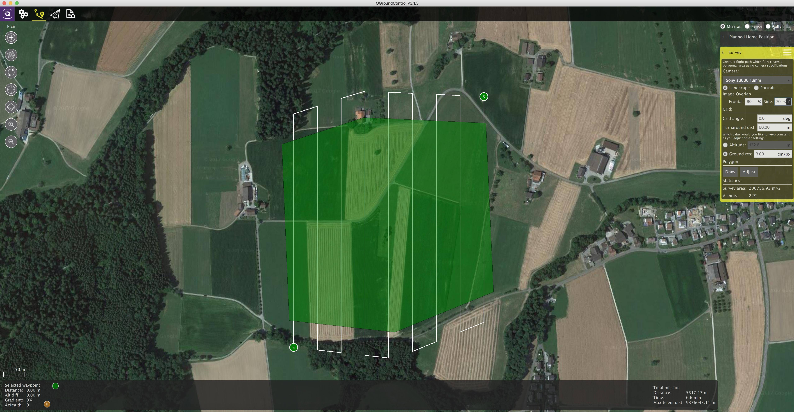

# 相机触发器

官网英文原文地址:http://dev.px4.io/advanced-camera-trigger.html

相机触发驱动器是为了让AUX端口发出一个脉冲来触发相机. 这个可以用于多个应用程序，包括航测和重建照片、同步多相机系统或者视觉惯性导航.

除了发送脉冲之外,还会发布一个MAVLink消息，其中包含序列号（当前会话的图像序列号）和对应的时间戳。

### 触发模式

支持四种不同的模式，由`TRIG_MODE`参数控制

* `TRIG_MODE` 1 就像一个基本的定时曝光器，可以使用MAVLink命令`MAV_CMD_DO_TRIGGER_CONTROL`使能或禁用。 有关详细信息，请参阅[命令界面](../zh/tutorials/camera_trigger.html#command-interface)。
* `TRIG_MODE` 2 不断打开定时曝光器。
* `TRIG_MODE` 3 每次超过设定的水平距离时都会拍摄照片。然而，两个镜头之间的最小时间间隔受限于设置的触发间隔。
* `TRIG_MODE` 4 在任务模式下飞行测量时自动触发。

在`TRIG_MODE` 0中，相机触发被禁用。

> **须知： ** If it is your first time enabling the camera trigger app, remember to reboot after changing the `TRIG_MODE` parameter.

想找到与相机触发模块有关的参数配置的完整列表，请参考 [参考](https://pixhawk.org/firmware/parameters#camera_trigger) 页.

> **须知：**  如果这是你第一次启用相机触发应用程序, 请记住在更改`TRIG_MODE`参数后重新启动。

### Trigger hardware configuration

You can choose which AUX pins to use for triggering using the `TRIG_PINS` parameter. The default is 56, which means that trigger is enabled on AUX 5 and AUX 6. 

**IMPORTANT :** With `TRIG_PINS` set to its **default** value of 56, you can use the AUX pins 1, 2, 3 and 4 as actuator outputs (for servos/ESCs). Due to the way the hardware timers are handled (1234 are 56 are 2 different groups handled by 2 timers), this is the ONLY combination which allows the simultaneous usage of camera trigger and FMU actuator outputs. **DO NOT CHANGE THE DEFAULT VALUE OF `TRIG_PINS` IF YOU NEED ACTUATOR OUTPUTS.**

### Trigger interface backends

The camera trigger driver supports several backends - each for a specific application, controlled by the `TRIG_INTERFACE` parameter : 
* `TRIG_INTERFACE` 1 enables the GPIO interface. The AUX outputs are pulsed high or low (depending on the `TRIG_POLARITY` parameter) every `TRIG_INTERVAL` duration. This can be used to trigger most standard machine vision cameras directly. Note that on PX4FMU series hardware (Pixhawk, Pixracer, etc.), the signal level on the AUX pins is 3.3v.
* `TRIG_INTERFACE` 2 enables the Seagull MAP2 interface. This allows the use of the [Seagull MAP2](http://www.seagulluav.com/product/seagull-map2/) to interface to a multitude of supported cameras. Pin 1 of the MAP2 should be connected to the lower AUX pin of `TRIG_PINS` (therefore, pin 1 to AUX 5 and pin 2 to AUX 6 by default). In this mode, PX4 also supports automatic power control and keep-alive functionalities of Sony Multiport cameras like the QX-1.
* `TRIG_INTERFACE` 3 enables the MAVLink interface. In this mode, no actual hardware output is used. Only the `CAMERA_TRIGGER` MAVLink message is sent by the autopilot (by default, if the MAVLink application is in `onboard` mode. Otherwise, a custom stream will need to be enabled).
* `TRIG_INTERFACE` 4 enables the generic PWM interface. This allows the use of  [infrared triggers](https://hobbyking.com/en_us/universal-remote-control-infrared-shutter-ir-rc-1g.html) or servos to trigger your camera.

### Other parameters 

* `TRIG_POLARITY` - Relevant only while using the GPIO interface. Sets the polarity of the trigger pin. Active high means that the pin is pulled low normally and pulled high on a trigger event. Active low is vice-versa.
* `TRIG_INTERVAL` - Defines the time between two consecutive trigger events in milliseconds.
* `TRIG_ACTIVATION_TIME`- Defines the time in milliseconds the trigger pin is held in the "active" state before returning to neutral. In PWM modes, the minimum is limited to 40 ms to make sure we always fit an activate pulse into the 50Hz PWM signal.

The full list of parameters pertaining to the camera trigger module can be found on the [parameter reference](../advanced/parameter_reference.md#camera-trigger) page.

### Command interface 

The camera trigger driver supports several commands -

**`MAV_CMD_DO_TRIGGER_CONTROL`** - Accepted in "command controlled" mode (`TRIG_MODE` 1).

| Command Parameter | Description                              |
| ----------------- | ---------------------------------------- |
| Param #1          | Trigger enable/disable (set to 0 for disable, 1 for start) |
| Param #2          | Trigger cycle time in milliseconds (sets the `TRIG_INTERVAL` parameter. ) |
| Param #3          | Sequence reset (set to 1 to reset image sequence number, 0 to keep current sequence number) |

**`MAV_CMD_DO_DIGICAM_CONTROL` ** - Accepted in all modes. This is used by the GCS to test-shoot the camera from the user interface. The trigger driver does not yet support all camera control parameters defined by the MAVLink spec.

| Command Parameter | Description                              |
| ----------------- | ---------------------------------------- |
| Param #5          | Trigger one-shot command (set to 1 to trigger a single image frame) |

**`MAV_CMD_DO_SET_CAM_TRIGG_DIST`** - Accepted in "mission controlled" mode (`TRIG_MODE` 4)

This command is autogenerated during missions to trigger the camera based on survey missions from the GCS.

### Testing trigger functionality

1. On the PX4 console : 
  `camera_trigger test`

2. From QGroundControl : 

Click on "Trigger Camera" in the main instrument panel. These shots are not logged or counted for geotagging.

## Sony QX-1 example (Photogrammetry)

In this example, we will use a Seagull MAP2 trigger cable to interface to a Sony QX-1 and use the setup to create orthomosaics after flying a fully autonomous survey mission. 

#### Trigger settings : 

The camera trigger can be configured from QGroundControl's "Camera" page under the settings tab

* `TRIG_INTERFACE`: 2, Seagull MAP2.
* `TRIG_MODE`: 4, Mission controlled.

Leave the rest of the parameters at their defaults.

You will need to connect the Seagull MAP2 to the auxiliary/FMU pins on your autopilot. Pin 1 goes to AUX 5, and Pin 2 to AUX 6. The other end of the MAP2 cable will go into the QX-1's "MULTI" port.

#### Camera configuration :

We use a Sony QX-1 with a 16-50mm f3.5-5.6 lens for this example.

To avoid autofocus and metering lag when the camera is triggered, the following guidelines should be followed :

* Manual focus to infinity
* Set camera to continuous shooting mode
* Manually set exposure and aperture
* ISO should be set as low as possible
* Manual white balance suitable for scene

#### Mission planning :

#### Geotagging : 

Download/copy the logfile and images from the flight and point QGroundControl to them. Then click on "Start Tagging".

You can verify the geotagging using a free online service like [Pic2Map](https://www.pic2map.com/). Note that Pic2Map is limited to only 40 images.

#### Reconstruction :

We use [Pix4D](https://pix4d.com/) for 3D reconstruction.

## Camera-IMU同步示例（VIO）

在这个例程中, 我们将对IMU测量同步可视化数据的基础来建立一个立体视觉惯性导航系统（VINS）. 很明显, 这里的想法是IMU不参与测量，而是当到达设置的时间点时触发拍照，为什么提供准确的数据的迭代算法.

自驾仪和外设有不同的时钟(自驾仪的启动时间和UNIX外设的启动时间), 所以他们有不同的时间, 我们直接看时钟之间的时间偏移量. 这个偏移量是添加或从中减去mavlink消息的时间（如高分辨率的IMU）（如该译者在PX4同伴和mavlink的接收端）. 实际的同步算法是网络时间协议（NTP）算法的修改版本，使用指数移动平均平滑跟踪时间偏移.如果使用高宽带的车载连接会自动完成这种同步连接.
要获取同步的图像数据和惯性测量数据,我们就要把相机的触发信号输入引脚连接到自驾仪的GPIO引脚. 从中获取惯性测量的时间点数据和图像序列号记录并发送到配套的计算机（相机触发信息）,缓存这些数据和从相机获得的图像. 这些是匹配了序列号、时间点数据的图像.

下面的图表说明了事件的发生，必须以正确的时间点匹配我们的图像序列号。


sequenceDiagram
  Note right of px4 : Time sync with mavros is done automatically
  px4 ->> mavros : Camera Trigger ready
  Note right of camera driver : Camera driver boots and is ready
  camera driver ->> mavros : mavros_msgs::CommandTriggerControl
  mavros ->> px4 : MAVLink::MAV_CMD_DO_TRIGGER_CONTROL
  loop Every TRIG_INTERVAL milliseconds
  px4 ->> mavros : MAVLink::CAMERA_TRIGGER
  mavros ->> camera driver : mavros_msgs::CamIMUStamp
  camera driver ->> camera driver : Match sequence number
  camera driver ->> camera driver : Stamp image and publish
end


### 步骤 1
 首先，将TRIG_MODE设置为1，使驱动程序等待启动命令并重新启动FCU以获取剩余的参数

### 步骤 2

为了本例的目的，我们将配置触发器与运行在30 FPS的Point Gray Firefly MV摄像机配合使用。

- 触发间隔时间(TRIG_INTERVAL): 33.33 ms
- 触发信号极性(TRIG_POLARITY): 0(低电平触发)
- 触发有效时间(TRIG_ACT_TIME): 0.5 ms。该手册指定它只需要至少1微秒即可。
- 触发模式(TRIG_MODE): 1, 因为我们希望我们的相机驱动程序准备好在开始触发之前接收图像。这对于正确处理序列号至关重要。
- 触发引脚(TRIG_PINS):  56，保留默认值。

### 步骤3

将摄像机连接到AUX端口，将接地和信号引脚连接到适当的位置。

### 步骤 4

你必须按照上面的顺序来修改你的驱动程序。公开的实现方法请参考[IDS 成像 UEye](https://github.com/ProjectArtemis/ueye_cam)，可兼容的相机列表请参考[兼容IEEE1394](https://github.com/andre-nguyen/camera1394) 。